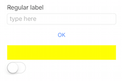
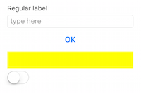
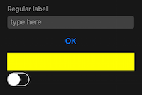
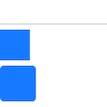
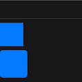

# Xamarin.Forms Themes

[ Download the sample](https://github.com/xamarin/xamarin-forms-samples/tree/master/Themes/ThemesDemo)


Xamarin.Forms Themes were announced at Evolve 2016 and are available as a
preview for customers to try and provide feedback.

A theme is added to a Xamarin.Forms application by including
the **Xamarin.Forms.Theme.Base** Nuget package, plus an additional
package that defines a specific theme (eg. Xamarin.Forms.Theme.Light)
or else a local theme can be defined for the application.

Refer to the [Light theme](light.md) and [Dark theme](dark.md) pages
for instructions on how to add them to an app, or check out the
[example custom theme](custom.md).

**IMPORTANT:** You should also follow the steps to [load theme assemblies (below)](#loadtheme)
by adding some boilerplate code to the iOS `AppDelegate` and Android `MainActivity`. This will
be improved in a future preview release.


## Control Appearance

The [Light](light.md) and [Dark](dark.md) themes both define a specific
visual appearance for the standard controls. Once you add a theme to the
application's resource dictionary, the appearance of the standard controls
will change.

The following XAML markup shows some common controls:

```xaml
<StackLayout Padding="40">
    <Label Text="Regular label" />
    <Entry Placeholder="type here" />
    <Button Text="OK" />
    <BoxView Color="Yellow" />
    <Switch />
</StackLayout>
```

These screenshots show these controls with:

* No theme applied
* Light theme (only subtle differences to having no theme)
* Dark theme

  

<a name="styleclass" />

## StyleClass

The `StyleClass` property allows a view's appearance to be changed
according to a definition provided by a theme.

The [Light](light.md) and [Dark](dark.md) themes both define three different appearances for
a `BoxView`: `HorizontalRule`, `Circle`, and `Rounded`. This markup
shows three different `BoxView`s wtih different style classes applied:

```xaml
<StackLayout Padding="40">
    <BoxView StyleClass="HorizontalRule" />
    <BoxView StyleClass="Circle" />
    <BoxView StyleClass="Rounded" />
</StackLayout>
```

This renders with light and dark as follows:

 

<a name="builtin" />

## Built-in Classes

In addition to automatically styling the common controls
the Light and Dark themes currently support the following classes
that can be applied by setting the `StyleClass` on these controls:

**BoxView**

* HorizontalRule
* Circle
* Rounded

**Image**

* Circle
* Rounded
* Thumbnail

**Button**

* Default
* Primary
* Success
* Info
* Warning
* Danger
* Link
* Small
* Large

**Label**

* Header
* Subheader
* Body
* Link
* Inverse


## Troubleshooting

<a name="loadtheme" />

### Could not load file or assembly 'Xamarin.Forms.Theme.Light' or one of its dependencies

In the preview release, themes may not be able to load at runtime. Add the code
shown below into the relevant projects to fix this error.

**iOS**

In the **AppDelegate.cs** add the following lines after `LoadApplication`

```csharp
var x = typeof(Xamarin.Forms.Themes.DarkThemeResources);
x = typeof(Xamarin.Forms.Themes.LightThemeResources);
x = typeof(Xamarin.Forms.Themes.iOS.UnderlineEffect);
```

**Android**

In the **MainActivity.cs** add the following lines after `LoadApplication`

```csharp
var x = typeof(Xamarin.Forms.Themes.DarkThemeResources);
x = typeof(Xamarin.Forms.Themes.LightThemeResources);
x = typeof(Xamarin.Forms.Themes.Android.UnderlineEffect);
```


## Related Links

- [ThemesDemo sample](https://github.com/xamarin/xamarin-forms-samples/tree/master/Themes/ThemesDemo)
