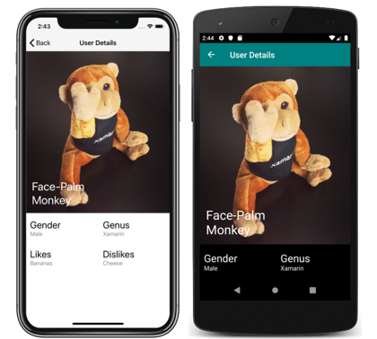

# Respond to system theme changes in Xamarin.Forms applications

[ Download the sample](/samples/xamarin/xamarin-forms-samples/userinterface-systemthemesdemo/)

Devices typically include light and dark themes, which each refer to a broad set of appearance preferences that can be set at the operating system level. Applications should respect these system themes, and respond immediately when the system theme changes.

The system theme may change for a variety of reasons, depending on the device configuration. This includes the system theme being explicitly changed by the user, it changing due to the time of day, and it changing due to environmental factors such as low light.

Xamarin.Forms applications can respond to system theme changes by consuming resources with the `AppThemeBinding` markup extension, and the `SetAppThemeColor` and `SetOnAppTheme<T>`  extension methods.

The following requirements must be met for Xamarin.Forms to respond to a system theme change:

- Xamarin.Forms 4.6.0.967 or greater.
- iOS 13 or greater.
- Android 10 (API 29) or greater.
- UWP build 14393 or greater.
- macOS 10.14 or greater.

The following screenshots show themed pages, for light and dark system themes on iOS and Android:

[](system-theme-changes-images/main-page-both-themes-large.png#lightbox "Main page of themed app")
[](system-theme-changes-images/detail-page-both-themes-large.png#lightbox "Detail page of themed app")

## Define and consume theme resources

Resources for light and dark themes can be consumed with the `AppThemeBinding` markup extension, and the `SetAppThemeColor` and `SetOnAppTheme<T>` extension methods. With these approaches, resources are automatically applied based on the value of the current system theme. In addition, objects that consume these resources are automatically updated if the system theme changes while an app is running.

### AppThemeBinding markup extension

The `AppThemeBinding` markup extension enables you to consume a resource, such as an image or color, based on the current system theme:

```xaml
<ContentPage ...>
    <StackLayout Margin="20">
        <Label Text="This text is green in light mode, and red in dark mode."
               TextColor="{AppThemeBinding Light=Green, Dark=Red}" />
        <Image Source="{AppThemeBinding Light=lightlogo.png, Dark=darklogo.png}" />
    </StackLayout>
</ContentPage>
```

In this example, the text color of the first [`Label`](xref:Xamarin.Forms.Label) is set to green when the device is using its light theme, and is set to red when the device is using its dark theme. Similarly, the [`Image`](xref:Xamarin.Forms.Image) displays a different image file based upon the current system theme.

In addition, resources defined in a [`ResourceDictionary`](xref:Xamarin.Forms.ResourceDictionary) can be consumed with the `StaticResource` markup extension:

```xaml
<ContentPage ...>
    <ContentPage.Resources>

        <!-- Light colors -->
        <Color x:Key="LightPrimaryColor">WhiteSmoke</Color>
        <Color x:Key="LightSecondaryColor">Black</Color>

        <!-- Dark colors -->
        <Color x:Key="DarkPrimaryColor">Teal</Color>
        <Color x:Key="DarkSecondaryColor">White</Color>

        <Style x:Key="ButtonStyle"
               TargetType="Button">
            <Setter Property="BackgroundColor"
                    Value="{AppThemeBinding Light={StaticResource LightPrimaryColor}, Dark={StaticResource DarkPrimaryColor}}" />
            <Setter Property="TextColor"
                    Value="{AppThemeBinding Light={StaticResource LightSecondaryColor}, Dark={StaticResource DarkSecondaryColor}}" />
        </Style>

    </ContentPage.Resources>

    <Grid BackgroundColor="{AppThemeBinding Light={StaticResource LightPrimaryColor}, Dark={StaticResource DarkPrimaryColor}}">
      <Button Text="MORE INFO"
              Style="{StaticResource ButtonStyle}" />
    </Grid>    
</ContentPage>    
```

In this example, the background color of the [`Grid`](xref:Xamarin.Forms.Grid) and the [`Button`](xref:Xamarin.Forms.Button) style changes based on whether the device is using its light theme or dark theme.

For more information about the `AppThemeBinding` markup extension, see [AppThemeBinding markup extension](~/xamarin-forms/xaml/markup-extensions/consuming.md#appthemebinding-markup-extension).

### Extension methods

Xamarin.Forms includes `SetAppThemeColor` and `SetOnAppTheme<T>` extension methods that enable [`VisualElement`](xref:Xamarin.Forms.VisualElement) objects to respond to system theme changes.

The `SetAppThemeColor` method enables [`Color`](xref:Xamarin.Forms.Color) objects to be specified that will be set on a target property based on the current system theme:

```csharp
Label label = new Label();
label.SetAppThemeColor(Label.TextColorProperty, Color.Green, Color.Red);
```

In this example, the text color of the [`Label`](xref:Xamarin.Forms.Label) is set to green when the device is using its light theme, and is set to red when the device is using its dark theme.

The `SetOnAppTheme<T>` method enables objects of type `T` to be specified that will be set on a target property based on the current system theme:

```csharp
Image image = new Image();
image.SetOnAppTheme<FileImageSource>(Image.SourceProperty, "lightlogo.png", "darklogo.png");
```

In this example, the [`Image`](xref:Xamarin.Forms.Image) displays `lightlogo.png` when the device is using its light theme, and `darklogo.png` when the device is using its dark theme.

## Detect the current system theme

The current system theme can be detected by getting the value of the `Application.RequestedTheme` property:

```csharp
OSAppTheme currentTheme = Application.Current.RequestedTheme;
```

The `RequestedTheme` property returns an `OSAppTheme` enumeration member. The `OSAppTheme` enumeration defines the following members:

- `Unspecified`, which indicates that the device is using an unspecified theme.
- `Light`, which indicates that the device is using its light theme.
- `Dark`, which indicates that the device is using its dark theme.

## Set the current user theme

The theme used by the application can be set with the `Application.UserAppTheme` property, which is of type `OSAppTheme`, regardless of which system theme is currently operational:

```csharp
Application.Current.UserAppTheme = OSAppTheme.Dark;
```

In this example, the application is set to use the theme defined for the system dark mode, regardless of which system theme is currently operational.

> [!NOTE]
> Set the `UserAppTheme` property to `OSAppTheme.Unspecified` to default to the operational system theme.

## React to theme changes

The system theme on a device may change for a variety of reasons, depending on how the device is configured. Xamarin.Forms apps can be notified when the system theme changes by handling the `Application.RequestedThemeChanged` event:

```csharp
Application.Current.RequestedThemeChanged += (s, a) =>
{
    // Respond to the theme change
};
```

The `AppThemeChangedEventArgs` object, which accompanies the `RequestedThemeChanged` event, has a single property named `RequestedTheme`, of type `OSAppTheme`. This property can be examined to detect the requested system theme.

> [!IMPORTANT]
> To respond to theme changes on Android you must include the `ConfigChanges.UiMode` flag in the `Activity` attribute of your `MainActivity` class.

## Related links

- [SystemThemes (sample)](/samples/xamarin/xamarin-forms-samples/userinterface-systemthemesdemo/)
- [AppThemeBinding markup extension](~/xamarin-forms/xaml/markup-extensions/consuming.md#appthemebinding-markup-extension)
- [Resource Dictionaries](~/xamarin-forms/xaml/resource-dictionaries.md)
- [Styling Xamarin.Forms Apps using XAML Styles](~/xamarin-forms/user-interface/styles/xaml/index.md)