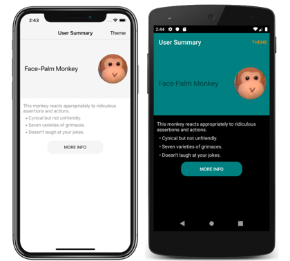
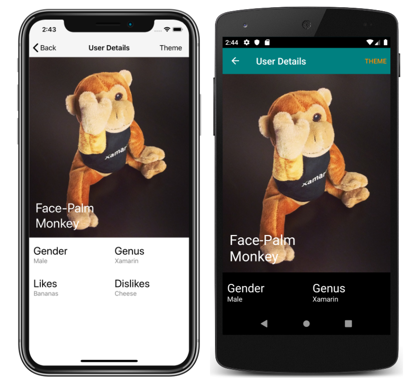

# Theme a Xamarin.Forms Application

[ Download the sample](/samples/xamarin/xamarin-forms-samples/userinterface-theming/)

Xamarin.Forms applications can respond to style changes dynamically at runtime by using the `DynamicResource` markup extension. This markup extension is similar to the `StaticResource` markup extension, in that both use a dictionary key to fetch a value from a [`ResourceDictionary`](xref:Xamarin.Forms.ResourceDictionary). However, while the `StaticResource` markup extension performs a single dictionary lookup, the `DynamicResource` markup extension maintains a link to the dictionary key. Therefore, if the value associated with the key is replaced, the change is applied to the [`VisualElement`](xref:Xamarin.Forms.VisualElement). This enables runtime theming to be implemented in Xamarin.Forms applications.

The process for implementing runtime theming in a Xamarin.Forms application is as follows:

1. Define the resources for each theme in a [`ResourceDictionary`](xref:Xamarin.Forms.ResourceDictionary).
1. Consume theme resources in the application, using the `DynamicResource` markup extension.
1. Set a default theme in the application's **App.xaml** file.
1. Add code to load a theme at runtime.

> [!IMPORTANT]
> Use the `StaticResource` markup extension if you don't need to change the app theme at runtime.

The following screenshots show themed pages, with the iOS application using a light theme and the Android application using a dark theme:

[](theming-images/main-page-both-themes-large.png#lightbox "Main page of themed app")
[](theming-images/detail-page-both-themes-large.png#lightbox "Detail page of themed app")

> [!NOTE]
> Changing a theme at runtime requires the use of XAML styles, and is not currently possible using CSS.

## Define themes

A theme is defined as a collection of resource objects stored in a [`ResourceDictionary`](xref:Xamarin.Forms.ResourceDictionary).

The following example shows the `LightTheme` from the sample application:

```xaml
<ResourceDictionary xmlns="http://xamarin.com/schemas/2014/forms"
                    xmlns:x="http://schemas.microsoft.com/winfx/2009/xaml"
                    x:Class="ThemingDemo.LightTheme">
    <Color x:Key="PageBackgroundColor">White</Color>
    <Color x:Key="NavigationBarColor">WhiteSmoke</Color>
    <Color x:Key="PrimaryColor">WhiteSmoke</Color>
    <Color x:Key="SecondaryColor">Black</Color>
    <Color x:Key="PrimaryTextColor">Black</Color>
    <Color x:Key="SecondaryTextColor">White</Color>
    <Color x:Key="TertiaryTextColor">Gray</Color>
    <Color x:Key="TransparentColor">Transparent</Color>
</ResourceDictionary>
```

The following example shows the `DarkTheme` from the sample application:

```xaml
<ResourceDictionary xmlns="http://xamarin.com/schemas/2014/forms"
                    xmlns:x="http://schemas.microsoft.com/winfx/2009/xaml"
                    x:Class="ThemingDemo.DarkTheme">
    <Color x:Key="PageBackgroundColor">Black</Color>
    <Color x:Key="NavigationBarColor">Teal</Color>
    <Color x:Key="PrimaryColor">Teal</Color>
    <Color x:Key="SecondaryColor">White</Color>
    <Color x:Key="PrimaryTextColor">White</Color>
    <Color x:Key="SecondaryTextColor">White</Color>
    <Color x:Key="TertiaryTextColor">WhiteSmoke</Color>
    <Color x:Key="TransparentColor">Transparent</Color>
</ResourceDictionary>
```

Each [`ResourceDictionary`](xref:Xamarin.Forms.ResourceDictionary) contains [`Color`](xref:Xamarin.Forms.Color) resources that define their respective themes, with each `ResourceDictionary` using identical key values. For more information about resource dictionaries, see [Resource Dictionaries](~/xamarin-forms/xaml/resource-dictionaries.md).

> [!IMPORTANT]
> A code behind file is required for each `ResourceDictionary`, which calls the `InitializeComponent` method. This is necessary so that a CLR object representing the chosen theme can be created at runtime.

## Set a default theme

An application requires a default theme, so that controls have values for the resources they consume. A default theme can be set by merging the theme's [`ResourceDictionary`](xref:Xamarin.Forms.ResourceDictionary) into the application-level `ResourceDictionary` that's defined in **App.xaml**:

```xaml
<Application xmlns="http://xamarin.com/schemas/2014/forms"
             xmlns:x="http://schemas.microsoft.com/winfx/2009/xaml"
             x:Class="ThemingDemo.App">
    <Application.Resources>
        <ResourceDictionary Source="Themes/LightTheme.xaml" />
    </Application.Resources>
</Application>
```

For more information about merging resource dictionaries, see [Merged resource dictionaries](~/xamarin-forms/xaml/resource-dictionaries.md#merged-resource-dictionaries).

## Consume theme resources

When an application wants to consume a resource that's stored in a [`ResourceDictionary`](xref:Xamarin.Forms.ResourceDictionary) that represents a theme, it should do so with the `DynamicResource` markup extension. This ensures that if a different theme is selected at runtime, the values from the new theme will be applied.

The following example shows three styles from the sample application that can be applied to [`Label`](xref:Xamarin.Forms.Label) objects:

```xaml
<Application xmlns="http://xamarin.com/schemas/2014/forms"
             xmlns:x="http://schemas.microsoft.com/winfx/2009/xaml"
             x:Class="ThemingDemo.App">
    <Application.Resources>

        <Style x:Key="LargeLabelStyle"
               TargetType="Label">
            <Setter Property="TextColor"
                    Value="{DynamicResource SecondaryTextColor}" />
            <Setter Property="FontSize"
                    Value="30" />
        </Style>

        <Style x:Key="MediumLabelStyle"
               TargetType="Label">
            <Setter Property="TextColor"
                    Value="{DynamicResource PrimaryTextColor}" />
            <Setter Property="FontSize"
                    Value="25" />
        </Style>

        <Style x:Key="SmallLabelStyle"
               TargetType="Label">
            <Setter Property="TextColor"
                    Value="{DynamicResource TertiaryTextColor}" />
            <Setter Property="FontSize"
                    Value="15" />
        </Style>

    </Application.Resources>
</Application>
```

These styles are defined in the application-level resource dictionary, so that they can be consumed by multiple pages. Each style consumes theme resources with the `DynamicResource` markup extension.

These styles are then consumed by pages:

```xaml
<ContentPage xmlns="http://xamarin.com/schemas/2014/forms"
             xmlns:x="http://schemas.microsoft.com/winfx/2009/xaml"
             xmlns:local="clr-namespace:ThemingDemo"
             x:Class="ThemingDemo.UserSummaryPage"
             Title="User Summary"
             BackgroundColor="{DynamicResource PageBackgroundColor}">
    ...
    <ScrollView>
        <Grid>
            <Grid.RowDefinitions>
                <RowDefinition Height="200" />
                <RowDefinition Height="120" />
                <RowDefinition Height="70" />
            </Grid.RowDefinitions>
            <Grid BackgroundColor="{DynamicResource PrimaryColor}">
                <Label Text="Face-Palm Monkey"
                       VerticalOptions="Center"
                       Margin="15"
                       Style="{StaticResource MediumLabelStyle}" />
                ...
            </Grid>
            <StackLayout Grid.Row="1"
                         Margin="10">
                <Label Text="This monkey reacts appropriately to ridiculous assertions and actions."
                       Style="{StaticResource SmallLabelStyle}" />
                <Label Text="  &#x2022; Cynical but not unfriendly."
                       Style="{StaticResource SmallLabelStyle}" />
                <Label Text="  &#x2022; Seven varieties of grimaces."
                       Style="{StaticResource SmallLabelStyle}" />
                <Label Text="  &#x2022; Doesn't laugh at your jokes."
                       Style="{StaticResource SmallLabelStyle}" />
            </StackLayout>
            ...
        </Grid>
    </ScrollView>
</ContentPage>
```

When a theme resource is consumed directly, it should be consumed with the `DynamicResource` markup extension. However, when a style that uses the `DynamicResource` markup extension is consumed, it should be consumed with the `StaticResource` markup extension.

For more information about styling, see [Styling Xamarin.Forms Apps using XAML Styles](~/xamarin-forms/user-interface/styles/xaml/index.md). For more information about the `DynamicResource` markup extension, see [Dynamic Styles in Xamarin.Forms](~/xamarin-forms/user-interface/styles/xaml/dynamic.md).

## Load a theme at runtime

When a theme is selected at runtime, the application should:

1. Remove the current theme from the application. This is achieved by clearing the [`MergedDictionaries`](xref:Xamarin.Forms.ResourceDictionary.MergedDictionaries) property of the application-level [`ResourceDictionary`](xref:Xamarin.Forms.ResourceDictionary).
2. Load the selected theme. This is achieved by adding an instance of the selected theme to the `MergedDictionaries` property of the application-level `ResourceDictionary`.

Any [`VisualElement`](xref:Xamarin.Forms.VisualElement) objects that set properties with the `DynamicResource` markup extension will then apply the new theme values. This occurs because the `DynamicResource` markup extension maintains a link to dictionary keys. Therefore, when the values associated with keys are replaced, the changes are applied to the `VisualElement` objects.

In the sample application, a theme is selected via a modal page that contains a [`Picker`](xref:Xamarin.Forms.Picker). The following code shows the `OnPickerSelectionChanged` method, which is executed when the selected theme changes:

```csharp
void OnPickerSelectionChanged(object sender, EventArgs e)
{
    Picker picker = sender as Picker;
    Theme theme = (Theme)picker.SelectedItem;

    ICollection<ResourceDictionary> mergedDictionaries = Application.Current.Resources.MergedDictionaries;
    if (mergedDictionaries != null)
    {
        mergedDictionaries.Clear();

        switch (theme)
        {
            case Theme.Dark:
                mergedDictionaries.Add(new DarkTheme());
                break;
            case Theme.Light:
            default:
                mergedDictionaries.Add(new LightTheme());
                break;
        }
    }
}
```

## Related links

- [Theming (sample)](/samples/xamarin/xamarin-forms-samples/userinterface-theming/)
- [Respond to system theme changes](system-theme-changes.md)
- [Resource Dictionaries](~/xamarin-forms/xaml/resource-dictionaries.md)
- [Dynamic Styles in Xamarin.Forms](~/xamarin-forms/user-interface/styles/xaml/dynamic.md)
- [Styling Xamarin.Forms Apps using XAML Styles](~/xamarin-forms/user-interface/styles/xaml/index.md)