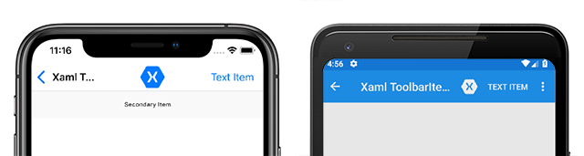
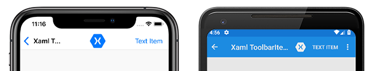
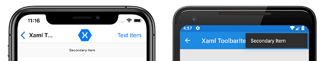

# Xamarin.Forms ToolbarItem

[ Download the sample](/samples/xamarin/xamarin-forms-samples/userinterface-toolbaritem/)

The Xamarin.Forms [`ToolbarItem`](xref:Xamarin.Forms.ToolbarItem) class is a special type of button that can be added to a `Page` object's `ToolbarItems` collection. Each `ToolbarItem` object will appear as a button in the application's navigation bar. A `ToolbarItem` instance can have an icon and appear as a primary or secondary menu item. The `ToolbarItem` class inherits from [`MenuItem`](xref:Xamarin.Forms.MenuItem).

The following screenshots show `ToolbarItem` objects in the navigation bar on iOS and Android:



The `ToolbarItem` class defines the following properties:

* [`Order`](xref:Xamarin.Forms.ToolbarItem.Order) is a `ToolbarItemOrder` enum value that determines whether the `ToolbarItem` instance displays in the primary or secondary menu.
* [`Priority`](xref:Xamarin.Forms.ToolbarItem.Priority) is an `integer` value that determines the display order of items in a `Page` object's `ToolbarItems` collection.

The `ToolbarItem` class inherits the following typically-used properties from the `MenuItem` class:

* [`Command`](xref:Xamarin.Forms.MenuItem.Command) is an `ICommand` that allows binding user actions, such as finger taps or clicks, to commands defined on a viewmodel.
* [`CommandParameter`](xref:Xamarin.Forms.MenuItem.CommandParameter) is an `object` that specifies the parameter that should be passed to the `Command`.
* [`IconImageSource`](xref:Xamarin.Forms.MenuItem.IconImageSource) is an `ImageSource` value that determines the display icon on a `ToolbarItem` object.
* [`Text`](xref:Xamarin.Forms.MenuItem.Text) is a `string` that determines the display text on a `ToolbarItem` object.

These properties are backed by [`BindableProperty`](xref:Xamarin.Forms.BindableProperty) objects so a `ToolbarItem` instance can be the target of data bindings.

> [!NOTE]
> An alternative to creating a toolbar from [`ToolbarItem`](xref:Xamarin.Forms.ToolbarItem) objects is to set the [`NavigationPage.TitleView`](xref:Xamarin.Forms.NavigationPage.TitleViewProperty) attached property to a layout class that contains multiple views. For more information, see [Displaying Views in the Navigation Bar](~/xamarin-forms/app-fundamentals/navigation/hierarchical.md#displaying-views-in-the-navigation-bar).

## Create a ToolbarItem

A `ToolbarItem` object can be instantiated in XAML. The `Text` and `IconImageSource` properties can be set to determine how the button is displayed in the navigation bar. The following example shows how to instantiate a `ToolbarItem` with some common properties set, and add it to a `ContentPage`'s `ToolbarItems` collection:

```xaml
<ContentPage.ToolbarItems>
    <ToolbarItem Text="Example Item"
                 IconImageSource="example_icon.png"
                 Order="Primary"
                 Priority="0" />
</ContentPage.ToolbarItems>
```

This example will result in a `ToolbarItem` object that has text, an icon and appears first in the primary navigation bar area. A `ToolbarItem` can also be created in code and added to the `ToolbarItems` collection:

```csharp
ToolbarItem item = new ToolbarItem
{
    Text = "Example Item",
    IconImageSource = ImageSource.FromFile("example_icon.png"),
    Order = ToolbarItemOrder.Primary,
    Priority = 0
};

// "this" refers to a Page object
this.ToolbarItems.Add(item);
```

The file represented by the `string`, provided as the `IconImageSource` property, must exist in each platform project.

> [!NOTE]
> Image assets are handled differently on each platform. An `ImageSource` can come from sources including a local file or embedded resource, a URI, or a stream. For more information about setting the `IconImageSource` property and Images in Xamarin.Forms, see [Images in Xamarin.Forms](~/xamarin-forms/user-interface/images.md).

## Define button behavior

The `ToolbarItem` class inherits the `Clicked` event from the `MenuItem` class. An event handler can be attached to the `Clicked` event to react to taps or clicks on `ToolbarItem` instances in XAML:

```xaml
<ToolbarItem ...
             Clicked="OnItemClicked" />
```

An event handler can also be attached in code:

```csharp
ToolbarItem item = new ToolbarItem { ... }
item.Clicked += OnItemClicked;
```

Previous examples referenced an `OnItemClicked` event handler. The following code shows an example implementation:

```csharp
void OnItemClicked(object sender, EventArgs e)
{
    ToolbarItem item = (ToolbarItem)sender;
    messageLabel.Text = $"You clicked the \"{item.Text}\" toolbar item.";
}
```

`ToolbarItem` objects can also use the `Command` and `CommandParameter` properties to react to user input without event handlers. For more information about the `ICommand` interface and MVVM data-binding, see [Xamarin.Forms MenuItem MVVM Behavior](~/xamarin-forms/user-interface/menuitem.md#define-menuitem-behavior-with-mvvm).

## Enable or disable a ToolbarItem at runtime

To enable of disable a `ToolbarItem` at runtime, bind its `Command` property to an `ICommand` implementation, and ensure that a `canExecute` delegate enables and disables the `ICommand` as appropriate.

For more information, see [Enable or disable a MenuItem at runtime](menuitem.md#enable-or-disable-a-menuitem-at-runtime).

## Primary and secondary menus

The `ToolbarItemOrder` enum has `Default`, `Primary`, and `Secondary` values.

When the `Order` property is set to `Primary`, the `ToolbarItem` object will appear in the main navigation bar on all platforms. `ToolbarItem` objects are prioritized over the page title, which will be truncated to make room for the items. The following screenshots show `ToolbarItem` objects in the primary menu on iOS and Android:



When the `Order` property is set to `Secondary`, behavior varies across platforms. On UWP and Android, the `Secondary` items menu appears as three dots that can be tapped or clicked to reveal items in a vertical list. On iOS, the `Secondary` items menu appears below the navigation bar as a horizontal list. The following screenshots show a secondary menu on iOS and Android:



> [!WARNING]
> Icon behavior in `ToolbarItem` objects that have their `Order` property set to `Secondary` is inconsistent across platforms. Avoid setting the `IconImageSource` property on items that appear in the secondary menu.

## Related links

* [ToolbarItem Demos](/samples/xamarin/xamarin-forms-samples/userinterface-toolbaritem/)
* [Images in Xamarin.Forms](~/xamarin-forms/user-interface/images.md)
* [Xamarin.Forms MenuItem](~/xamarin-forms/user-interface/menuitem.md)