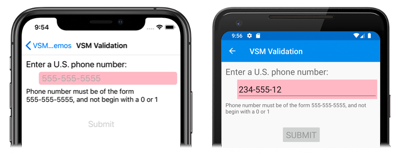
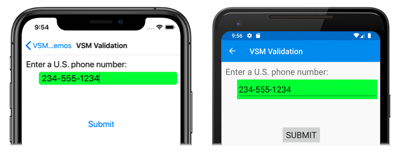

# The Xamarin.Forms Visual State Manager

[ Download the sample](https://developer.xamarin.com/samples/xamarin-forms/UserInterface/VsmDemos/)

_Use the Visual State Manager to make changes to XAML elements based on visual states set from code._

The Visual State Manager (VSM) is new in Xamarin.Forms 3.0. The VSM provides a structured way to make visual changes to the user interface from code. In most cases, the user interface of the application is defined in XAML, and this XAML includes markup describing how the Visual State Manager affects the visuals of the user interface.

The VSM introduces the concept of _visual states_. A Xamarin.Forms view such as a `Button` can have several different visual appearances depending on its underlying state &mdash; whether it's disabled, or pressed, or has input focus. These are the button's states.

Visual states are collected in _visual state groups_. All the visual states within a visual state group are mutually exclusive. Both visual states and visual state groups are identified by simple text strings.

The Xamarin.Forms Visual State Manager defines one visual state group named "CommonStates" with three visual states:

- "Normal"
- "Disabled"
- "Focused"

This visual state group is supported for all classes that derive from [`VisualElement`](xref:Xamarin.Forms.VisualElement), which is the base class for [`View`](xref:Xamarin.Forms.View) and [`Page`](xref:Xamarin.Forms.Page). 

You can also define your own visual state groups and visual states, as this article will demonstrate.

> [!NOTE]
> Xamarin.Forms developers familiar with [triggers](~/xamarin-forms/app-fundamentals/triggers.md) are aware that triggers can also make changes to visuals in the user interface based on changes in a view's properties or the firing of events. However, using triggers to deal with various combinations of these changes can become quite confusing. Historically, the Visual State Manager was introduced in Windows XAML-based environments to alleviate the confusion resulting from combinations of visual states. With the VSM, the visual states within a visual state group are always mutually exclusive. At any time, only one state in each group is the current state.

## The common states

The Visual State Manager allows you to include sections in your XAML file that can change the visual appearance of a view if the view is normal, or disabled, or has the input focus. These are known as the _common states_.

For example, suppose you have an `Entry` view on your page, and you want the visual appearance of the `Entry` to change in the following ways:

- The `Entry` should have a pink background when the `Entry` is disabled.
- The `Entry` should have a lime background normally.
- The `Entry` should expand to twice its normal height when it has input focus.

You can attach the VSM markup to an individual view, or you can define it in a style if it applies to multiple views. The next two sections describe these approaches.

### VSM markup on a view

To attach VSM markup to an `Entry` view, first separate the `Entry` into start and end tags:

```xaml
<Entry FontSize="18">

</Entry>
```

It's given an explicit font size because one of the states will use the `FontSize` property to double the size of the text in the `Entry`.

Next, insert `VisualStateManager.VisualStateGroups` tags between those tags:

```xaml
<Entry FontSize="18">
    <VisualStateManager.VisualStateGroups>

    </VisualStateManager.VisualStateGroups>
</Entry>
```

[`VisualStateGroups`](xref:Xamarin.Forms.VisualStateManager.VisualStateGroupsProperty) is an attached bindable property defined by the [`VisualStateManager`](xref:Xamarin.Forms.VisualStateManager) class. (For more information on attached bindable properties, see the article [Attached properties](~/xamarin-forms/xaml/attached-properties.md).) This is how the `VisualStateGroups` property is attached to the `Entry` object.

The `VisualStateGroups` property is of type [`VisualStateGroupList`](xref:Xamarin.Forms.VisualStateGroupList), which is a collection of [`VisualStateGroup`](xref:Xamarin.Forms.VisualStateGroup) objects. Within the `VisualStateManager.VisualStateGroups` tags, insert a pair of `VisualStateGroup` tags for each group of visual states you wish to include:

```xaml
<Entry FontSize="18">
    <VisualStateManager.VisualStateGroups>
        <VisualStateGroup x:Name="CommonStates">

        </VisualStateGroup>
    </VisualStateManager.VisualStateGroups>
</Entry>
```

Notice that the `VisualStateGroup` tag has an `x:Name` attribute indicating the name of the group. The `VisualStateGroup` class defines a `Name` property that you can use instead:

```xaml
<VisualStateGroup Name="CommonStates">
```

You can use either `x:Name` or `Name` but not both in the same element.

The `VisualStateGroup` class defines a property named [`States`](xref:Xamarin.Forms.VisualStateGroup.States), which is a collection of [`VisualState`](xref:Xamarin.Forms.VisualState) objects. `States` is the _content property_ of `VisualStateGroups` so you can include the `VisualState` tags directly between the `VisualStateGroup` tags. (Content properties are discussed in the article [Essential XAML Syntax](~/xamarin-forms/xaml/xaml-basics/essential-xaml-syntax.md#content-properties).)

The next step is to include a pair of tags for every visual state in that group. These also can be identified using `x:Name` or `Name`:

```xaml
<Entry FontSize="18">
    <VisualStateManager.VisualStateGroups>
        <VisualStateGroup x:Name="CommonStates">
            <VisualState x:Name="Normal">

            </VisualState>

            <VisualState x:Name="Focused">

            </VisualState>

            <VisualState x:Name="Disabled">

            </VisualState>
        </VisualStateGroup>
    </VisualStateManager.VisualStateGroups>
</Entry>
```

`VisualState` defines a property named [`Setters`](xref:Xamarin.Forms.VisualState.Setters), which is a collection of [`Setter`](xref:Xamarin.Forms.Setter) objects. These are the same `Setter` objects that you use in a [`Style`](xref:Xamarin.Forms.Style) object.

`Setters` is _not_ the content property of `VisualState`, so it is necessary to include property element tags for the `Setters` property:

```xaml
<Entry FontSize="18">
    <VisualStateManager.VisualStateGroups>
        <VisualStateGroup x:Name="CommonStates">
            <VisualState x:Name="Normal">
                <VisualState.Setters>

                </VisualState.Setters>
            </VisualState>

            <VisualState x:Name="Focused">
                <VisualState.Setters>
    
                </VisualState.Setters>
            </VisualState>

            <VisualState x:Name="Disabled">
                <VisualState.Setters>

                </VisualState.Setters>
            </VisualState>
        </VisualStateGroup>
    </VisualStateManager.VisualStateGroups>
</Entry>
```

You can now insert one or more `Setter` objects between each pair of `Setters` tags. These are the `Setter` objects that define the visual states described earlier:

```xaml
<Entry FontSize="18">
    <VisualStateManager.VisualStateGroups>
        <VisualStateGroup x:Name="CommonStates">
            <VisualState x:Name="Normal">
                <VisualState.Setters>
                    <Setter Property="BackgroundColor" Value="Lime" />
                </VisualState.Setters>
            </VisualState>

            <VisualState x:Name="Focused">
                <VisualState.Setters>
                    <Setter Property="FontSize" Value="36" />
                </VisualState.Setters>
            </VisualState>

            <VisualState x:Name="Disabled">
                <VisualState.Setters>
                    <Setter Property="BackgroundColor" Value="Pink" />
                </VisualState.Setters>
            </VisualState>
        </VisualStateGroup>
    </VisualStateManager.VisualStateGroups>
</Entry>
```

Each `Setter` tag indicates the value of a particular property when that state is current. Any property referenced by a `Setter` object must be backed by a bindable property.

Markup similar to this is the basis of the **VSM on View** page in the **[VsmDemos](https://developer.xamarin.com/samples/xamarin-forms/UserInterface/VsmDemos/)** sample program. The page includes three `Entry` views, but only the second one has the VSM markup attached to it:

```xaml
<ContentPage xmlns="http://xamarin.com/schemas/2014/forms"
             xmlns:x="http://schemas.microsoft.com/winfx/2009/xaml"
             xmlns:local="clr-namespace:VsmDemos"
             x:Class="VsmDemos.MainPage"
             Title="VSM Demos">

    <StackLayout>
        <StackLayout.Resources>
            <Style TargetType="Entry">
                <Setter Property="Margin" Value="20, 0" />
                <Setter Property="FontSize" Value="18" />
            </Style>

            <Style TargetType="Label">
                <Setter Property="Margin" Value="20, 30, 20, 0" />
                <Setter Property="FontSize" Value="Large" />
            </Style>
        </StackLayout.Resources>

        <Label Text="Normal Entry:" />

        <Entry />

        <Label Text="Entry with VSM: " />

        <Entry>
            <VisualStateManager.VisualStateGroups>
                <VisualStateGroup x:Name="CommonStates">
                    
                    <VisualState x:Name="Normal">
                        <VisualState.Setters>
                            <Setter Property="BackgroundColor" Value="Lime" />
                        </VisualState.Setters>
                    </VisualState>

                    <VisualState x:Name="Focused">
                        <VisualState.Setters>
                            <Setter Property="FontSize" Value="36" />
                        </VisualState.Setters>
                    </VisualState>

                    <VisualState x:Name="Disabled">
                        <VisualState.Setters>
                            <Setter Property="BackgroundColor" Value="Pink" />
                        </VisualState.Setters>
                    </VisualState>
                </VisualStateGroup>
            </VisualStateManager.VisualStateGroups>

            <Entry.Triggers>
                <DataTrigger TargetType="Entry"
                             Binding="{Binding Source={x:Reference entry3},
                                               Path=Text.Length}"
                             Value="0">
                    <Setter Property="IsEnabled" Value="False" />
                </DataTrigger>
            </Entry.Triggers>
        </Entry>

        <Label Text="Entry to enable 2nd Entry:" />

        <Entry x:Name="entry3"
               Text=""
               Placeholder="Type something to enable 2nd Entry" />
    </StackLayout>
</ContentPage>
```

Notice that the second `Entry` also has a `DataTrigger` as part of its `Trigger` collection. This causes the `Entry` to be disabled until something is typed into the third `Entry`. Here's the page at startup running on iOS, Android, and the Universal Windows Platform (UWP):

[](vsm-images/VsmOnViewDisabled-Large.png#lightbox)

The current visual state is "Disabled" so the background of the second `Entry` is pink on the iOS and Android screens. The UWP implementation of `Entry` does not allow setting the background color when the `Entry` is disabled. 

When you enter some text into the third `Entry`, the second `Entry` switches into the "Normal" state, and the background is now lime:

[](vsm-images/VsmOnViewNormal-Large.png#lightbox)

When you touch the second `Entry`, it gets the input focus. It switches to the "Focused" state and expands to twice its height:

[](vsm-images/VsmOnViewFocused-Large.png#lightbox)

Notice that the `Entry` does not retain the lime background when it gets the input focus. As the Visual State Manager switches between the visual states, the properties set by the previous state are unset. Keep in mind that the visual states are mutually exclusive. The "Normal" state does not mean solely that the `Entry` is enabled. It means that the `Entry` is enabled and does not have input focus. 

If you want the `Entry` to have a lime background in the "Focused" state, add another `Setter` to that visual state:

```xaml
<VisualState x:Name="Focused">
    <VisualState.Setters>
        <Setter Property="FontSize" Value="36" />
        <Setter Property="BackgroundColor" Value="Lime" />
    </VisualState.Setters>
</VisualState>
```

In order for these `Setter` objects to work properly, a `VisualStateGroup` must contain `VisualState` objects for all the states in that group. If there is a visual state that does not have any `Setter` objects, include it anyway as an empty tag:

```xaml
<VisualState x:Name="Normal" />
``` 

### Visual State Manager markup in a style

It's often necessary to share the same Visual State Manager markup among two or more views. In this case, you'll want to put the markup in a `Style` definition.

Here's the existing implicit `Style` for the `Entry` elements in the **VSM On View** page:

```xaml
<Style TargetType="Entry">
    <Setter Property="Margin" Value="20, 0" />
    <Setter Property="FontSize" Value="18" />
</Style> 
```

Add `Setter` tags for the `VisualStateManager.VisualStateGroups` attached bindable property:

```xaml
<Style TargetType="Entry">
    <Setter Property="Margin" Value="20, 0" />
    <Setter Property="FontSize" Value="18" />
    <Setter Property="VisualStateManager.VisualStateGroups">

    </Setter>
</Style> 
```

The content property for `Setter` is `Value`, so the value of the `Value` property can be specified directly within those tags. That property is of type `VisualStateGroupList`:

```xaml
<Style TargetType="Entry">
    <Setter Property="Margin" Value="20, 0" />
    <Setter Property="FontSize" Value="18" />
    <Setter Property="VisualStateManager.VisualStateGroups">
        <VisualStateGroupList>

        </VisualStateGroupList>
    </Setter>
</Style> 
```

Within those tags you can include one of more `VisualStateGroup` objects:

```xaml
<Style TargetType="Entry">
    <Setter Property="Margin" Value="20, 0" />
    <Setter Property="FontSize" Value="18" />
    <Setter Property="VisualStateManager.VisualStateGroups">
        <VisualStateGroupList>
            <VisualStateGroup x:Name="CommonStates">

            </VisualStateGroup>
        </VisualStateGroupList>
    </Setter>
</Style> 
```

The remainder of the VSM markup is the same as before.

Here's the **VSM in Style** page showing the complete VSM markup:

```xaml
<ContentPage xmlns="http://xamarin.com/schemas/2014/forms"
             xmlns:x="http://schemas.microsoft.com/winfx/2009/xaml"
             x:Class="VsmDemos.VsmInStylePage"
             Title="VSM in Style">
    <StackLayout>
        <StackLayout.Resources>
            <Style TargetType="Entry">
                <Setter Property="Margin" Value="20, 0" />
                <Setter Property="FontSize" Value="18" />
                <Setter Property="VisualStateManager.VisualStateGroups">
                    <VisualStateGroupList>
                        <VisualStateGroup x:Name="CommonStates">

                            <VisualState x:Name="Normal">
                                <VisualState.Setters>
                                    <Setter Property="BackgroundColor" Value="Lime" />
                                </VisualState.Setters>
                            </VisualState>

                            <VisualState x:Name="Focused">
                                <VisualState.Setters>
                                    <Setter Property="FontSize" Value="36" />
                                    <Setter Property="BackgroundColor" Value="Lime" />
                                </VisualState.Setters>
                            </VisualState>

                            <VisualState x:Name="Disabled">
                                <VisualState.Setters>
                                    <Setter Property="BackgroundColor" Value="Pink" />
                                </VisualState.Setters>
                            </VisualState>
                        </VisualStateGroup>
                    </VisualStateGroupList>
                </Setter>
            </Style>

            <Style TargetType="Label">
                <Setter Property="Margin" Value="20, 30, 20, 0" />
                <Setter Property="FontSize" Value="Large" />
            </Style>
        </StackLayout.Resources>

        <Label Text="Normal Entry:" />

        <Entry />
        
        <Label Text="Entry with VSM: " />

        <Entry>
            <Entry.Triggers>
                <DataTrigger TargetType="Entry"
                             Binding="{Binding Source={x:Reference entry3},
                                               Path=Text.Length}"
                             Value="0">
                    <Setter Property="IsEnabled" Value="False" />
                </DataTrigger>
            </Entry.Triggers>
        </Entry>

        <Label Text="Entry to enable 2nd Entry:" />

        <Entry x:Name="entry3"
               Text=""
               Placeholder="Type something to enable 2nd Entry" />
    </StackLayout>
</ContentPage>
```

Now all the `Entry` views on this page respond the same way to their visual states. Notice also that the "Focused" state now includes a second `Setter` that gives each `Entry` a lime background also when it has input focus:

[](vsm-images/VsmInStyle-Large.png#lightbox)

## Defining your own visual states

Every class that derives from `VisualElement` supports the three common states "Normal", "Focused", and "Disabled". Internally, the [`VisualElement`](https://github.com/xamarin/Xamarin.Forms/blob/master/Xamarin.Forms.Core/VisualElement.cs) class detects when it's becoming enabled or disabled, or focused or unfocused, and calls the static [`VisualStateManager.GoToState`](xref:Xamarin.Forms.VisualStateManager.GoToState(Xamarin.Forms.VisualElement,System.String)) method:

```csharp
VisualStateManager.GoToState(this, "Focused");
```

This is the only Visual State Manager code that you'll find in the `VisualElement` class. Because `GoToState` is called for every object based on every class that derives from `VisualElement`, you can use the Visual State Manager with any `VisualElement` object to respond to these changes.

Interestingly, the name of the visual state group "CommonStates" is not explicitly referenced in `VisualElement`. The group name is not part of the API for the Visual State Manager. Within one of the two sample program shown so far, you can change the name of the group from "CommonStates" to anything else, and the program will still work. The group name is merely a general description of the states in that group. It is implicitly understood that the visual states in any group are mutually exclusive: One state and only one state is current at any time.

If you want to implement your own visual states, you'll need to call `VisualStateManager.GoToState` from code. Most often you'll make this call from the code-behind file of your page class.

The **VSM Validation** page in the **[VsmDemos](https://developer.xamarin.com/samples/xamarin-forms/UserInterface/VsmDemos/)** sample shows how to use the Visual State Manager in connection with input validation. The XAML file consists of two `Label` elements, an `Entry`, and `Button`:

```xaml
<ContentPage xmlns="http://xamarin.com/schemas/2014/forms"
             xmlns:x="http://schemas.microsoft.com/winfx/2009/xaml"
             x:Class="VsmDemos.VsmValidationPage"
             Title="VSM Validation">
    <StackLayout Padding="10, 10">
        
        <Label Text="Enter a U.S. phone number:"
               FontSize="Large" />

        <Entry Placeholder="555-555-5555"
               FontSize="Large"
               Margin="30, 0, 0, 0"
               TextChanged="OnTextChanged" />

        <Label x:Name="helpLabel"
               Text="Phone number must be of the form 555-555-5555, and not begin with a 0 or 1">
            <VisualStateManager.VisualStateGroups>
                <VisualStateGroup Name="ValidityStates">
                    
                    <VisualState Name="Valid">
                        <VisualState.Setters>
                            <Setter Property="TextColor" Value="Transparent" />
                        </VisualState.Setters>
                    </VisualState>

                    <VisualState Name="Invalid" />
                    
                </VisualStateGroup>
            </VisualStateManager.VisualStateGroups>
        </Label>

        <Button x:Name="submitButton"
                Text="Submit"
                FontSize="Large"
                Margin="0, 20"
                VerticalOptions="Center"
                HorizontalOptions="Center">
            <VisualStateManager.VisualStateGroups>
                <VisualStateGroup Name="ValidityStates">
                    
                    <VisualState Name="Valid" />

                    <VisualState Name="Invalid">
                        <VisualState.Setters>
                            <Setter Property="IsEnabled" Value="False" />
                        </VisualState.Setters>
                    </VisualState>
                    
                </VisualStateGroup>
            </VisualStateManager.VisualStateGroups>
        </Button>
    </StackLayout>
</ContentPage>
```

VSM markup is attached to the second `Label` (named `helpLabel`) and the `Button` (named `submitButton`). There are two mutually-exclusive states, named "Valid" and "Invalid". Notice that each of the two "ValidationState" groups contains `VisualState` tags for both "Valid" and "Invalid", although one of them is empty in each case. 

If the `Entry` does not contain a valid phone number, then the current state is "Invalid", and so the second `Label` is visible and the `Button` is disabled:

[](vsm-images/VsmValidationInvalid-Large.png#lightbox)

When a valid phone number is entered, then the current state becomes "Valid". The second `Entry` disappears and the `Button` is now enabled:

[](vsm-images/VsmValidationValid-Large.png#lightbox)

The code-behind file is reponsible for handling the `TextChanged` event from the `Entry`. The handler uses a regular expression to determine if the input string is valid or not. The method in the code-behind file named `GoToState` calls the static `VisualStateManager.GoToState` method for both `helpLabel` and `submitButton`:

```csharp
public partial class VsmValidationPage : ContentPage
{
    public VsmValidationPage ()
    {
        InitializeComponent ();

        GoToState(false);
    }

    void OnTextChanged(object sender, TextChangedEventArgs args)
    {
        bool isValid = Regex.IsMatch(args.NewTextValue, @"^[2-9]\d{2}-\d{3}-\d{4}$");
        GoToState(isValid);
    }

    void GoToState(bool isValid)
    {
        string visualState = isValid ? "Valid" : "Invalid";
        VisualStateManager.GoToState(helpLabel, visualState);
        VisualStateManager.GoToState(submitButton, visualState);
    }
}
```

Notice also that the `GoToState` method is called from the constructor to initialize the state. There should always be a current state. But nowhere in the code is there any reference to the name of the visual state group, although it's referenced in the XAML as "ValidationStates" for purposes of clarity. 

Notice that the code-behind file must take account of every object on the page that is affected by these visual states, and to call `VisualStateManager.GoToState` for each of these objects. In this example, it's only two objects (the `Label` and the `Button`), but it could be several more.

You might wonder: If the code-behind file must reference every object on the page that is affected by these visual states, why can't the code-behind file simply access the objects directly? It surely could. However, the advantage of using the VSM is that you can control how visual elements react to different state entirely in XAML, which keeps all of the UI design in one location. This avoids setting visual appearance by accessing visual elements directly from the code-behind.

It might be tempting to consider deriving a class from `Entry` and perhaps defining a property that you can set to an external validation function. The class that derives from `Entry` can then call the `VisualStateManager.GoToState` method. This scheme would work fine, but only if the `Entry` were the only object affected by the different visual states. In this example, a `Label` and a `Button` are also be affected. There is no way for VSM markup attached to an `Entry` to control other objects on the page, and no way for VSM markup attached to these other objects to reference a change in visual state from another object.

<a name="adaptive-layout" />

## Using the Visual State Manager for adaptive layout

A Xamarin.Forms application running on a phone can usually be viewed in a portrait or landscape aspect ratio, and a Xamarin.Forms program running on the desktop can be resized to assume many different sizes and aspect ratios. A well-designed application might display its content differently for these various page or window form factors. 

This technique is sometimes known as _adaptive layout_. Because adaptive layout solely involves a program's visuals, it is an ideal application of the Visual State Manager.

A simple example is an application that displays a small collection of buttons that affect the application's content. In portrait mode, these buttons might be displayed in a horizontal row on the top of the page:

[](vsm-images/VsmAdaptiveLayoutPortrait-Large.png#lightbox)

In landscape mode, the array of buttons might be moved to one side, and displayed in a column:

[](vsm-images/VsmAdaptiveLayoutLandscape-Large.png#lightbox)

From top to bottom, the program is running on the Universal Windows Platform, Android, and iOS.

The **VSM Adaptive Layout** page in the [VsmDemos](https://developer.xamarin.com/samples/xamarin-forms/UserInterface/VsmDemos/) sample defines a group named "OrientationStates" with two visual states named "Portrait" and "Landscape". (A more complex approach might be based on several different page or window widths.) 

VSM markup occurs in four places in the XAML file. The `StackLayout` named `mainStack` contains both the menu and the content, which is an `Image` element. This `StackLayout` should have a vertical orientation in portrait mode and a horizontal orientation in landscape mode:

```xaml
<ContentPage xmlns="http://xamarin.com/schemas/2014/forms"
             xmlns:x="http://schemas.microsoft.com/winfx/2009/xaml"
             x:Class="VsmDemos.VsmAdaptiveLayoutPage"
             Title="VSM Adaptive Layout">

    <StackLayout x:Name="mainStack">
        <VisualStateManager.VisualStateGroups>
            <VisualStateGroup Name="OrientationStates">

                <VisualState Name="Portrait">
                    <VisualState.Setters>
                        <Setter Property="Orientation" Value="Vertical" />
                    </VisualState.Setters>
                </VisualState>

                <VisualState Name="Landscape">
                    <VisualState.Setters>
                        <Setter Property="Orientation" Value="Horizontal" />
                    </VisualState.Setters>
                </VisualState>
            </VisualStateGroup>
        </VisualStateManager.VisualStateGroups>
        
        <ScrollView x:Name="menuScroll">
            <VisualStateManager.VisualStateGroups>
                <VisualStateGroup Name="OrientationStates">
                    
                    <VisualState Name="Portrait">
                        <VisualState.Setters>
                            <Setter Property="Orientation" Value="Horizontal" />
                        </VisualState.Setters>
                    </VisualState>

                    <VisualState Name="Landscape">
                        <VisualState.Setters>
                            <Setter Property="Orientation" Value="Vertical" />
                        </VisualState.Setters>
                    </VisualState>
                </VisualStateGroup>
            </VisualStateManager.VisualStateGroups>
            
            <StackLayout x:Name="menuStack">
                <VisualStateManager.VisualStateGroups>
                    <VisualStateGroup Name="OrientationStates">

                        <VisualState Name="Portrait">
                            <VisualState.Setters>
                                <Setter Property="Orientation" Value="Horizontal" />
                            </VisualState.Setters>
                        </VisualState>

                        <VisualState Name="Landscape">
                            <VisualState.Setters>
                                <Setter Property="Orientation" Value="Vertical" />
                            </VisualState.Setters>
                        </VisualState>
                    </VisualStateGroup>
                </VisualStateManager.VisualStateGroups>

                <StackLayout.Resources>
                    <Style TargetType="Button">
                        <Setter Property="VisualStateManager.VisualStateGroups">
                            <VisualStateGroupList>
                                <VisualStateGroup Name="OrientationStates">

                                    <VisualState Name="Portrait">
                                        <VisualState.Setters>
                                            <Setter Property="HorizontalOptions" Value="CenterAndExpand" />
                                            <Setter Property="Margin" Value="10, 5" />
                                        </VisualState.Setters>
                                    </VisualState>

                                    <VisualState Name="Landscape">
                                        <VisualState.Setters>
                                            <Setter Property="VerticalOptions" Value="CenterAndExpand" />
                                            <Setter Property="HorizontalOptions" Value="Center" />
                                            <Setter Property="Margin" Value="10" />
                                        </VisualState.Setters>
                                    </VisualState>
                                </VisualStateGroup>
                            </VisualStateGroupList>
                        </Setter>
                    </Style>
                </StackLayout.Resources>

                <Button Text="Banana"
                        Command="{Binding SelectedCommand}"
                        CommandParameter="Banana.jpg" />
                
                <Button Text="Face Palm"
                        Command="{Binding SelectedCommand}"
                        CommandParameter="FacePalm.jpg" />
                
                <Button Text="Monkey"
                        Command="{Binding SelectedCommand}"
                        CommandParameter="monkey.png" />
                
                <Button Text="Seated Monkey"
                        Command="{Binding SelectedCommand}"
                        CommandParameter="SeatedMonkey.jpg" />
            </StackLayout>
        </ScrollView>

        <Image x:Name="image"
               VerticalOptions="FillAndExpand"
               HorizontalOptions="FillAndExpand" />
    </StackLayout>
</ContentPage>
```

The inner `ScrollView` named `menuScroll` and the `StackLayout` named `menuStack` implement the menu of buttons. The orientation of these layouts is opposite of `mainStack`. The menu should be horizontal in portrait mode and vertical in landscape mode.

The fourth section of VSM markup is in an implicit style for the buttons themselves. This markup sets `VerticalOptions`, `HorizontalOptions`, and `Margin` properties specific to the portait and landscape orientations.

The code-behind file sets the `BindingContext` property of `menuStack` to implement `Button` commanding, and also attaches a handler to the `SizeChanged` event of the page:

```csharp
public partial class VsmAdaptiveLayoutPage : ContentPage
{
    public VsmAdaptiveLayoutPage ()
    {
        InitializeComponent ();

        SizeChanged += (sender, args) =>
        {
            string visualState = Width > Height ? "Landscape" : "Portrait";
            VisualStateManager.GoToState(mainStack, visualState);
            VisualStateManager.GoToState(menuScroll, visualState);
            VisualStateManager.GoToState(menuStack, visualState);

            foreach (View child in menuStack.Children)
            {
                VisualStateManager.GoToState(child, visualState);
            }
        };

        SelectedCommand = new Command<string>((filename) =>
        {
            image.Source = ImageSource.FromResource("VsmDemos.Images." + filename);
        });

        menuStack.BindingContext = this;
    }

    public ICommand SelectedCommand { private set; get; }
}
```

The `SizeChanged` handler calls `VisualStateManager.GoToState` for the two `StackLayout` and `ScrollView` elements, and then loops through the children of `menuStack` to call `VisualStateManager.GoToState` for the `Button` elements.

It may seem as if the code-behind file can handle orientation changes more directly by setting properties of elements in the XAML file, but the Visual State Manager is definitely a more structured approach. All the visuals are kept in the XAML file, where they become easier to examine, maintain, and modify.

## Visual State Manager with Xamarin.University

> [!VIDEO https://youtube.com/embed/qhUHbVP5mIQ]

**Xamarin.Forms 3.0 Visual State Manager, by [Xamarin University](https://university.xamarin.com/)**

## Related links

- [VsmDemos](https://developer.xamarin.com/samples/xamarin-forms/UserInterface/VsmDemos/)

