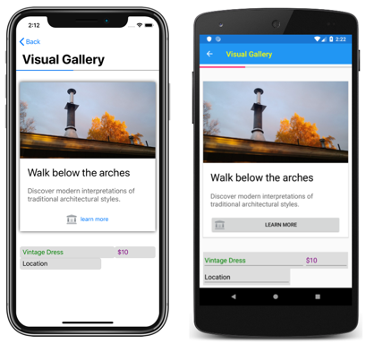
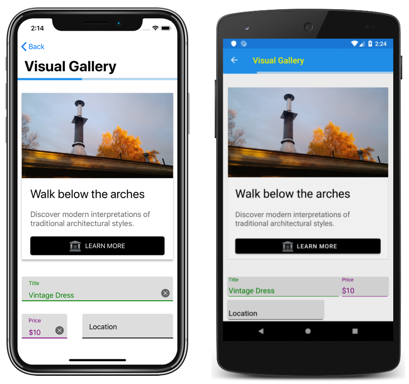

# Xamarin.Forms Visual


_This article introduces Xamarin.Forms Visual, which renders views identically, or largely identically, on iOS and Android._

Many developers want to create Xamarin.Forms applications that look identical, or largely identical, on iOS and Android. Xamarin.Forms 4.0-pre1 includes a mechanism for including additional renderers that implement a visual appearance, with applications opting into the appearance through a `Visual` property:

```xaml
<ContentPage ...
             Visual="Material">
    ...
</ContentPage>    
```

Renderers that implement the visual appearance are then used to renderer views, rather than the default renderers. At renderer selection time, the `Visual` property of the view is inspected and included in the renderer selection process. In addition, if the `Visual` property changes at runtime, the specified renderer is recreated along with any children.

> [!IMPORTANT]
> The `Visual` property is defined in the `VisualElement` class, with views inheriting the `Visual` property value from their parents. Therefore, setting the `Visual` property on a `ContentPage` ensures that any supported views in the page will use that visual appearance. In addition, the `Visual` property can be overridden on a view.

Xamarin.Forms 4.0-pre1 includes an experimental visual appearance based on material design, with the renderers being known as the material renderers. Material renderers are currently included for the following views on iOS and Android:

- [`Button`](xref:Xamarin.Forms.Button)
- [`Entry`](xref:Xamarin.Forms.Entry)
- [`Frame`](xref:Xamarin.Forms.Frame)
- [`ProgressBar`](xref:Xamarin.Forms.ProgressBar)

Functionally, the material renderers are no different to the default renderers. However, they are currently experimental and can only be used by adding the following line of code to your `AppDelegate` class on iOS, or to your `MainActivity` class on Android, before calling `Forms.Init`:

```csharp
Forms.SetFlags("Visual_Experimental");
```

In addition, on iOS, your platform project must have the [Xamarin.iOS.MaterialComponents](https://www.nuget.org/packages/Xamarin.iOS.MaterialComponents/) NuGet package installed. On Android, Visual works with API 29 only, your platform project must use v28 of the support libraries, and set its theme to inherit from a Material Components theme or continue to inherit from an AppCompat theme while adding some new theme attributes to the theme. For more information, see [Getting started with Material Components for Android](https://github.com/material-components/material-components-android/blob/master/docs/getting-started.md).

The following screenshots show a user interface that includes the four views for which material renderers exist, but rendered using the default renderers:

[](visual-images/default-renderers-large.png#lightbox)

The following screenshots show the same user interface rendered using the material renderers:

[](visual-images/material-renderers-large.png#lightbox)

> [!NOTE]
> With material renderers the rendered controls remain native controls, and therefore there will still be user interface differences between platforms for areas such as fonts, shadows, colors, and elevation.

## Related Links

- [Custom Renderers](~/xamarin-forms/app-fundamentals/custom-renderer/index.md)
