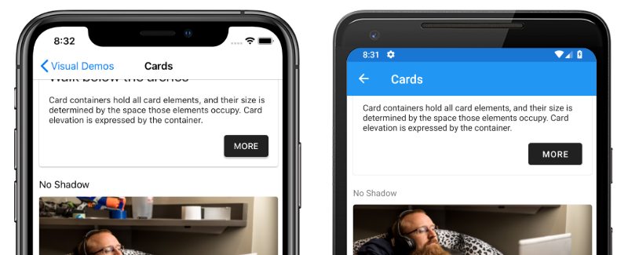

# Xamarin.Forms Material Visual

[ Download the sample](/samples/xamarin/xamarin-forms-samples/userinterface-visualdemos)

[Material Design](https://material.io) is an opinionated design system created by Google, that prescribes the size, color, spacing, and other aspects of how views and layouts should look and behave.

Xamarin.Forms Material Visual can be used to apply Material Design rules to Xamarin.Forms applications, creating applications that look largely identical on iOS and Android. When Material Visual is enabled, supported views adopt the same design cross-platform, creating a unified look and feel.

[](material-visual-images/material-visual.png#lightbox)

The process for enabling Xamarin.Forms Material Visual in your application is:

1. Add the [Xamarin.Forms.Visual.Material](https://www.nuget.org/packages/Xamarin.Forms.Visual.Material/) NuGet package to your iOS and Android platform projects. This NuGet package delivers optimized Material Design renderers on iOS and Android. On iOS, the package provides the transitive dependency to [Xamarin.iOS.MaterialComponents](https://www.nuget.org/packages/Xamarin.iOS.MaterialComponents), which is a C# binding to Google's [Material Components for iOS](https://material.io/develop/ios/). On Android, the package provides build targets to ensure that your TargetFramework is correctly set up.
1. Initialize Material Visual in each platform project. For more information, see [Initialize Material Visual](#initialize-material-visual).
1. Create Material Visual controls by setting the [`Visual`](xref:Xamarin.Forms.VisualElement.Visual) property to `Material` on any pages that should adopt the Material Design rules. For more information, see [Consume Material renderers](#apply-material-visual).
1. [optional] Customize Material controls. For more information, see [Customize Material controls](#customize-material-visual).

> [!IMPORTANT]
> On Android, Material Visual requires a minimum version of 5.0 (API 21) or greater, and a TargetFramework of version 9.0 (API 28). In addition, your platform project requires Android support libraries 28.0.0 or greater, and its theme needs to inherit from a Material Components theme or continue to inherit from an AppCompat theme. For more information, see [Getting started with Material Components for Android](https://github.com/material-components/material-components-android/blob/master/docs/getting-started.md).

Material Visual currently supports the following controls:

- [`ActivityIndicator`](xref:Xamarin.Forms.ActivityIndicator)
- [`Button`](xref:Xamarin.Forms.Button)
- [`CheckBox`](xref:Xamarin.Forms.CheckBox)
- [`DatePicker`](xref:Xamarin.Forms.DatePicker)
- [`Editor`](xref:Xamarin.Forms.Editor)
- [`Entry`](xref:Xamarin.Forms.Entry)
- [`Frame`](xref:Xamarin.Forms.Frame)
- [`Picker`](xref:Xamarin.Forms.Picker)
- [`ProgressBar`](xref:Xamarin.Forms.ProgressBar)
- [`Slider`](xref:Xamarin.Forms.Slider)
- [`Stepper`](xref:Xamarin.Forms.Stepper)
- [`TimePicker`](xref:Xamarin.Forms.TimePicker)

Material controls are realized by Material renderers, which apply the Material Design rules. Functionally, Material renderers are no different to the default renderers. For more information, see [Customize Material Visual](#customize-material-visual).

## Initialize Material Visual

After installing the [Xamarin.Forms.Visual.Material](https://www.nuget.org/packages/Xamarin.Forms.Visual.Material/) NuGet package, the Material renderers must be initialized in each platform project.

On iOS, this should occur in **AppDelegate.cs** by invoking the `Xamarin.Forms.FormsMaterial.Init` method *after* the `Xamarin.Forms.Forms.Init` method:

```csharp
global::Xamarin.Forms.Forms.Init();
global::Xamarin.Forms.FormsMaterial.Init();
```

On Android, this should occur in **MainActivity.cs** by invoking the `Xamarin.Forms.FormsMaterial.Init` method *after* the `Xamarin.Forms.Forms.Init` method:

```csharp
global::Xamarin.Forms.Forms.Init(this, savedInstanceState);
global::Xamarin.Forms.FormsMaterial.Init(this, savedInstanceState);
```

## Apply Material Visual

Applications can enable Material Visual by setting the [`VisualElement.Visual`](xref:Xamarin.Forms.VisualElement.Visual) property on a page, layout, or view, to `Material`:

```xaml
<ContentPage Visual="Material"
             ...>
    ...
</ContentPage>
```

The equivalent C# code is:

```csharp
ContentPage contentPage = new ContentPage();
contentPage.Visual = VisualMarker.Material;
```

Setting the `VisualElement.Visual` property to `Material` directs your application to use the Material Visual renderers instead of the default renderers. The [`Visual`](xref:Xamarin.Forms.VisualElement.Visual) property can be set to any type that implements `IVisual`, with the [`VisualMarker`](xref:Xamarin.Forms.VisualMarker) class providing the following `IVisual` properties:

- `Default` – indicates that the view should render using the default renderer.
- `MatchParent` – indicates that the view should use the same renderer as its direct parent.
- `Material` – indicates that the view should render using a Material renderer.

> [!IMPORTANT]
> The [`Visual`](xref:Xamarin.Forms.VisualElement.Visual) property is defined in the [`VisualElement`](xref:Xamarin.Forms.VisualElement) class, with views inheriting the `Visual` property value from their parents. Therefore, setting the `Visual` property on a [`ContentPage`](xref:Xamarin.Forms.ContentPage) ensures that any supported views in the page will use that Visual. In addition, the `Visual` property can be overridden on a view.

The following screenshots show a user interface rendered using the default renderers:

[](material-visual-images/default-renderers-large.png#lightbox)

The following screenshots show the same user interface rendered using the Material renderers:

[](material-visual-images/material-renderers-large.png#lightbox)

The main visible differences between the default renderers and Material renderers, shown here, are that the Material renderers capitalize [`Button`](xref:Xamarin.Forms.Button) text, and round the corners of [`Frame`](xref:Xamarin.Forms.Frame) borders. However, Material renderers use native controls, and therefore there may still be user interface differences between platforms for areas such as fonts, shadows, colors, and elevation.

> [!NOTE]
> Material Design components adhere closely to Google's guidelines. As a result, Material Design renderers are biased towards that sizing and behavior. When you require greater control of styles or behavior, you can still create your own [Effect](~/xamarin-forms/app-fundamentals/effects/index.md), [Behavior](~/xamarin-forms/app-fundamentals/behaviors/index.md), or [Custom Renderer](~/xamarin-forms/app-fundamentals/custom-renderer/index.md) to achieve the detail you require.

## Customize Material Visual

The Material Visual NuGet package is a collection of renderers that realize the Xamarin.Forms controls. Customizing Material Visual controls is identical to customizing default controls.

Effects are the recommended technique when the goal is to customize an existing control. If a Material Visual renderer exists, it is less work to customize the control with an effect than it is to subclass the renderer. For more information about effects see [Xamarin.Forms effects](~/xamarin-forms/app-fundamentals/effects/index.md).

Custom renderers are the recommended technique when a Material renderer does not exist. The following renderer classes are included with Material Visual:

- `MaterialButtonRenderer`
- `MaterialCheckBoxRenderer`
- `MaterialEntryRenderer`
- `MaterialFrameRenderer`
- `MaterialProgressBarRenderer`
- `MaterialDatePickerRenderer`
- `MaterialTimePickerRenderer`
- `MaterialPickerRenderer`
- `MaterialActivityIndicatorRenderer`
- `MaterialEditorRenderer`
- `MaterialSliderRenderer`
- `MaterialStepperRenderer`

Subclassing a Material renderer is almost identical to non-Material renderers. However, when exporting a renderer that subclasses a Material renderer, you must provide a third argument to the `ExportRenderer` attribute that specifies the `VisualMarker.MaterialVisual` type:

```csharp
using Xamarin.Forms.Material.Android;

[assembly: ExportRenderer(typeof(ProgressBar), typeof(CustomMaterialProgressBarRenderer), new[] { typeof(VisualMarker.MaterialVisual) })]
namespace MyApp.Android
{
    public class CustomMaterialProgressBarRenderer : MaterialProgressBarRenderer
    {
        //...
    }
}
```

In this example, the `ExportRendererAttribute` specifies that the `CustomMaterialProgressBarRenderer` class will be used to render the [`ProgressBar`](xref:Xamarin.Forms.ProgressBar) view, with the `IVisual` type registered as the third argument.

> [!NOTE]
> A renderer that specifies an `IVisual` type, as part of its `ExportRendererAttribute`, will be used to render opted in views, rather than the default renderer. At renderer selection time, the `Visual` property of the view is inspected and included in the renderer selection process.

For more information about custom renderers, see [Custom Renderers](~/xamarin-forms/app-fundamentals/custom-renderer/index.md).

## Related links

- [Material Visual (sample)](/samples/xamarin/xamarin-forms-samples/userinterface-visualdemos)
- [Create a Xamarin.Forms Visual Renderer](create.md)
- [Xamarin.Forms Effects](~/xamarin-forms/app-fundamentals/effects/index.md)
- [Custom Renderers](~/xamarin-forms/app-fundamentals/custom-renderer/index.md)