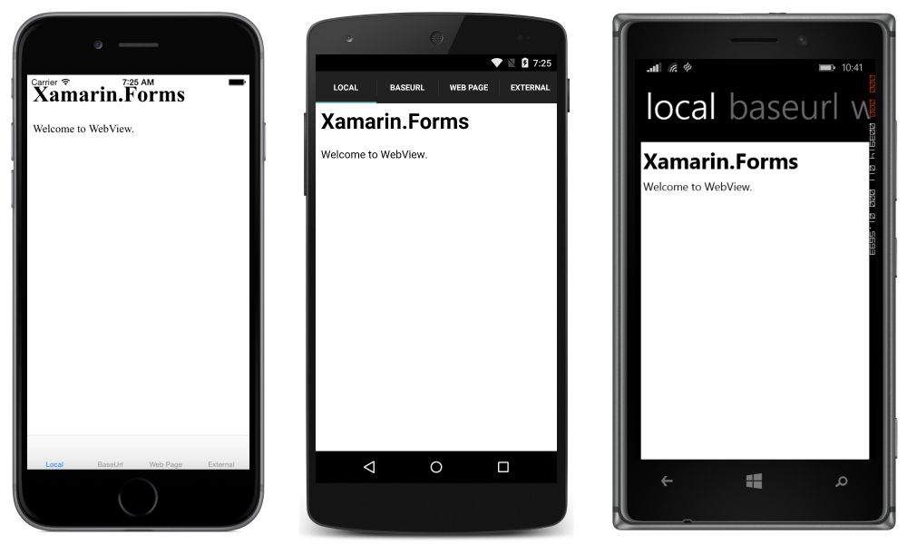
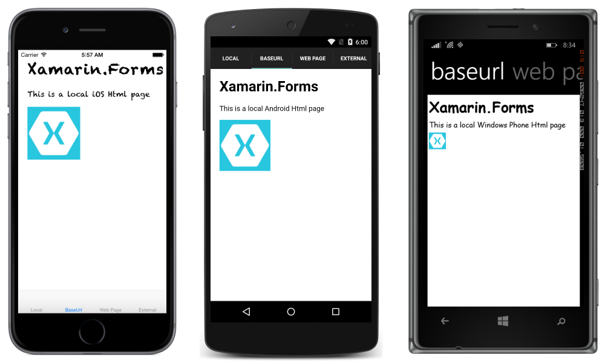
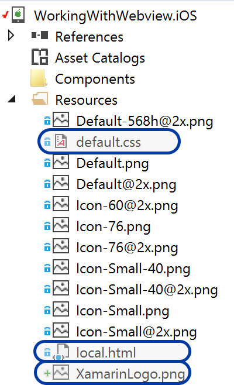
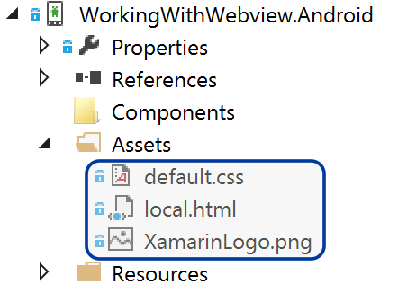
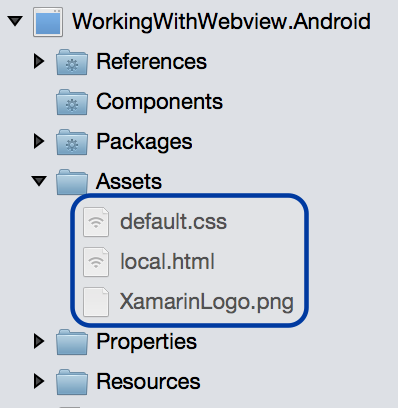
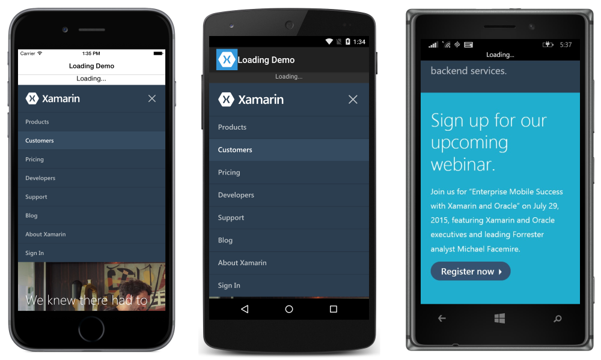
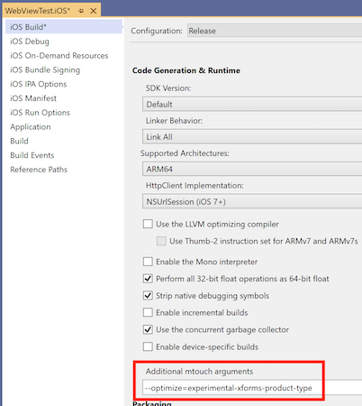
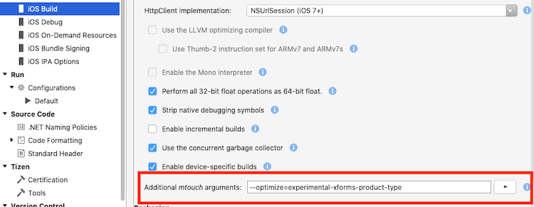

# Xamarin.Forms WebView

[ Download the sample](/samples/xamarin/xamarin-forms-samples/workingwithwebview)

[`WebView`](xref:Xamarin.Forms.WebView) is a view for displaying web and HTML content in your app:


## Content

`WebView` supports the following types of content:

- HTML & CSS websites &ndash; WebView has full support for websites written using HTML & CSS, including JavaScript support.
- Documents &ndash; Because WebView is implemented using native components on each platform, WebView is capable of showing documents in the formats that are supported by the underlying platform.
- HTML strings &ndash; WebView can show HTML strings from memory.
- Local Files &ndash; WebView can present any of the content types above embedded in the app.

> [!NOTE]
> `WebView` on Windows does not support Silverlight, Flash or any ActiveX controls, even if they are supported by Internet Explorer on that platform.

### Websites

To display a website from the internet, set the `WebView`'s [`Source`](xref:Xamarin.Forms.WebViewSource) property to a string URL:

```csharp
var browser = new WebView
{
  Source = "https://dotnet.microsoft.com/apps/xamarin"
};
```

> [!NOTE]
> URLs must be fully formed with the protocol specified (i.e. it must have "http://" or "https://" prepended to it).

#### iOS and ATS

Since version 9, iOS will only allow your application to communicate with servers that implement best-practice security by default. Values must be set in `Info.plist` to enable communication with unsecure servers.

> [!NOTE]
> If your application requires a connection to an unsecure website, you should always enter the domain as an exception using `NSExceptionDomains` instead of turning ATS off completely using `NSAllowsArbitraryLoads`. `NSAllowsArbitraryLoads` should only be used in extreme emergency situations.

The following demonstrates how to enable a specific domain (in this case xamarin.com) to bypass ATS requirements:

```xml
<key>NSAppTransportSecurity</key>
    <dict>
        <key>NSExceptionDomains</key>
        <dict>
            <key>xamarin.com</key>
            <dict>
                <key>NSIncludesSubdomains</key>
                <true/>
                <key>NSTemporaryExceptionAllowsInsecureHTTPLoads</key>
                <true/>
                <key>NSTemporaryExceptionMinimumTLSVersion</key>
                <string>TLSv1.1</string>
            </dict>
        </dict>
    </dict>
    ...
</key>
```

It is best practice to only enable some domains to bypass ATS, allowing you to use trusted sites while benefitting from the additional security on untrusted domains. The following demonstrates the less secure method of disabling ATS for the app:

```xml
<key>NSAppTransportSecurity</key>
    <dict>
        <key>NSAllowsArbitraryLoads </key>
        <true/>
    </dict>
    ...
</key>
```

See [App Transport Security](~/ios/app-fundamentals/ats.md) for more information about this new feature in iOS 9.

### HTML Strings

If you want to present a string of HTML defined dynamically in code, you'll need to create an instance of [`HtmlWebViewSource`](xref:Xamarin.Forms.HtmlWebViewSource):

```csharp
var browser = new WebView();
var htmlSource = new HtmlWebViewSource();
htmlSource.Html = @"<html><body>
  <h1>Xamarin.Forms</h1>
  <p>Welcome to WebView.</p>
  </body></html>";
browser.Source = htmlSource;
```



In the above code, `@` is used to mark the HTML as a [verbatim string literal](/dotnet/csharp/programming-guide/strings/#regular-and-verbatim-string-literals), meaning most escape characters are ignored.

> [!NOTE]
> It may be necessary to set the `WidthRequest` and `HeightRequest` properties of the [`WebView`](xref:Xamarin.Forms.WebView) to see the HTML content, depending upon the layout the `WebView` is a child of. For example, this is required in a [`StackLayout`](xref:Xamarin.Forms.StackLayout).

### Local HTML Content

WebView can display content from HTML, CSS and JavaScript embedded within the app. For example:

```html
<html>
  <head>
    <title>Xamarin Forms</title>
  </head>
  <body>
    <h1>Xamarin.Forms</h1>
    <p>This is an iOS web page.</p>
    
  </body>
</html>
```

CSS:

```css
html,body {
  margin:0;
  padding:10;
}
body,p,h1 {
  font-family: Chalkduster;
}
```

Note that the fonts specified in the above CSS will need to be customized for each platform, as not every platform has the same fonts.

To display local content using a `WebView`, you'll need to open the HTML file like any other, then load the contents as a string into the `Html` property of an `HtmlWebViewSource`. For more information on opening files, see [Working with Files](~/xamarin-forms/data-cloud/data/files.md).

The following screenshots show the result of displaying local content on each platform:



Although the first page has been loaded, the `WebView` has no knowledge of where the HTML came from. That is a problem when dealing with pages that reference local resources. Examples of when that might happen include when local pages link to each other, a page makes use of a separate JavaScript file, or a page links to a CSS stylesheet.  

To solve this, you need to tell the `WebView` where to find files on the filesystem. Do that by setting the `BaseUrl` property on the `HtmlWebViewSource` used by the `WebView`.

Because the filesystem on each of the operating systems is different, you need to determine that URL on each platform. Xamarin.Forms exposes the `DependencyService` for resolving dependencies at runtime on each platform.

To use the `DependencyService`, first define an interface that can be implemented on each platform:

```csharp
public interface IBaseUrl { string Get(); }
```

Note that until the interface is implemented on each platform, the app will not run. In the common project, make sure that you remember to set the `BaseUrl` using the `DependencyService`:

```csharp
var source = new HtmlWebViewSource();
source.BaseUrl = DependencyService.Get<IBaseUrl>().Get();
```

Implementations of the interface for each platform must then be provided.

#### iOS

On iOS, the web content should be located in the project's root directory or **Resources** directory with build action *BundleResource*, as demonstrated below:

# [Visual Studio](#tab/windows)



# [Visual Studio for Mac](#tab/macos)


-----

The `BaseUrl` should be set to the path of the main bundle:

```csharp
[assembly: Dependency (typeof (BaseUrl_iOS))]
namespace WorkingWithWebview.iOS
{
  public class BaseUrl_iOS : IBaseUrl
  {
    public string Get()
    {
      return NSBundle.MainBundle.BundlePath;
    }
  }
}
```

#### Android

On Android, place HTML, CSS, and images in the Assets folder with build action *AndroidAsset* as demonstrated below:

# [Visual Studio](#tab/windows)



# [Visual Studio for Mac](#tab/macos)



-----

On Android, the `BaseUrl` should be set to `"file:///android_asset/"`:

```csharp
[assembly: Dependency (typeof(BaseUrl_Android))]
namespace WorkingWithWebview.Android
{
  public class BaseUrl_Android : IBaseUrl
  {
    public string Get()
    {
      return "file:///android_asset/";
    }
  }
}
```

On Android, files in the **Assets** folder can also be accessed through the current Android context, which is exposed by the `MainActivity.Instance` property:

```csharp
var assetManager = MainActivity.Instance.Assets;
using (var streamReader = new StreamReader (assetManager.Open ("local.html")))
{
  var html = streamReader.ReadToEnd ();
}
```

#### Universal Windows Platform

On Universal Windows Platform (UWP) projects, place HTML, CSS and images in the project root with the build action set to *Content*.

The `BaseUrl` should be set to `"ms-appx-web:///"`:

```csharp
[assembly: Dependency(typeof(BaseUrl))]
namespace WorkingWithWebview.UWP
{
    public class BaseUrl : IBaseUrl
    {
        public string Get()
        {
            return "ms-appx-web:///";
        }
    }
}
```

## Navigation

WebView supports navigation through several methods and properties that it makes available:

- **GoForward()** &ndash; if `CanGoForward` is true, calling `GoForward` navigates forward to the next visited page.
- **GoBack()** &ndash; if `CanGoBack` is true, calling `GoBack` will navigate to the last visited page.
- **CanGoBack** &ndash; `true` if there are pages to navigate back to, `false` if the browser is at the starting URL.
- **CanGoForward** &ndash; `true` if the user has navigated backwards and can move forward to a page that was already visited.

Within pages, `WebView` does not support multi-touch gestures. It is important to make sure that content is mobile-optimized and appears without the need for zooming.

It is common for applications to show a link within a `WebView`, rather than the device's browser. In those situations, it is useful to allow normal navigation, but when the user hits back while they are on the starting link, the app should return to the normal app view.

Use the built-in navigation methods and properties to enable this scenario.

Start by creating the page for the browser view:

```xaml
<ContentPage xmlns="http://xamarin.com/schemas/2014/forms"
             xmlns:x="http://schemas.microsoft.com/winfx/2009/xaml"
             x:Class="WebViewSample.InAppBrowserXaml"
             Title="Browser">
    <StackLayout Margin="20">
        <StackLayout Orientation="Horizontal">
            <Button Text="Back" HorizontalOptions="StartAndExpand" Clicked="OnBackButtonClicked" />
            <Button Text="Forward" HorizontalOptions="EndAndExpand" Clicked="OnForwardButtonClicked" />
        </StackLayout>
        <!-- WebView needs to be given height and width request within layouts to render. -->
        <WebView x:Name="webView" WidthRequest="1000" HeightRequest="1000" />
    </StackLayout>
</ContentPage>
```

In the code-behind:

```csharp
public partial class InAppBrowserXaml : ContentPage
{
    public InAppBrowserXaml(string URL)
    {
        InitializeComponent();
        webView.Source = URL;
    }

    async void OnBackButtonClicked(object sender, EventArgs e)
    {
        if (webView.CanGoBack)
        {
            webView.GoBack();
        }
        else
        {
            await Navigation.PopAsync();
        }
    }

    void OnForwardButtonClicked(object sender, EventArgs e)
    {
        if (webView.CanGoForward)
        {
            webView.GoForward();
        }
    }
}
```

That's it!


## Events

WebView raises the following events to help you respond to changes in state:

- [`Navigating`](xref:Xamarin.Forms.WebView.Navigating) – event raised when the WebView begins loading a new page.
- [`Navigated`](xref:Xamarin.Forms.WebView.Navigated) – event raised when the page is loaded and navigation has stopped.
- [`ReloadRequested`](xref:Xamarin.Forms.WebView.ReloadRequested) – event raised when a request is made to reload the current content.

The [`WebNavigatingEventArgs`](xref:Xamarin.Forms.WebNavigatingEventArgs) object that accompanies the [`Navigating`](xref:Xamarin.Forms.WebView.Navigating) event has four properties:

- `Cancel` – indicates whether or not to cancel the navigation.
- `NavigationEvent` – the navigation event that was raised.
- `Source` – the element that performed the navigation.
- `Url` – the navigation destination.

The [`WebNavigatedEventArgs`](xref:Xamarin.Forms.WebNavigatedEventArgs) object that accompanies the [`Navigated`](xref:Xamarin.Forms.WebView.Navigated) event has four properties:

- `NavigationEvent` – the navigation event that was raised.
- `Result` – describes the result of the navigation, using a [`WebNavigationResult`](xref:Xamarin.Forms.WebNavigationResult) enumeration member. Valid values are `Cancel`, `Failure`, `Success`, and `Timeout`.
- `Source` – the element that performed the navigation.
- `Url` – the navigation destination.

If you anticipate using webpages that take a long time to load, consider using the [`Navigating`](xref:Xamarin.Forms.WebView.Navigating) and [`Navigated`](xref:Xamarin.Forms.WebView.Navigated) events to implement a status indicator. For example:

```xaml
<ContentPage xmlns="http://xamarin.com/schemas/2014/forms"
             xmlns:x="http://schemas.microsoft.com/winfx/2009/xaml"
             x:Class="WebViewSample.LoadingLabelXaml"
             Title="Loading Demo">
    <StackLayout>
        <!--Loading label should not render by default.-->
        <Label x:Name="labelLoading" Text="Loading..." IsVisible="false" />
        <WebView HeightRequest="1000" WidthRequest="1000" Source="https://dotnet.microsoft.com/apps/xamarin" Navigated="webviewNavigated" Navigating="webviewNavigating" />
    </StackLayout>
</ContentPage>
```

The two event handlers:

```csharp
void webviewNavigating(object sender, WebNavigatingEventArgs e)
{
    labelLoading.IsVisible = true;
}

void webviewNavigated(object sender, WebNavigatedEventArgs e)
{
    labelLoading.IsVisible = false;
}
```

This results in the following output (loading):



Finished Loading:


## Reloading content

[`WebView`](xref:Xamarin.Forms.WebView) has a `Reload` method that can be used to reload the current content:

```csharp
var webView = new WebView();
...
webView.Reload();
```

When the `Reload` method is invoked the `ReloadRequested` event is fired, indicating that a request has been made to reload the current content.

## Performance

Popular web browsers adopt technologies like hardware accelerated rendering and JavaScript compilation. Prior to Xamarin.Forms 4.4, the Xamarin.Forms `WebView` was implemented on iOS by the `UIWebView` class. However, many of these technologies were unavailable in this implementation. Therefore, since Xamarin.Forms 4.4, the Xamarin.Forms `WebView` is implemented on iOS by the `WkWebView` class, which supports faster browsing.

> [!NOTE]
> On iOS, the `WkWebViewRenderer` has a constructor overload that accepts a `WkWebViewConfiguration` argument. This enables the renderer to be configured on creation.

An application can return to using the iOS `UIWebView` class to implement the Xamarin.Forms `WebView`, for compatibility reasons. This can be achieved by adding the following code to the **AssemblyInfo.cs** file in the iOS platform project for the application:

```csharp
// Opt-in to using UIWebView instead of WkWebView.
[assembly: ExportRenderer(typeof(Xamarin.Forms.WebView), typeof(Xamarin.Forms.Platform.iOS.WebViewRenderer))]
```

> [!NOTE]
> In Xamarin.Forms 5.0, the `WebViewRenderer` class has been removed. Therefore, Xamarin.Forms 5.0 doesn't contain a reference to the `UIWebView` control.

`WebView` on Android by default is about as fast as the built-in browser.

The [UWP WebView](/windows/uwp/design/controls-and-patterns/web-view) uses the Microsoft Edge rendering engine. Desktop and tablet devices should see the same performance as using the Edge browser itself.

## Permissions

In order for `WebView` to work, you must make sure that permissions are set for each platform. Note that on some platforms, `WebView` will work in debug mode, but not when built for release. That is because some permissions, like those for internet access on Android, are set by default by Visual Studio for Mac when in debug mode.

- **UWP** &ndash; requires the Internet (Client & Server) capability when displaying network content.
- **Android** &ndash; requires `INTERNET`  only when displaying content from the network. Local content requires no special permissions.
- **iOS** &ndash; requires no special permissions.

## Layout

Unlike most other Xamarin.Forms views, `WebView` requires that `HeightRequest` and `WidthRequest` are specified when contained in StackLayout or RelativeLayout. If you fail to specify those properties, the `WebView` will not render.

The following examples demonstrate layouts that result in working, rendering `WebView`s:

StackLayout with WidthRequest & HeightRequest:

```xaml
<StackLayout>
    <Label Text="test" />
    <WebView Source="https://dotnet.microsoft.com/apps/xamarin"
        HeightRequest="1000"
        WidthRequest="1000" />
</StackLayout>
```

RelativeLayout with WidthRequest & HeightRequest:

```xaml
<RelativeLayout>
    <Label Text="test"
        RelativeLayout.XConstraint= "{ConstraintExpression
                                      Type=Constant, Constant=10}"
        RelativeLayout.YConstraint= "{ConstraintExpression
                                      Type=Constant, Constant=20}" />
    <WebView Source="https://dotnet.microsoft.com/apps/xamarin"
        RelativeLayout.XConstraint="{ConstraintExpression Type=Constant,
                                     Constant=10}"
        RelativeLayout.YConstraint="{ConstraintExpression Type=Constant,
                                     Constant=50}"
        WidthRequest="1000" HeightRequest="1000" />
</RelativeLayout>
```

AbsoluteLayout *without* WidthRequest & HeightRequest:

```xaml
<AbsoluteLayout>
    <Label Text="test" AbsoluteLayout.LayoutBounds="0,0,100,100" />
    <WebView Source="https://dotnet.microsoft.com/apps/xamarin"
      AbsoluteLayout.LayoutBounds="0,150,500,500" />
</AbsoluteLayout>
```

Grid *without* WidthRequest & HeightRequest. Grid is one of the few layouts that does not require specifying requested heights and widths.:

```xaml
<Grid>
    <Grid.RowDefinitions>
        <RowDefinition Height="100" />
        <RowDefinition Height="*" />
    </Grid.RowDefinitions>
    <Label Text="test" Grid.Row="0" />
    <WebView Source="https://dotnet.microsoft.com/apps/xamarin" Grid.Row="1" />
</Grid>
```

## Invoking JavaScript

[`WebView`](xref:Xamarin.Forms.WebView) includes the ability to invoke a JavaScript function from C#, and return any result to the calling C# code. This is accomplished with the [`WebView.EvaluateJavaScriptAsync`](xref:Xamarin.Forms.WebView.EvaluateJavaScriptAsync*) method, which is shown in the following example from the [WebView](/samples/xamarin/xamarin-forms-samples/userinterface-webview) sample:

```csharp
var numberEntry = new Entry { Text = "5" };
var resultLabel = new Label();
var webView = new WebView();
...

int number = int.Parse(numberEntry.Text);
string result = await webView.EvaluateJavaScriptAsync($"factorial({number})");
resultLabel.Text = $"Factorial of {number} is {result}.";
```

The [`WebView.EvaluateJavaScriptAsync`](xref:Xamarin.Forms.WebView.EvaluateJavaScriptAsync*) method evaluates the JavaScript that's specified as the argument, and returns any result as a `string`. In this example, the `factorial` JavaScript function is invoked, which returns the factorial of `number` as a result. This JavaScript function is defined in the local HTML file that the [`WebView`](xref:Xamarin.Forms.WebView) loads, and is shown in the following example:

```html
<html>
<body>
<script type="text/javascript">
function factorial(num) {
        if (num === 0 || num === 1)
            return 1;
        for (var i = num - 1; i >= 1; i--) {
            num *= i;
        }
        return num;
}
</script>
</body>
</html>
```

## Cookies

Cookies can be set on a [`WebView`](xref:Xamarin.Forms.WebView), which are then sent with the web request to the specified URL. This is accomplished by adding `Cookie` objects to a `CookieContainer`, which is then set as the value of the `WebView.Cookies` bindable property. The following code shows an example of this:

```csharp
using System.Net;
using Xamarin.Forms;
// ...

CookieContainer cookieContainer = new CookieContainer();
Uri uri = new Uri("https://dotnet.microsoft.com/apps/xamarin", UriKind.RelativeOrAbsolute);

Cookie cookie = new Cookie
{
    Name = "XamarinCookie",
    Expires = DateTime.Now.AddDays(1),
    Value = "My cookie",
    Domain = uri.Host,
    Path = "/"
};
cookieContainer.Add(uri, cookie);
webView.Cookies = cookieContainer;
webView.Source = new UrlWebViewSource { Url = uri.ToString() };
```

In this example, a single `Cookie` is added to the `CookieContainer` object, which is then set as the value of the `WebView.Cookies` property. When the  [`WebView`](xref:Xamarin.Forms.WebView) sends a web request to the specified URL, the cookie is sent with the request.

## UIWebView Deprecation and App Store Rejection (ITMS-90809)

Starting in April 2020, [Apple will reject apps](https://developer.apple.com/news/?id=12232019b) that still use the deprecated `UIWebView` API. While Xamarin.Forms has switched to `WKWebView` as the default, there is still a reference to the older SDK in the Xamarin.Forms binaries. Current [iOS linker](~/ios/deploy-test/linker.md) behavior does not remove this, and as a result the deprecated `UIWebView` API will still appear to be referenced from your app when you submit to the App Store.

> [!IMPORTANT]
> In Xamarin.Forms 5.0, the `WebViewRenderer` class has been removed. Therefore, Xamarin.Forms 5.0 doesn't contain a reference to the `UIWebView` control.

A preview version of the linker is available to fix this issue. To enable the preview, you will need to supply an additional argument `--optimize=experimental-xforms-product-type` to the linker.

The prerequisites for this to work are:

- **Xamarin.Forms 4.5 or higher**. Xamarin.Forms 4.6, or higher, is required if your app uses Material Visual.
- **Xamarin.iOS 13.10.0.17 or higher**. Check your Xamarin.iOS version [in Visual Studio](~/cross-platform/troubleshooting/questions/version-logs.md#version-information). This version of Xamarin.iOS is included with Visual Studio for Mac 8.4.1 and Visual Studio 16.4.3.
- **Remove references to `UIWebView`**. Your code should not have any references to `UIWebView` or any classes that make use of `UIWebView`.

For more information about detecting and removing `UIWebView` references, see [UIWebView deprecation](~/ios/user-interface/controls/webview.md#uiwebview-deprecation).

### Configure the linker

# [Visual Studio](#tab/windows)

Follow these steps for the linker to remove `UIWebView` references:

1. **Open iOS project properties** &ndash; Right-click your iOS project and choose **Properties**.
1. **Navigate to the iOS Build section** &ndash; Select the **iOS Build** section.
1. **Update the Additional mtouch arguments** &ndash; In the **Additional mtouch arguments** add this flag `--optimize=experimental-xforms-product-type` (in addition to any value that might already be in there). Note: this flag works together with the **Linker Behavior** set to **SDK Only** or **Link All**. If, for any reason, you see errors when setting the Linker Behavior to All, this is most likely a problem within the app code or a third-party library that is not linker safe. For more information on the linker, see [Linking Xamarin.iOS Apps](~/ios/deploy-test/linker.md).
1. **Update all build configurations** &ndash; Use the **Configuration** and **Platform** lists at the top of the window to update all build configurations. The most important configuration to update is the **Release/iPhone** configuration, since that is typically used to create builds for App Store submission.

You can see the window with the new flag in place in this screenshot:

[](webview-images/iosbuildblade-vs.png#lightbox)

# [Visual Studio for Mac](#tab/macos)

Follow these steps for the linker to remove `UIWebView` references:

1. **Open iOS project options** &ndash; Right-click your iOS project and choose **Options**.
1. **Navigate to the iOS Build section** &ndash; Select the **iOS Build** section.
1. **Update the Additional _mtouch_ arguments** &ndash; In the **Additional _mtouch_ arguments** add this flag `--optimize=experimental-xforms-product-type` (in addition to any value that might already be in there). Note: this flag works together with the **Linker Behavior** set to **SDK Only** or **Link All**. If, for any reason, you see errors when setting the Linker Behavior to All, this is most likely a problem within the app code or a third-party library that is not linker safe. For more information on the linker, see [Linking Xamarin.iOS Apps](~/ios/deploy-test/linker.md).
1. **Update all build configurations** &ndash; Use the **Configuration** and **Platform** lists at the top of the window to update all build configurations. The most important configuration to update is the **Release/iPhone** configuration, since that is typically used to create builds for App Store submission.

You can see the window with the new flag in place in this screenshot:

[](webview-images/iosbuildblade-xs.png#lightbox)

-----

Now when you create a new (release) build and submit it to the App Store, there should be no warnings about the deprecated API.

## Related Links

- [Working with WebView (sample)](/samples/xamarin/xamarin-forms-samples/workingwithwebview)
- [WebView (sample)](/samples/xamarin/xamarin-forms-samples/userinterface-webview)
- [UIWebView deprecation](~/ios/user-interface/controls/webview.md#uiwebview-deprecation)
