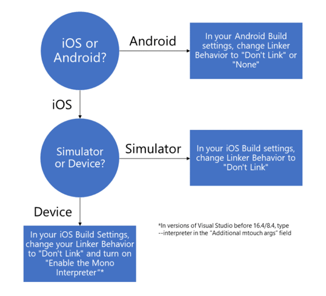

# XAML Hot Reload for Xamarin.Forms

XAML Hot Reload plugs into your existing workflow to increase your productivity and save you time. Without XAML Hot Reload, you have to build and deploy your app every time you want to see a XAML change. With Hot Reload, when you save your XAML file the changes are reflected live in your running app. In addition, your navigation state and data will be maintained, enabling you to quickly iterate on your UI without losing your place in the app. Therefore, with XAML Hot Reload, you'll spend less time rebuilding and deploying your apps to validate UI changes.

> [!NOTE]
> If you're writing a WPF or UWP app, see [XAML Hot Reload for UWP and WPF](/visualstudio/debugger/xaml-hot-reload).
>
> XAML Hot Reload for Xamarin.Forms does _not_ currently work for Xamarin.Forms UWP projects.

## System requirements

| IDE/Framework | Version Required |
|------|------------------|
|Visual Studio 2019 | 16.4 or greater
Visual Studio 2019 for Mac | 8.4 or greater
Xamarin.Forms | 4.1 or greater

## Enable XAML Hot Reload for Xamarin.Forms

If you are starting from a template, XAML Hot Reload is on by default and the project is configured to work with no additional setup. Debug your app on an Android or iOS emulator, simulator, or physical device, change your XAML, and save your file to trigger a XAML Hot Reload.

If you're working from an existing Xamarin.Forms solution, no additional installation is required to use XAML Hot Reload, but you might have to double check your configuration to ensure the best experience. First, enable it in your IDE settings:

* On Windows, check the **Enable XAML Hot Reload** checkbox (and the required platforms) at **Tools** > **Options** > **Debugging** > **Hot Reload**.
  * In earlier versions of Visual Studio 2019, the checkbox is at  **Tools** > **Options** > **Xamarin** > **Hot Reload**.
* On Mac, check the **Enable Xamarin Hot Reload** checkbox at **Visual Studio** > **Preferences** > **Tools for Xamarin** > **XAML Hot Reload**.
  * In earlier versions of Visual Studio for Mac, the checkbox is at **Visual Studio** > **Preferences** > **Projects** > **Xamarin Hot Reload**.

Then, in your Android and iOS build settings, check that the Linker is set to "Don't Link" or "Link None". To use XAML Hot Reload with a physical iOS device, you also have to check **Enable the Mono interpreter** (Visual Studio 16.4 and above) or add **--interpreter** to your **Additional mtouch args** (Visual Studio 16.3 and below).

You can use the following flowchart to check your existing project's setup for use with XAML Hot Reload:

## Resilient reloading

If you make a change that XAML Hot Reload can't reload, it will show you an error message using IntelliSense. These changes, known as rude edits, include mistyping your XAML or wiring a control to an event handler that doesn't exist. Even with a rude edit, you can continue to reload without restarting the app - make another change elsewhere in the XAML file and hit save. The rude edit won't be reloaded, but your other changes will continue to be applied.

## Reload on multiple platforms at once

XAML Hot Reload supports simultaneous debugging in Visual Studio and Visual Studio for Mac. You can deploy an Android and an iOS target at the same time to see your changes reflected on both platforms at once. To debug on multiple platforms, see:
* **Windows** [How To: Set multiple startup projects](/visualstudio/ide/how-to-set-multiple-startup-projects?view=vs-2019)
* **Mac** [Set multiple startup projects](/visualstudio/mac/set-startup-projects?view=vsmac-2019)

## Known limitations

* Other Xamarin.Forms targets, such as UWP and macOS, are *not* yet supported. You can track the progress of UWP support [here](https://developercommunity.visualstudio.com/idea/661682/xaml-hot-reload-for-xamarinforms-on-uwp.html).
* You can't add, remove, or rename files or NuGet packages during a XAML Hot Reload session. If you add or remove a file or NuGet package, rebuild and redeploy your app to continue using XAML Hot Reload.
* Set your linker to **Don't Link** or **Link None** for the best experience. The **Link SDK only** setting works most of the time, but it may fail in certain cases. Linker settings can be found in your Android and iOS build options.
* Debugging on a physical iPhone requires the interpreter to use XAML Hot Reload. To do this, open the project settings, select the iOS Build tab, and ensure **Enable the Mono interpreter** setting is enabled. You may need to change the **Platform** option at the top of the property page to **iPhone**.
* Any references created by assigning a control to another field or property using its `x:Name` value won't be reloaded.
* Updating the visual hierarchy of your Shell application in AppShell.xaml can cause issues maintaining the state of your application. If you experience issues, rebuild the app to continue reloading.
* XAML Hot Reload can't reload C# code, including event handlers, custom controls, page code-behind, and additional classes.

## More resources

* [Tips and Tricks for XAML Hot Reload](https://devblogs.microsoft.com/xamarin/tips-tricks-xaml-hot-reload/)
* [XAML Hot Reload for Xamarin.Forms In-Depth: The Xamarin Show](https://www.youtube.com/watch?v=crhjjPjzknk)

## Troubleshooting

* If XAML Hot Reload fails to initialize:
  * Update your Xamarin.Forms version.
  * Ensure you are on the latest version of the IDE.
  * Set your Android or iOS Linker settings to **Don't Link** in the project's build settings.
* If nothing happens upon saving your XAML file, ensure that XAML Hot Reload is enabled in the IDE.
* If you're debugging on a physical iPhone and your app becomes unresponsive, check that the interpreter is enabled. To turn it on, check **Enable the Mono interpreter** (Visual Studio 16.4/8.4 and up) or add **--interpreter** to the **Additional mtouch arguments** field (Visual Studio 16.3/8.3 and prior) in your iOS Build settings.

To report a bug, use **Help** > **Send Feedback** > **Report a Problem** on Windows, and **Help** > **Report a Problem** on Mac.
