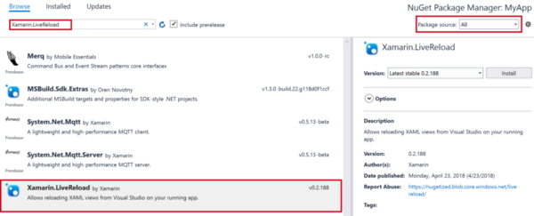

# Xamarin Live Reload (Preview)

> [!NOTE]
> The preview of Xamarin Live Reload has ended, and we want to thank everyone for your feedback and comments. 
>
> To edit your XAML while your app is running, use [XAML Hot Reload for Xamarin.Forms](~/xamarin-forms/xaml/hot-reload.md).
>

Xamarin Live Reload enables you to **make changes to your XAML and see them reflected live, without requiring another compile and deploy**. Any changes made to your XAML will be redeployed on save and reflected on your deploy target.

## Requirements

* [Visual Studio 2017 version 15.7 or above](https://visualstudio.microsoft.com/vs/) with the **Mobile development with .NET** workload.
* [Xamarin.Forms 3.0.0 or above](https://www.nuget.org/packages/Xamarin.Forms/).

## Getting Started
### 1. Install Xamarin Live Reload from the Visual Studio Marketplace

Xamarin Live Reload is distributed via the Visual Studio Marketplace. To install the extension, visit the [Xamarin Live Reload page on the Visual Studio Marketplace](https://marketplace.visualstudio.com/items?itemName=Xamarin.XamarinLiveReload) website and click **Download**.

Open the .vsix that is downloaded, and click **Install**.


Alternatively, you can search for it in the **Online** tab in the **Extensions and Updates** dialog inside Visual Studio.

### 2. Configure your app to use Live Reload

Adding Live Reload to existing mobile apps can be done in three steps:

1. Ensure all projects are updated to use [Xamarin.Forms 3.0.0 or above](https://www.nuget.org/packages/Xamarin.Forms/) or above.

2. Add the **Xamarin.LiveReload** NuGet package:

    a. **.NET Standard** – Install the **Xamarin.LiveReload** NuGet into your .NET Standard 2.0 library. This does not need to be installed in your platform projects. Ensure that the **Package source** is set to **All**.
    
    b. **Shared Projects** – Install the **Xamarin.LiveReload** NuGet into all platform projects (such as Android, iOS, UWP, etc.). Ensure that the **Package source** is set to **All**.

    [](images/addlivereloadnuget.w157.png#lightbox)

3. Add `LiveReload.Init();` to the constructor in the `Application` class, as shown in the following code snippet:

```csharp
public partial class App : Application
{
    public App ()
    {
        // Initialize Live Reload.
        #if DEBUG
        LiveReload.Init();
        #endif
        
        InitializeComponent();
        MainPage = new MainPage();
    }
}
```

### 3. Start live reloading

Compile and deploy your application. Once the app is the deployed, open a XAML file, make some changes, and save the file. Your changes are redeployed to the deployment target.

> [!Video https://www.youtube.com/embed/-5WJZpeXlC8]

Live Reload works with changes to any XAML file. Changes to C# or adding/removing NuGet packages requires a new build and deploy to take effect.

## Frequently Asked Questions 
### Is Xamarin Live Reload available on Visual Studio for Mac? 

No, preview release of Xamarin Live Reload is only available for Visual Studio 2017.

### Does this work with all libraries, such as Prism? 

Because your app is compiled, Live Reload works with all libraries, such as Prism, and third-party control libraries, such as Telerik, Infragistics, Syncfusion, ArcGIS, GrapeCity, and other control vendors.

### What changes does Live Reload redeploy? 

Live Reload only applies changes made to XAML or CSS. If you make changes to a C# file, a recompile will be required. 

### What platforms are supported? 

Live Reload works on any platform supported by Xamarin.Forms, including Android, iOS, and UWP.

### Does this work on emulators, simulators, and physical devices? 

Yes, Live Reload works with all valid deployment targets, including Android emulators, iOS simulators, and physical devices. Deployment to a device requires that the device and computer be on the same Wi-Fi network.

### Does this work with corporate networks?

If you are debugging to an Android emulator or iOS simulator, Live Reload uses localhost to communicate. If you wish to deploy to a device, the device and computer need to be on the same Wi-Fi network. In scenarios where this is not possible, you can [configure your own Live Reload server](#live-reload-server), which will enable you to Live Reload, regardless of network connectivity settings.

### Does it require debugging the app? 

No. In fact, you can even start all your supported application targets (Android, iOS, and UWP) on any number of devices or simulators/emulators and see them all update at once. 

## Limitations

* Only reloading of XAML is supported.
* UI state may not be maintained between redeploys, unless using MVVM.

## Known Issues

* Only supported in Visual Studio.
* Linking must be set to **Don't Link** or **Link Framework SDKs Only** 
* Reloading app-wide resources (i.e. **App.xaml** or shared resource dictionaries), app navigation is reset. 
* Reloading of ContentView currently requires reloading the containing page.
* Elements containing AutomationId may cause a reload failure.
* Editing XAML while debugging UWP may cause a runtime crash. Workaround: Use **Start without Debugging (Ctrl + F5)** instead of **Start Debugging (F5)**.

## Troubleshooting

### Error codes

* **XLR001**: *The current project references 'Xamarin.LiveReload' NuGet package version '[VERSION]' but the Xamarin Live Reload extension requires version '[VERSION]'.*

  In order to allow rapid iteration and evolution of the Live Reload feature, the NuGet package and the Visual Studio extension must match exactly. Update your NuGet package to the same version of the extension you have installed.

* **XLR002**: *Live Reload requires at least the 'MqttHostname' property when building from the command line. Alternatively, set 'EnableLiveReload' to 'false' to disable the feature.*

  The properties required by Live Reload are not available when building from the command line (or in continuous integration), and must therefore be provided explicitly. 

* **XLR003**: *Live Reload NuGet package requires installing the Xamarin Live Reload Visual Studio extension.*

  Attempted to build a project that references the Live Reload NuGet package but the Visual Extension is not installed.  

* *Exception while loading assemblies: System.IO.FileNotFoundException: Could not load assembly 'Xamarin.Live.Reload, Version=0.3.27.0, Culture=neutral, PublicKeyToken='.*

  The host project should be using `PackageReference` instead of `packages.config`

### App doesn't connect

When the application is built, the information from **Tools > Options > Xamarin > Live Reload** (host name, port and encryption keys) are embedded in the app, so that when `LiveReload.Init()` runs, no pairing or configuration is necessary for the connection to succeed.

Other than normal networking problems (firewall, device on a different network), the main reason the app may not successfully connect IDE is because its configuration differs from the one in Visual Studio. This may happen if:

* App was compiled on a different machine.
* App was compiled and deployed in a different Visual Studio session, and **Auto-generate encryption keys** is checked (the default) in **Tools > Options > Xamarin > Live Reload**.
* Visual Studio settings were changed (i.e. hostname, port or encryption keys) but the app was not built and deployed again.

These cases are all solved by building and deploying the app again.

### Uninstalling Preview 1

If you have an older preview and you have problems uninstalling it, follow these steps:

1. Delete the folder **C:\Program Files (x86)\Microsoft Visual Studio\Preview\Enterprise\Common7\IDE\Extensions\Xamarin\LiveReload** (NOTE: replace "Enterprise" with your installed edition, and "Preview" with "2017" if you installed to a stable VS)
2. Open a **Developer command prompt** for that Visual Studio and run `devenv /updateconfiguration`. 

## Tips & Tricks

* As long as the Live Reload settings don't change (including the encryption keys, such as if you turn off **Auto-generate encryption keys**) and you build from the same machine, you don't need to build and deploy the app after the initial deploy, unless you change code or dependencies. You can just launch again a previously deployed app and it will connect to the last host used.

* There is no limitation on how many devices you can connect to the same Visual Studio session. You can deploy and start the app in as many devices/simulators as necessary to see the live reloading working on all of them at the same time.

* Live Reload will only reload the user interface portion of your app, but it does *not* re-create your pages, neither does it replace your view model (or binding context). This means the *whole* app state is always preserved across reloads, including your injected dependencies.

## Live Reload Server

In scenarios where a connection from the running app to your machine (as denoted by using `localhost` or `127.0.0.1` in **Tools > Options > Xamarin > Live Reload**) is not possible (i.e. firewalls, different networks), you can configure a remote server instead, which both the IDE and the app will conect to.

Live Reload uses the standard [MQTT protocol](https://mqtt.org/) to exchange messages, and can therefore communicate with [third party servers](https://github.com/mqtt/mqtt.github.io/wiki/servers). There are even [public servers](https://github.com/mqtt/mqtt.github.io/wiki/public_brokers) (also known as *brokers*) available that you can use. Live Reload has been tested with `broker.hivemq.com` and `iot.eclipse.org` host names, as well as the services provided by [www.cloudmqtt.com](https://www.cloudmqtt.com) and [www.cloudamqp.com](https://www.cloudamqp.com). You can also deploy your own MQTT server in the cloud, such as [HiveMQ on Azure](https://www.hivemq.com/blog/hivemq-on-windows-azure-mqtt-microsoft-cloud).

You can configure any port, but it's common to use the default 1883 port for remote servers. Live Reload messages use strong end-to-end AES symmetric encryption, so it's safe to connect to remote servers. By default, both the encryption key and the initialization vector (IV) are regenerated on every Visual Studio session.

Probably the easiest way is to install the [mosquitto](https://mosquitto.org) server in a blank Ubuntu VM in Azure:

1. Create a new Ubuntu Server VM in Azure Portal
2. Add a new inbound port rule for 1883 (default MQTT port) in the Networking tab
3. Open the [Cloud Shell](/azure/cloud-shell/overview) (bash mode)
4. Type `ssh [USERNAME]@[PUBLIC_IP]` using the username you chose in 1) and the public IP shown in your VM overview page
5. Run `sudo apt-get install mosquitto`, entering the password you chose in 1)

Now you can use that IP to connect to your own MQTT server.