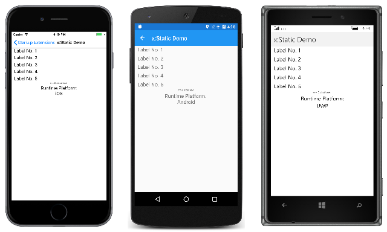
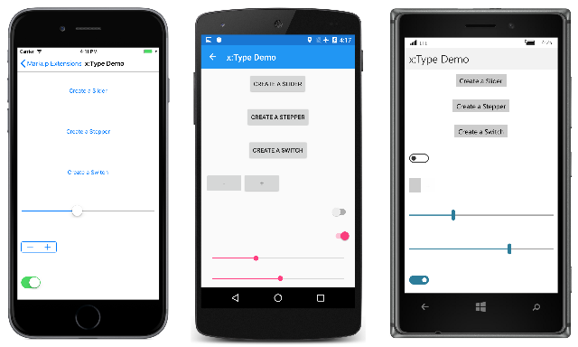
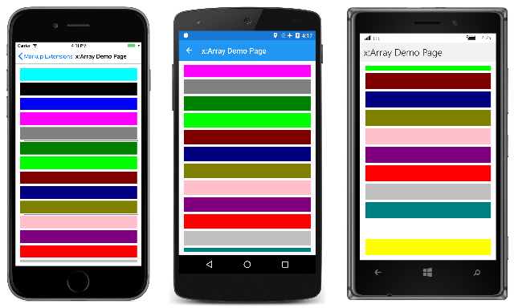
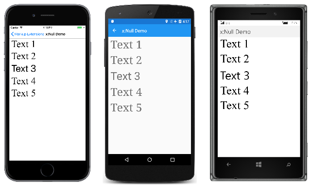
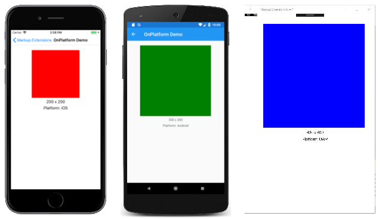
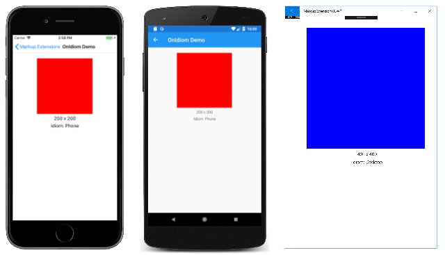
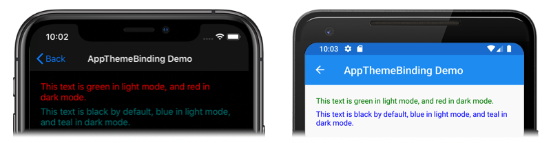

# Consuming XAML Markup Extensions

[ Download the sample](/samples/xamarin/xamarin-forms-samples/xaml-markupextensions)

XAML markup extensions help enhance the power and flexibility of XAML by allowing element attributes to be set from a variety of sources. Several XAML markup extensions are part of the XAML 2009 specification. These appear in XAML files with the customary `x` namespace prefix, and are commonly referred to with this prefix. This article discusses the following markup extensions:

- [`x:Static`](#xstatic-markup-extension) – reference static properties, fields, or enumeration members.
- [`x:Reference`](#xreference-markup-extension) – reference named elements on the page.
- [`x:Type`](#xtype-markup-extension) – set an attribute to a `System.Type` object.
- [`x:Array`](#xarray-markup-extension) – construct an array of objects of a particular type.
- [`x:Null`](#xnull-markup-extension) – set an attribute to a `null` value.
- [`OnPlatform`](#onplatform-markup-extension) – customize UI appearance on a per-platform basis.
- [`OnIdiom`](#onidiom-markup-extension) – customize UI appearance based on the idiom of the device the application is running on.
- [`DataTemplate`](#datatemplate-markup-extension) – converts a type into a [`DataTemplate`](xref:Xamarin.Forms.DataTemplate).
- [`FontImage`](#fontimage-markup-extension) – display a font icon in any view that can display an `ImageSource`.
- [`AppThemeBinding`](#appthemebinding-markup-extension) – consume a resource based on the current system theme.

Additional XAML markup extensions have historically been supported by other XAML implementations, and are also supported by Xamarin.Forms. These are described more fully in other articles:

- `StaticResource` - reference objects from a resource dictionary, as described in the article  [**Resource Dictionaries**](~/xamarin-forms/xaml/resource-dictionaries.md).
- `DynamicResource` - respond to changes in objects in a resource dictionary, as described in the article [**Dynamic Styles**](~/xamarin-forms/user-interface/styles/dynamic.md).
- `Binding` - establish a link between properties of two objects, as described in the article [**Data Binding**](~/xamarin-forms/app-fundamentals/data-binding/index.md).
- `TemplateBinding` - performs data binding from a control template, as discussed in the article [**Xamarin.Forms control templates**](~/xamarin-forms/app-fundamentals/templates/control-template.md).
- `RelativeSource` - sets the binding source relative to the position of the binding target, as discussed in the article [Relative Bindings](~/xamarin-forms/app-fundamentals/data-binding/relative-bindings.md).

The [`RelativeLayout`](xref:Xamarin.Forms.RelativeLayout) layout makes use of the custom markup extension [`ConstraintExpression`](xref:Xamarin.Forms.ConstraintExpression). This markup extension is described in the article [**RelativeLayout**](~/xamarin-forms/user-interface/layouts/relativelayout.md).

## x:Static markup extension

The `x:Static` markup extension is supported by the [`StaticExtension`](xref:Xamarin.Forms.Xaml.StaticExtension) class. The class has a single property named [`Member`](xref:Xamarin.Forms.Xaml.StaticExtension.Member) of type `string` that you set to the name of a public constant, static property, static field, or enumeration member.

One common way to use `x:Static` is to first define a class with some constants or static variables, such as this tiny `AppConstants` class in the [**MarkupExtensions**](/samples/xamarin/xamarin-forms-samples/xaml-markupextensions) program:

```csharp
static class AppConstants
{
    public static double NormalFontSize = 18;
}
```

The **x:Static Demo** page demonstrates several ways to use the `x:Static` markup extension. The most verbose approach instantiates the `StaticExtension` class between `Label.FontSize` property-element tags:

```xaml
<ContentPage xmlns="http://xamarin.com/schemas/2014/forms"
             xmlns:x="http://schemas.microsoft.com/winfx/2009/xaml"
             xmlns:sys="clr-namespace:System;assembly=netstandard"
             xmlns:local="clr-namespace:MarkupExtensions"
             x:Class="MarkupExtensions.StaticDemoPage"
             Title="x:Static Demo">
    <StackLayout Margin="10, 0">
        <Label Text="Label No. 1">
            <Label.FontSize>
                <x:StaticExtension Member="local:AppConstants.NormalFontSize" />
            </Label.FontSize>
        </Label>

        ···

    </StackLayout>
</ContentPage>
```

The XAML parser also allows the `StaticExtension` class to be abbreviated as `x:Static`:

```xaml
<Label Text="Label No. 2">
    <Label.FontSize>
        <x:Static Member="local:AppConstants.NormalFontSize" />
    </Label.FontSize>
</Label>
```

This can be simplified even further, but the change introduces some new syntax: It consists of putting the `StaticExtension` class and the member setting in curly braces. The resulting expression is set directly to the `FontSize` attribute:

```xaml
<Label Text="Label No. 3"
       FontSize="{x:StaticExtension Member=local:AppConstants.NormalFontSize}" />
```

Notice that there are *no* quotation marks within the curly braces. The `Member` property of `StaticExtension` is no longer an XML attribute. It is instead part of the expression for the markup extension.

Just as you can abbreviate `x:StaticExtension` to `x:Static` when you use it as an object element, you can also abbreviate it in the expression within curly braces:

```xaml
<Label Text="Label No. 4"
       FontSize="{x:Static Member=local:AppConstants.NormalFontSize}" />
```

The `StaticExtension` class has a `ContentProperty` attribute referencing the property `Member`, which marks this property as the class's default content property. For XAML markup extensions expressed with curly braces, you can eliminate the `Member=` part of the expression:

```xaml
<Label Text="Label No. 5"
       FontSize="{x:Static local:AppConstants.NormalFontSize}" />
```

This is the most common form of the `x:Static` markup extension.

The **Static Demo** page contains two other examples. The root tag of the XAML file contains an XML namespace declaration for the .NET `System` namespace:

```xaml
xmlns:sys="clr-namespace:System;assembly=netstandard"
```

This allows the `Label` font size to be set to the static field `Math.PI`. That results in rather small text, so the `Scale` property is set to `Math.E`:

```xaml
<Label Text="&#x03C0; &#x00D7; E sized text"
       FontSize="{x:Static sys:Math.PI}"
       Scale="{x:Static sys:Math.E}"
       HorizontalOptions="Center" />
```

The final example displays the `Device.RuntimePlatform` value. The `Environment.NewLine` static property is used to insert a new-line character between the two `Span` objects:

```xaml
<Label HorizontalTextAlignment="Center"
       FontSize="{x:Static local:AppConstants.NormalFontSize}">
    <Label.FormattedText>
        <FormattedString>
            <Span Text="Runtime Platform: " />
            <Span Text="{x:Static sys:Environment.NewLine}" />
            <Span Text="{x:Static Device.RuntimePlatform}" />
        </FormattedString>
    </Label.FormattedText>
</Label>
```

Here's the sample running:

[](consuming-images/staticdemo-large.png#lightbox "x:Static Demo")

## x:Reference markup extension

The `x:Reference` markup extension is supported by the [`ReferenceExtension`](xref:Xamarin.Forms.Xaml.ReferenceExtension) class. The class has a single property named [`Name`](xref:Xamarin.Forms.Xaml.ReferenceExtension.Name) of type `string` that you set to the name of an element on the page that has been given a name with `x:Name`. This `Name` property is the content property of `ReferenceExtension`, so `Name=` is not required when `x:Reference` appears in curly braces.

The `x:Reference` markup extension is used exclusively with data bindings, which are described in more detail in the article [**Data Binding**](~/xamarin-forms/app-fundamentals/data-binding/index.md).

The **x:Reference Demo** page shows two uses of `x:Reference` with data bindings, the first where it's used to set the `Source` property of the `Binding` object, and the second where it's used to set the `BindingContext` property for two data bindings:

```xaml
<ContentPage xmlns="http://xamarin.com/schemas/2014/forms"
             xmlns:x="http://schemas.microsoft.com/winfx/2009/xaml"
             x:Class="MarkupExtensions.ReferenceDemoPage"
             x:Name="page"
             Title="x:Reference Demo">

    <StackLayout Margin="10, 0">

        <Label Text="{Binding Source={x:Reference page},
                              StringFormat='The type of this page is {0}'}"
               FontSize="18"
               VerticalOptions="CenterAndExpand"
               HorizontalTextAlignment="Center" />

        <Slider x:Name="slider"
                Maximum="360"
                VerticalOptions="Center" />

        <Label BindingContext="{x:Reference slider}"
               Text="{Binding Value, StringFormat='{0:F0}&#x00B0; rotation'}"
               Rotation="{Binding Value}"
               FontSize="24"
               HorizontalOptions="Center"
               VerticalOptions="CenterAndExpand" />

    </StackLayout>
</ContentPage>
```

Both `x:Reference` expressions use the abbreviated version of the `ReferenceExtension` class name and eliminate the `Name=` part of the expression. In the first example, the `x:Reference` markup extension is embedded in the `Binding` markup extension. Notice that the `Source` and `StringFormat` settings are separated by commas. Here's the program running:

[](consuming-images/referencedemo-large.png#lightbox "x:Reference Demo")

## x:Type markup extension

The `x:Type` markup extension is the XAML equivalent of the C# [`typeof`](/dotnet/csharp/language-reference/keywords/typeof/) keyword. It is supported by the [`TypeExtension`](xref:Xamarin.Forms.Xaml.TypeExtension) class, which defines one property named [`TypeName`](xref:Xamarin.Forms.Xaml.TypeExtension.TypeName) of type `string` that is set to a class or structure name. The `x:Type` markup extension returns the [`System.Type`](xref:System.Type) object of that class or structure. `TypeName` is the content property of `TypeExtension`, so `TypeName=` is not required when `x:Type` appears with curly braces.

Within Xamarin.Forms, there are several properties that have arguments of type `Type`. Examples include the [`TargetType`](xref:Xamarin.Forms.Style.TargetType) property of `Style`, and the [x:TypeArguments](~/xamarin-forms/xaml/passing-arguments.md#specifying-a-generic-type-argument) attribute used to specify arguments in generic classes. However, the XAML parser performs the `typeof` operation automatically, and the `x:Type` markup extension is not used in these cases.

One place where `x:Type` *is* required is with the `x:Array` markup extension, which is described in the [next section](#xarray-markup-extension).

The `x:Type` markup extension is also useful when constructing a menu where each menu item corresponds to an object of a particular type. You can associate a `Type` object with each menu item, and then instantiate the object when the menu item is selected.

This is how the navigation menu in `MainPage` in the **Markup Extensions** program works. The **MainPage.xaml** file contains a `TableView` with each `TextCell` corresponding to a particular page in the program:

```xaml
<ContentPage xmlns="http://xamarin.com/schemas/2014/forms"
             xmlns:x="http://schemas.microsoft.com/winfx/2009/xaml"
             xmlns:local="clr-namespace:MarkupExtensions"
             x:Class="MarkupExtensions.MainPage"
             Title="Markup Extensions"
             Padding="10">
    <TableView Intent="Menu">
        <TableRoot>
            <TableSection>
                <TextCell Text="x:Static Demo"
                          Detail="Access constants or statics"
                          Command="{Binding NavigateCommand}"
                          CommandParameter="{x:Type local:StaticDemoPage}" />

                <TextCell Text="x:Reference Demo"
                          Detail="Reference named elements on the page"
                          Command="{Binding NavigateCommand}"
                          CommandParameter="{x:Type local:ReferenceDemoPage}" />

                <TextCell Text="x:Type Demo"
                          Detail="Associate a Button with a Type"
                          Command="{Binding NavigateCommand}"
                          CommandParameter="{x:Type local:TypeDemoPage}" />

                <TextCell Text="x:Array Demo"
                          Detail="Use an array to fill a ListView"
                          Command="{Binding NavigateCommand}"
                          CommandParameter="{x:Type local:ArrayDemoPage}" />

                ···                          

        </TableRoot>
    </TableView>
</ContentPage>
```

Here's the opening main page in **Markup Extensions**:

[](consuming-images/mainpage-large.png#lightbox "Main Page")

Each `CommandParameter` property is set to an `x:Type` markup extension that references one of the other pages. The `Command` property is bound to a property named `NavigateCommand`. This property is defined in the `MainPage` code-behind file:

```csharp
public partial class MainPage : ContentPage
{
    public MainPage()
    {
        InitializeComponent();

        NavigateCommand = new Command<Type>(async (Type pageType) =>
        {
            Page page = (Page)Activator.CreateInstance(pageType);
            await Navigation.PushAsync(page);
        });

        BindingContext = this;
    }

    public ICommand NavigateCommand { private set; get; }
}
```

The `NavigateCommand` property is a `Command` object that implements an execute command with an argument of type `Type` &mdash; the value of `CommandParameter`. The method uses `Activator.CreateInstance` to instantiate the page and then navigates to it. The constructor concludes by setting the `BindingContext` of the page to itself, which enables the `Binding` on `Command` to work. See the [**Data Binding**](~/xamarin-forms/app-fundamentals/data-binding/index.md) article and particularly the [**Commanding**](~/xamarin-forms/app-fundamentals/data-binding/commanding.md) article for more details about this type of code.

The **x:Type Demo** page uses a similar technique to instantiate Xamarin.Forms elements and to add them to a `StackLayout`. The XAML file initially consists of three `Button` elements with their `Command` properties set to a `Binding` and the `CommandParameter` properties set to types of three Xamarin.Forms views:

```xaml
<ContentPage xmlns="http://xamarin.com/schemas/2014/forms"
             xmlns:x="http://schemas.microsoft.com/winfx/2009/xaml"
             x:Class="MarkupExtensions.TypeDemoPage"
             Title="x:Type Demo">

    <StackLayout x:Name="stackLayout"
                 Padding="10, 0">

        <Button Text="Create a Slider"
                HorizontalOptions="Center"
                VerticalOptions="CenterAndExpand"
                Command="{Binding CreateCommand}"
                CommandParameter="{x:Type Slider}" />

        <Button Text="Create a Stepper"
                HorizontalOptions="Center"
                VerticalOptions="CenterAndExpand"
                Command="{Binding CreateCommand}"
                CommandParameter="{x:Type Stepper}" />

        <Button Text="Create a Switch"
                HorizontalOptions="Center"
                VerticalOptions="CenterAndExpand"
                Command="{Binding CreateCommand}"
                CommandParameter="{x:Type Switch}" />
    </StackLayout>
</ContentPage>
```

The code-behind file defines and initializes the `CreateCommand` property:

```csharp
public partial class TypeDemoPage : ContentPage
{
    public TypeDemoPage()
    {
        InitializeComponent();

        CreateCommand = new Command<Type>((Type viewType) =>
        {
            View view = (View)Activator.CreateInstance(viewType);
            view.VerticalOptions = LayoutOptions.CenterAndExpand;
            stackLayout.Children.Add(view);
        });

        BindingContext = this;
    }

    public ICommand CreateCommand { private set; get; }
}
```

The method that is executed when a `Button` is pressed creates a new instance of the argument, sets its `VerticalOptions` property, and adds it to the `StackLayout`. The three `Button` elements then share the page with dynamically created views:

[](consuming-images/typedemo-large.png#lightbox "x:Type Demo")

## x:Array markup extension

The `x:Array` markup extension enables you to define an array in markup. It is supported by the [`ArrayExtension`](xref:Xamarin.Forms.Xaml.ArrayExtension) class, which defines two properties:

- `Type` of type `Type`, which indicates the type of the elements in the array.
- `Items` of type `IList`, which is a collection of the items themselves. This is the content property of `ArrayExtension`.

The `x:Array` markup extension itself never appears in curly braces. Instead, `x:Array` start and end tags delimit the list of items. Set the `Type` property to an `x:Type` markup extension.

The **x:Array Demo** page shows how to use `x:Array` to add items to a `ListView` by setting the `ItemsSource` property to an array:

```xaml
<ContentPage xmlns="http://xamarin.com/schemas/2014/forms"
             xmlns:x="http://schemas.microsoft.com/winfx/2009/xaml"
             x:Class="MarkupExtensions.ArrayDemoPage"
             Title="x:Array Demo Page">
    <ListView Margin="10">
        <ListView.ItemsSource>
            <x:Array Type="{x:Type Color}">
                <Color>Aqua</Color>
                <Color>Black</Color>
                <Color>Blue</Color>
                <Color>Fuchsia</Color>
                <Color>Gray</Color>
                <Color>Green</Color>
                <Color>Lime</Color>
                <Color>Maroon</Color>
                <Color>Navy</Color>
                <Color>Olive</Color>
                <Color>Pink</Color>
                <Color>Purple</Color>
                <Color>Red</Color>
                <Color>Silver</Color>
                <Color>Teal</Color>
                <Color>White</Color>
                <Color>Yellow</Color>
            </x:Array>
        </ListView.ItemsSource>

        <ListView.ItemTemplate>
            <DataTemplate>
                <ViewCell>
                    <BoxView Color="{Binding}"
                             Margin="3" />    
                </ViewCell>
            </DataTemplate>
        </ListView.ItemTemplate>
    </ListView>
</ContentPage>        
```

The `ViewCell` creates a simple `BoxView` for each color entry:

[](consuming-images/arraydemo-large.png#lightbox "x:Array Demo")

There are several ways to specify the individual `Color` items in this array. You can use an `x:Static` markup extension:

```xaml
<x:Static Member="Color.Blue" />
```

Or, you can use `StaticResource` to retrieve a color from a resource dictionary:

```xaml
<StaticResource Key="myColor" />
```

Towards the end of this article, you'll see a custom XAML markup extension that also creates a new color value:

```xaml
<local:HslColor H="0.5" S="1.0" L="0.5" />
```

When defining arrays of common types like strings or numbers, use the tags listed in the [**Passing Constructor Arguments**](~/xamarin-forms/xaml/passing-arguments.md#passing-constructor-arguments) article to delimit the values.

## x:Null markup extension

The `x:Null` markup extension is supported by the [`NullExtension`](xref:Xamarin.Forms.Xaml.NullExtension) class. It has no properties and is simply the XAML equivalent of the C# [`null`](/dotnet/csharp/language-reference/keywords/null/) keyword.

The `x:Null` markup extension is rarely needed and seldom used, but if you do find a need for it, you'll be glad that it exists.

The **x:Null Demo** page illustrates one scenario when `x:Null` might be convenient. Suppose that you define an implicit `Style` for `Label` that includes a `Setter` that sets the `FontFamily` property to a platform-dependent family name:

```xaml
<ContentPage xmlns="http://xamarin.com/schemas/2014/forms"
             xmlns:x="http://schemas.microsoft.com/winfx/2009/xaml"
             x:Class="MarkupExtensions.NullDemoPage"
             Title="x:Null Demo">
    <ContentPage.Resources>
        <ResourceDictionary>
            <Style TargetType="Label">
                <Setter Property="FontSize" Value="48" />
                <Setter Property="FontFamily">
                    <Setter.Value>
                        <OnPlatform x:TypeArguments="x:String">
                            <On Platform="iOS" Value="Times New Roman" />
                            <On Platform="Android" Value="serif" />
                            <On Platform="UWP" Value="Times New Roman" />
                        </OnPlatform>
                    </Setter.Value>
                </Setter>
            </Style>
        </ResourceDictionary>
    </ContentPage.Resources>

    <ContentPage.Content>
        <StackLayout Padding="10, 0">
            <Label Text="Text 1" />
            <Label Text="Text 2" />

            <Label Text="Text 3"
                   FontFamily="{x:Null}" />

            <Label Text="Text 4" />
            <Label Text="Text 5" />
        </StackLayout>
    </ContentPage.Content>
</ContentPage>   
```

Then you discover that for one of the `Label` elements, you want all the property settings in the implicit `Style` except for the `FontFamily`, which you want to be the default value. You could define another `Style` for that purpose but a simpler approach is simply to set the `FontFamily` property of the particular `Label` to `x:Null`, as demonstrated in the center `Label`.

Here's the program running:

[](consuming-images/nulldemo-large.png#lightbox "x:Null Demo")

Notice that four of the `Label` elements have a serif font, but the center `Label` has the  default sans-serif font.

## OnPlatform markup extension

The `OnPlatform` markup extension enables you to customize UI appearance on a per-platform basis. It provides the same functionality as the [`OnPlatform`](xref:Xamarin.Forms.OnPlatform`1) and [`On`](xref:Xamarin.Forms.On) classes, but with a more concise representation.

The `OnPlatform` markup extension is supported by the [`OnPlatformExtension`](xref:Xamarin.Forms.Xaml.OnPlatformExtension) class, which defines the following properties:

- `Default` of type `object`, that you set to a default value to be applied to the properties that represent platforms.
- `Android` of type `object`, that you set to a value to be applied on Android.
- `GTK` of type `object`, that you set to a value to be applied on GTK platforms.
- `iOS` of type `object`, that you set to a value to be applied on iOS.
- `macOS` of type `object`, that you set to a value to be applied on macOS.
- `Tizen` of type `object`, that you set to a value to be applied on the Tizen platform.
- `UWP` of type `object`, that you set to a value to be applied on the Universal Windows Platform.
- `WPF` of type `object`, that you set to a value to be applied on the Windows Presentation Foundation platform.
- `Converter` of type `IValueConverter`, that can be set to an `IValueConverter` implementation.
- `ConverterParameter` of type `object`, that can be set to a value to pass to the `IValueConverter` implementation.

> [!NOTE]
> The XAML parser allows the [`OnPlatformExtension`](xref:Xamarin.Forms.Xaml.OnPlatformExtension) class to be abbreviated as `OnPlatform`.

The `Default` property is the content property of `OnPlatformExtension`. Therefore, for XAML markup expressions expressed with curly braces, you can eliminate the `Default=` part of the expression provided that it's the first argument. If the `Default` property isn't set, it will default to the [`BindableProperty.DefaultValue`](xref:Xamarin.Forms.BindableProperty.DefaultValue) property value, provided that the markup extension is targeting a [`BindableProperty`](xref:Xamarin.Forms.BindableProperty).

> [!IMPORTANT]
> The XAML parser expects that values of the correct type will be provided to properties consuming the `OnPlatform` markup extension. If type conversion is necessary, the `OnPlatform` markup extension will attempt to perform it using the default converters provided by Xamarin.Forms. However, there are some type conversions that can't be performed by the default converters and in these cases the `Converter` property should be set to an `IValueConverter` implementation.

The **OnPlatform Demo** page shows how to use the `OnPlatform` markup extension:

```xaml
<BoxView Color="{OnPlatform Yellow, iOS=Red, Android=Green, UWP=Blue}"
         WidthRequest="{OnPlatform 250, iOS=200, Android=300, UWP=400}"  
         HeightRequest="{OnPlatform 250, iOS=200, Android=300, UWP=400}"
         HorizontalOptions="Center" />
```

In this example, all three `OnPlatform` expressions use the abbreviated version of the `OnPlatformExtension` class name. The three `OnPlatform` markup extensions set the [`Color`](xref:Xamarin.Forms.BoxView.Color), [`WidthRequest`](xref:Xamarin.Forms.VisualElement.WidthRequest), and [`HeightRequest`](xref:Xamarin.Forms.VisualElement.HeightRequest) properties of the [`BoxView`](xref:Xamarin.Forms.BoxView) to different values on iOS, Android, and UWP. The markup extensions also provide default values for these properties on the platforms that aren't specified, while eliminating the `Default=` part of the expression. Notice that the markup extension properties that are set are separated by commas.

Here's the program running:

[](consuming-images/onplatformdemo-large.png#lightbox "OnPlatform Demo")

## OnIdiom markup extension

The `OnIdiom` markup extension enables you to customize UI appearance based on the idiom of the device the application is running on. It's supported by the [`OnIdiomExtension`](xref:Xamarin.Forms.Xaml.OnIdiomExtension) class, which defines the following properties:

- `Default` of type `object`, that you set to a default value to be applied to the properties that represent device idioms.
- `Phone` of type `object`, that you set to a value to be applied on phones.
- `Tablet` of type `object`, that you set to a value to be applied on tablets.
- `Desktop` of type `object`, that you set to a value to be applied on desktop platforms.
- `TV` of type `object`, that you set to a value to be applied on TV platforms.
- `Watch` of type `object`, that you set to a value to be applied on Watch platforms.
- `Converter` of type `IValueConverter`, that can be set to an `IValueConverter` implementation.
- `ConverterParameter` of type `object`, that can be set to a value to pass to the `IValueConverter` implementation.

> [!NOTE]
> The XAML parser allows the [`OnIdiomExtension`](xref:Xamarin.Forms.Xaml.OnIdiomExtension) class to be abbreviated as `OnIdiom`.

The `Default` property is the content property of `OnIdiomExtension`. Therefore, for XAML markup expressions expressed with curly braces, you can eliminate the `Default=` part of the expression provided that it's the first argument.

> [!IMPORTANT]
> The XAML parser expects that values of the correct type will be provided to properties consuming the `OnIdiom` markup extension. If type conversion is necessary, the `OnIdiom` markup extension will attempt to perform it using the default converters provided by Xamarin.Forms. However, there are some type conversions that can't be performed by the default converters and in these cases the `Converter` property should be set to an `IValueConverter` implementation.

The **OnIdiom Demo** page shows how to use the `OnIdiom` markup extension:

```xaml
<BoxView Color="{OnIdiom Yellow, Phone=Red, Tablet=Green, Desktop=Blue}"
         WidthRequest="{OnIdiom 100, Phone=200, Tablet=300, Desktop=400}"
         HeightRequest="{OnIdiom 100, Phone=200, Tablet=300, Desktop=400}"
         HorizontalOptions="Center" />
```

In this example, all three `OnIdiom` expressions use the abbreviated version of the `OnIdiomExtension` class name. The three `OnIdiom` markup extensions set the [`Color`](xref:Xamarin.Forms.BoxView.Color), [`WidthRequest`](xref:Xamarin.Forms.VisualElement.WidthRequest), and [`HeightRequest`](xref:Xamarin.Forms.VisualElement.HeightRequest) properties of the [`BoxView`](xref:Xamarin.Forms.BoxView) to different values on the phone, tablet, and desktop idioms. The markup extensions also provide default values for these properties on the idioms that aren't specified, while eliminating the `Default=` part of the expression. Notice that the markup extension properties that are set are separated by commas.

Here's the program running:

[](consuming-images/onidiomdemo-large.png#lightbox "OnIdiom Demo")

## DataTemplate markup extension

The `DataTemplate` markup extension enables you to convert a type into a [`DataTemplate`](xref:Xamarin.Forms.DataTemplate). It's supported by the `DataTemplateExtension` class, which defines a `TypeName` property, of type `string`, that is set to the name of the type to be converted into a `DataTemplate`. The `TypeName` property is the content property of `DataTemplateExtension`. Therefore, for XAML markup expressions expressed with curly braces, you can eliminate the `TypeName=` part of the expression.

> [!NOTE]
> The XAML parser allows the `DataTemplateExtension` class to be abbreviated as `DataTemplate`.

A typical usage of this markup extension is in a Shell application, as shown in the following example:

```xaml
<ShellContent Title="Monkeys"
              Icon="monkey.png"
              ContentTemplate="{DataTemplate views:MonkeysPage}" />
```

In this example, `MonkeysPage` is converted from a [`ContentPage`](xref:Xamarin.Forms.ContentPage) to a [`DataTemplate`](xref:Xamarin.Forms.DataTemplate), which is set as the value of the `ShellContent.ContentTemplate` property. This ensures that `MonkeysPage` is only created when navigation to the page occurs, rather than at application startup.

For more information about Shell applications, see [Xamarin.Forms Shell](~/xamarin-forms/app-fundamentals/shell/index.md).

## FontImage markup extension

The `FontImage` markup extension enables you to display a font icon in any view that can display an `ImageSource`. It provides the same functionality as the `FontImageSource` class, but with a more concise representation.

The `FontImage` markup extension is supported by the `FontImageExtension` class, which defines the following properties:

- `FontFamily` of type `string`, the font family to which the font icon belongs.
- `Glyph` of type `string`, the unicode character value of the font icon.
- `Color` of type [`Color`](xref:Xamarin.Forms.Color), the color to be used when displaying the font icon.
- `Size` of type `double`, the size, in device-independent units, of the rendered font icon. The default value is 30. In addition, this property can be set to a named font size.

> [!NOTE]
> The XAML parser allows the `FontImageExtension` class to be abbreviated as `FontImage`.

The `Glyph` property is the content property of `FontImageExtension`. Therefore, for XAML markup expressions expressed with curly braces, you can eliminate the `Glyph=` part of the expression provided that it's the first argument.

The **FontImage Demo** page shows how to use the `FontImage` markup extension:

```xaml
<Image BackgroundColor="#D1D1D1"
       Source="{FontImage &#xf30c;, FontFamily={OnPlatform iOS=Ionicons, Android=ionicons.ttf#}, Size=44}" />
```

In this example, the abbreviated version of the `FontImageExtension` class name is used to display an XBox icon, from the Ionicons font family, in an [`Image`](xref:Xamarin.Forms.Image). The expression also uses the `OnPlatform` markup extension to specify different `FontFamily` property values on iOS and Android. In addition, the `Glyph=` part of the expression is eliminated, and the markup extension properties that are set are separated by commas. Note that while the unicode character for the icon is `\uf30c`, it has to be escaped in XAML and so becomes `&#xf30c;`.

Here's the program running:

[](consuming-images/fontimagedemo-large.png#lightbox "FontImage Demo")

For information about displaying font icons by specifying the font icon data in a `FontImageSource` object, see [Display font icons](~/xamarin-forms/user-interface/text/fonts.md#display-font-icons).

## AppThemeBinding markup extension

The `AppThemeBinding` markup extension enables you to specify a resource to be consumed, such as an image or color, based on the current system theme.

> [!IMPORTANT]
> The `AppThemeBinding` markup extension has minimum operating system requirements. For more information, see [Respond to system theme changes in Xamarin.Forms applications](~/xamarin-forms/user-interface/theming/system-theme-changes.md).

The `AppThemeBinding` markup extension is supported by the `AppThemeBindingExtension` class, which defines the following properties:

- `Default`, of type `object`, that you set to the resource to be used by default.
- `Light`, of type `object`, that you set to the resource to be used when the device is using its light theme.
- `Dark`, of type `object`, that you set to the resource to be used when the device is using its dark theme.
- `Value`, of type `object`, that returns the resource that's currently being used by the markup extension.

> [!NOTE]
> The XAML parser allows the `AppThemeBindingExtension` class to be abbreviated as `AppBindingTheme`.

The `Default` property is the content property of `AppThemeBindingExtension`. Therefore, for XAML markup expressions expressed with curly braces, you can eliminate the `Default=` part of the expression provided that it's the first argument.

The **AppThemeBinding Demo** page shows how to use the `AppThemeBinding` markup extension:

```xaml
<ContentPage xmlns="http://xamarin.com/schemas/2014/forms"
             xmlns:x="http://schemas.microsoft.com/winfx/2009/xaml"
             x:Class="MarkupExtensions.AppThemeBindingDemoPage"
             Title="AppThemeBinding Demo">
    <ContentPage.Resources>

        <Style x:Key="labelStyle"
               TargetType="Label">
            <Setter Property="TextColor"
                    Value="{AppThemeBinding Black, Light=Blue, Dark=Teal}" />
        </Style>

    </ContentPage.Resources>
    <StackLayout Margin="20">
        <Label Text="This text is green in light mode, and red in dark mode."
               TextColor="{AppThemeBinding Light=Green, Dark=Red}" />
        <Label Text="This text is black by default, blue in light mode, and teal in dark mode."
               Style="{StaticResource labelStyle}" />
    </StackLayout>
</ContentPage>
```

In this example, the text color of the first [`Label`](xref:Xamarin.Forms.Label) is set to green when the device is using its light theme, and is set to red when the device is using its dark theme. The second `Label` has its [`TextColor`](xref:Xamarin.Forms.Label.TextColor) property set through a [`Style`](xref:Xamarin.Forms.Style). This `Style` sets the text color of the `Label` to black by default, to blue when the device is using its light theme, and to teal when the device is using its dark theme.

Here's the program running:



## Define markup extensions

If you've encountered a need for a XAML markup extension that isn't available in Xamarin.Forms, you can [create your own](creating.md).

## Related links

- [Markup Extensions (sample)](/samples/xamarin/xamarin-forms-samples/xaml-markupextensions)
- [XAML markup extensions chapter from Xamarin.Forms book](~/xamarin-forms/creating-mobile-apps-xamarin-forms/summaries/chapter10.md)
- [Resource Dictionaries](~/xamarin-forms/xaml/resource-dictionaries.md)
- [Dynamic Styles](~/xamarin-forms/user-interface/styles/dynamic.md)
- [Data Binding](~/xamarin-forms/app-fundamentals/data-binding/index.md)
- [Xamarin.Forms Shell](~/xamarin-forms/app-fundamentals/shell/index.md)
- [Respond to system theme changes in Xamarin.Forms applications](~/xamarin-forms/user-interface/theming/system-theme-changes.md)