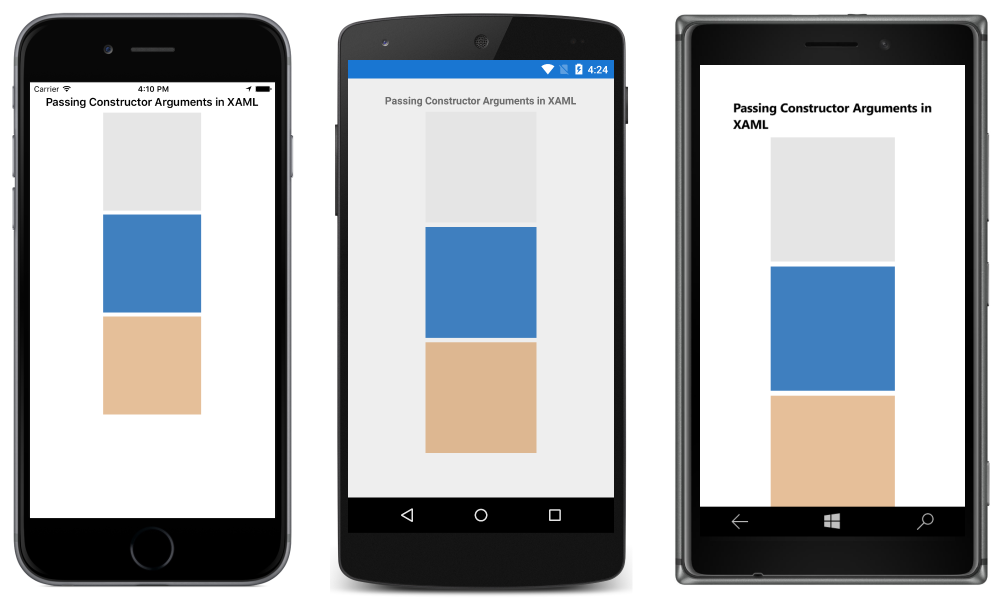
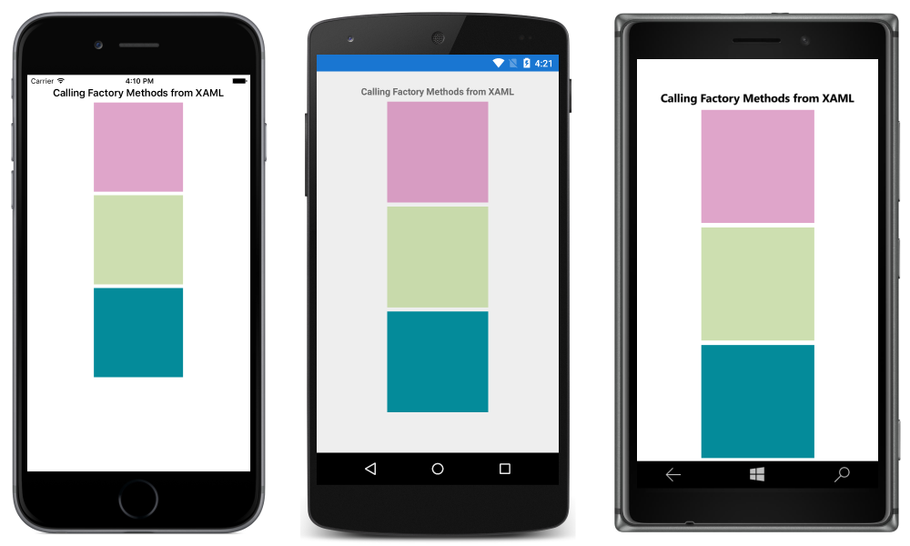

# Passing Arguments in XAML

[ Download the sample](/samples/xamarin/xamarin-forms-samples/xaml-passingconstructorarguments)

_This article demonstrates using the XAML attributes that can be used to pass arguments to non-default constructors, to call factory methods, and to specify the type of a generic argument._

## Overview

It's often necessary to instantiate objects with constructors that require arguments, or by calling a static creation method. This can be achieved in XAML by using the `x:Arguments` and `x:FactoryMethod` attributes:

- The `x:Arguments` attribute is used to specify constructor arguments for a non-default constructor, or for a factory method object declaration. For more information, see [Passing Constructor Arguments](#passing-constructor-arguments).
- The `x:FactoryMethod` attribute is used to specify a factory method that can be used to initialize an object. For more information, see [Calling Factory Methods](#calling-factory-methods).

In addition, the `x:TypeArguments` attribute can be used to specify the generic type arguments to the constructor of a generic type. For more information, see [Specifying a Generic Type Argument](#specifying-a-generic-type-argument).

## Passing Constructor Arguments

Arguments can be passed to a non-default constructor using the `x:Arguments` attribute. Each constructor argument must be delimited within an XML element that represents the type of the argument. Xamarin.Forms supports the following elements for basic types:

- `x:Array`
- `x:Boolean`
- `x:Byte`
- `x:Char`
- `x:DateTime`
- `x:Decimal`
- `x:Double`
- `x:Int16`
- `x:Int32`
- `x:Int64`
- `x:Object`
- `x:Single`
- `x:String`
- `x:TimeSpan`

The following code example demonstrates using the `x:Arguments` attribute with three [`Color`](xref:Xamarin.Forms.Color) constructors:

```xaml
<BoxView HeightRequest="150" WidthRequest="150" HorizontalOptions="Center">
  <BoxView.Color>
    <Color>
      <x:Arguments>
        <x:Double>0.9</x:Double>
      </x:Arguments>
    </Color>
  </BoxView.Color>
</BoxView>
<BoxView HeightRequest="150" WidthRequest="150" HorizontalOptions="Center">
  <BoxView.Color>
    <Color>
      <x:Arguments>
        <x:Double>0.25</x:Double>
        <x:Double>0.5</x:Double>
        <x:Double>0.75</x:Double>
      </x:Arguments>
    </Color>
  </BoxView.Color>
</BoxView>
<BoxView HeightRequest="150" WidthRequest="150" HorizontalOptions="Center">
  <BoxView.Color>
    <Color>
      <x:Arguments>
        <x:Double>0.8</x:Double>
        <x:Double>0.5</x:Double>
        <x:Double>0.2</x:Double>
        <x:Double>0.5</x:Double>
      </x:Arguments>
    </Color>
  </BoxView.Color>
</BoxView>
```

The number of elements within the `x:Arguments` tag, and the types of these elements, must match one of the [`Color`](xref:Xamarin.Forms.Color) constructors. The `Color` [constructor](xref:Xamarin.Forms.Color.%23ctor(System.Double)) with a single parameter requires a grayscale value from 0 (black) to 1 (white). The `Color` [constructor](xref:Xamarin.Forms.Color.%23ctor(System.Double,System.Double,System.Double)) with three parameters requires a red, green, and blue value ranging from 0 to 1. The `Color` [constructor](xref:Xamarin.Forms.Color.%23ctor(System.Double,System.Double,System.Double,System.Double)) with four parameters adds an alpha channel as the fourth parameter.

The following screenshots show the result of calling each [`Color`](xref:Xamarin.Forms.Color) constructor with the specified argument values:



## Calling Factory Methods

Factory methods can be called in XAML by specifying the method's name using the `x:FactoryMethod` attribute, and its arguments using the `x:Arguments` attribute. A factory method is a `public static` method that returns objects or values of the same type as the class or structure that defines the methods.

The [`Color`](xref:Xamarin.Forms.Color) structure defines a number of factory methods, and the following code example demonstrates calling three of them:

```xaml
<BoxView HeightRequest="150" WidthRequest="150" HorizontalOptions="Center">
  <BoxView.Color>
    <Color x:FactoryMethod="FromRgba">
      <x:Arguments>
        <x:Int32>192</x:Int32>
        <x:Int32>75</x:Int32>
        <x:Int32>150</x:Int32>                        
        <x:Int32>128</x:Int32>
      </x:Arguments>
    </Color>
  </BoxView.Color>
</BoxView>
<BoxView HeightRequest="150" WidthRequest="150" HorizontalOptions="Center">
  <BoxView.Color>
    <Color x:FactoryMethod="FromHsla">
      <x:Arguments>
        <x:Double>0.23</x:Double>
        <x:Double>0.42</x:Double>
        <x:Double>0.69</x:Double>
        <x:Double>0.7</x:Double>
      </x:Arguments>
    </Color>
  </BoxView.Color>
</BoxView>
<BoxView HeightRequest="150" WidthRequest="150" HorizontalOptions="Center">
  <BoxView.Color>
    <Color x:FactoryMethod="FromHex">
      <x:Arguments>
        <x:String>#FF048B9A</x:String>
      </x:Arguments>
    </Color>
  </BoxView.Color>
</BoxView>
```

The number of elements within the `x:Arguments` tag, and the types of these elements, must match the arguments of the factory method being called. The [`FromRgba`](xref:Xamarin.Forms.Color.FromRgba(System.Int32,System.Int32,System.Int32,System.Int32)) factory method requires four [`Int32`](/dotnet/api/system.int32) parameters, which represent the red, green, blue, and alpha values, ranging from 0 to 255 respectively. The [`FromHsla`](xref:Xamarin.Forms.Color.FromHsla(System.Double,System.Double,System.Double,System.Double)) factory method requires four [`Double`](/dotnet/api/system.double) parameters, which represent the hue, saturation, luminosity, and alpha values, ranging from 0 to 1 respectively. The [`FromHex`](xref:Xamarin.Forms.Color.FromHex(System.String)) factory method requires a [`String`](/dotnet/api/system.string) that represents the hexadecimal (A)RGB color.

The following screenshots show the result of calling each [`Color`](xref:Xamarin.Forms.Color) factory method with the specified argument values:



## Specifying a Generic Type Argument

Generic type arguments for the constructor of a generic type can be specified using the `x:TypeArguments` attribute, as demonstrated in the following code example:

```xaml
<ContentPage ...>
  <StackLayout>
    <StackLayout.Margin>
      <OnPlatform x:TypeArguments="Thickness">
        <On Platform="iOS" Value="0,20,0,0" />
        <On Platform="Android" Value="5, 10" />
        <On Platform="UWP" Value="10" />
      </OnPlatform>
    </StackLayout.Margin>
  </StackLayout>
</ContentPage>
```

The [`OnPlatform`](xref:Xamarin.Forms.OnPlatform`1) class is a generic class and must be instantiated with an `x:TypeArguments` attribute that matches the target type. In the [`On`](xref:Xamarin.Forms.On) class, the [`Platform`](xref:Xamarin.Forms.On.Platform) attribute can accept a single `string` value, or multiple comma-delimited `string` values. In this example, the [`StackLayout.Margin`](xref:Xamarin.Forms.View.Margin) property is set to a platform-specific [`Thickness`](xref:Xamarin.Forms.Thickness).

For more information about generic type arguments, see [Generics in Xamarin.Forms XAML](generics.md).

## Related Links

- [Passing Constructor Arguments (sample)](/samples/xamarin/xamarin-forms-samples/xaml-passingconstructorarguments)
- [Calling Factory Methods (sample)](/samples/xamarin/xamarin-forms-samples/xaml-callingfactorymethods)
- [XAML Namespaces](~/xamarin-forms/xaml/namespaces.md)
- [Generics in Xamarin.Forms XAML](generics.md)