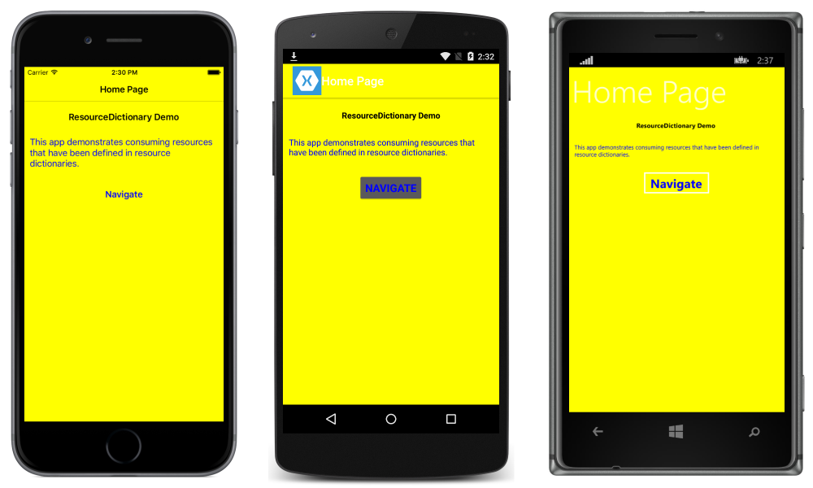
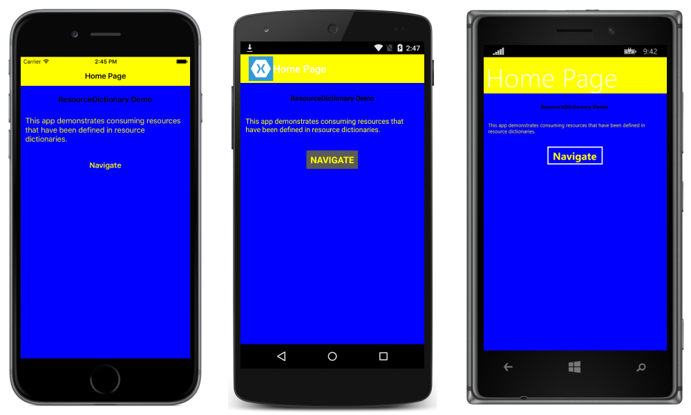

# Resource Dictionaries

[ Download the sample](https://developer.xamarin.com/samples/xamarin-forms/xaml/resourcedictionaries/)

_XAML resources are definitions of objects that can be shared and re-used throughout a Xamarin.Forms application._

These resource objects are stored in a resource dictionary. This article describes how to create and consume a resource dictionary, and how to merge resource dictionaries.

## Overview

A [`ResourceDictionary`](xref:Xamarin.Forms.ResourceDictionary) is a repository for resources that are used by a Xamarin.Forms application. Typical resources that are stored in a `ResourceDictionary` include [styles](~/xamarin-forms/user-interface/styles/index.md), [control templates](~/xamarin-forms/app-fundamentals/templates/control-templates/index.md), [data templates](~/xamarin-forms/app-fundamentals/templates/data-templates/index.md), colors, and converters.

In XAML, resources that are stored in a `ResourceDictionary` can then be retrieved and applied to elements by using the `StaticResource` markup extension. In C#, resources can also be defined in a `ResourceDictionary` and then retrieved and applied to elements by using a string-based indexer. However, there's little advantage to using a `ResourceDictionary` in C#, as shared objects can simply be stored as fields or properties, and accessed directly without having to first retrieve them from a dictionary.

## Creating and Consuming a ResourceDictionary

Resources are defined in a [`ResourceDictionary`](xref:Xamarin.Forms.ResourceDictionary) that is then set to one of the following `Resources` properties:

- The [`Resources`](xref:Xamarin.Forms.Application.Resources) property of any class that derives from [`Application`](xref:Xamarin.Forms.Application)
- The [`Resources`](xref:Xamarin.Forms.VisualElement.Resources) property of any class that derives from [`VisualElement`](xref:Xamarin.Forms.Application)

A Xamarin.Forms program contains only one class that derives from `Application` but often makes use of many classes that derive from `VisualElement`, including pages, layouts, and controls. Any of these objects can have its `Resources` property set to a `ResourceDictionary`. Choosing where to put a particular `ResourceDictionary` impacts where the resources can be used:

- Resources in a `ResourceDictionary` that is attached to a view such as `Button` or `Label` can only be applied to that particular object, so this is not very useful.
- Resources in a `ResourceDictionary` attached to a layout such as `StackLayout` or `Grid` can be applied to the layout and all the children of that layout.
- Resources in a `ResourceDictionary` defined at the page level can be applied to the page and to all its children.
- Resources in a `ResourceDictionary` defined at the application level can be applied throughout the application.

The following XAML shows resources defined in an application level `ResourceDictionary` in the **App.xaml** file created as part of the standard Xamarin.Forms program:

```xaml
<Application ...>
    <Application.Resources>
        <ResourceDictionary>
            <Color x:Key="PageBackgroundColor">Yellow</Color>
            <Color x:Key="HeadingTextColor">Black</Color>
            <Color x:Key="NormalTextColor">Blue</Color>
            <Style x:Key="LabelPageHeadingStyle" TargetType="Label">
                <Setter Property="FontAttributes" Value="Bold" />
                <Setter Property="HorizontalOptions" Value="Center" />
                <Setter Property="TextColor" Value="{StaticResource HeadingTextColor}" />
            </Style>
        </ResourceDictionary>
    </Application.Resources>
</Application>
```

This `ResourceDictionary` defines three [`Color`](xref:Xamarin.Forms.Color) resources and a [`Style`](xref:Xamarin.Forms.Style) resource. For more information about the `App` class, see [App Class](~/xamarin-forms/app-fundamentals/application-class.md).

Beginning in Xamarin.Forms 3.0, the explicit `ResourceDictionary` tags are not required. The `ResourceDictionary` object is created automatically, and you can insert the resources directly between the `Resources` property-element tags:

```xaml
<Application ...>
    <Application.Resources>
        <Color x:Key="PageBackgroundColor">Yellow</Color>
        <Color x:Key="HeadingTextColor">Black</Color>
        <Color x:Key="NormalTextColor">Blue</Color>
        <Style x:Key="LabelPageHeadingStyle" TargetType="Label">
            <Setter Property="FontAttributes" Value="Bold" />
            <Setter Property="HorizontalOptions" Value="Center" />
            <Setter Property="TextColor" Value="{StaticResource HeadingTextColor}" />
        </Style>
    </Application.Resources>
</Application>
```

Each resource has a key that is specified using the `x:Key` attribute, which becomes it dictionary key in the `ResourceDictionary`. The key is used to retrieve a resource from the `ResourceDictionary` by the [`StaticResource`](xref:Xamarin.Forms.Xaml.StaticResourceExtension) markup extension, as demonstrated in the following XAML code example that shows additional resources defined within the `StackLayout`:

```xaml
<StackLayout Margin="0,20,0,0">
  <StackLayout.Resources>
    <ResourceDictionary>
      <Style x:Key="LabelNormalStyle" TargetType="Label">
        <Setter Property="TextColor" Value="{StaticResource NormalTextColor}" />
      </Style>
      <Style x:Key="MediumBoldText" TargetType="Button">
        <Setter Property="FontSize" Value="Medium" />
        <Setter Property="FontAttributes" Value="Bold" />
      </Style>
    </ResourceDictionary>
  </StackLayout.Resources>
  <Label Text="ResourceDictionary Demo" Style="{StaticResource LabelPageHeadingStyle}" />
    <Label Text="This app demonstrates consuming resources that have been defined in resource dictionaries."
           Margin="10,20,10,0"
           Style="{StaticResource LabelNormalStyle}" />
    <Button Text="Navigate"
            Clicked="OnNavigateButtonClicked"
            TextColor="{StaticResource NormalTextColor}"
            Margin="0,20,0,0"
            HorizontalOptions="Center"
            Style="{StaticResource MediumBoldText}" />
</StackLayout>
```

The first [`Label`](xref:Xamarin.Forms.Label) instance retrieves and consumes the `LabelPageHeadingStyle` resource defined in the application level `ResourceDictionary`, with the second `Label` instance retrieving and consuming the `LabelNormalStyle` resource defined in the control level `ResourceDictionary`. Similarly, the [`Button`](xref:Xamarin.Forms.Button) instance retrieves and consumes the `NormalTextColor` resource defined in the application level `ResourceDictionary`, and the `MediumBoldText` resource defined in the control level `ResourceDictionary`. This results in the appearance shown in the following screenshots:

[](resource-dictionaries-images/screenshots.png#lightbox "Consuming ResourceDictionary Resources")

> [!NOTE]
> Resources that are specific to a single page shouldn't be included in an application level resource dictionary, as such resources will then be parsed at application startup instead of when required by a page. For more information, see [Reduce the Application Resource Dictionary Size](~/xamarin-forms/deploy-test/performance.md).

## Overriding Resources

When `ResourceDictionary` resources share `x:Key` attribute values, resources defined lower in the view hierarchy will take precedence over those defined higher up. For example, setting the `PageBackgroundColor` resource to `Blue` at the application level will be overridden by a page level `PageBackgroundColor` resource set to `Yellow`. Similarly, a page level `PageBackgroundColor` resource will be overridden by a control level `PageBackgroundColor` resource. This precedence is demonstrated by the following XAML code example:

```xaml
<ContentPage ... BackgroundColor="{StaticResource PageBackgroundColor}">
    <ContentPage.Resources>
        <ResourceDictionary>
            <Color x:Key="PageBackgroundColor">Blue</Color>
            <Color x:Key="NormalTextColor">Yellow</Color>
        </ResourceDictionary>
    </ContentPage.Resources>
    <StackLayout Margin="0,20,0,0">
        ...
        <Label Text="ResourceDictionary Demo" Style="{StaticResource LabelPageHeadingStyle}" />
        <Label Text="This app demonstrates consuming resources that have been defined in resource dictionaries."
               Margin="10,20,10,0"
               Style="{StaticResource LabelNormalStyle}" />
        <Button Text="Navigate"
                Clicked="OnNavigateButtonClicked"
                TextColor="{StaticResource NormalTextColor}"
                Margin="0,20,0,0"
                HorizontalOptions="Center"
                Style="{StaticResource MediumBoldText}" />
    </StackLayout>
</ContentPage>
```

The original `PageBackgroundColor` and `NormalTextColor` instances, defined at the application level, are overridden by the `PageBackgroundColor` and `NormalTextColor` instances defined at page level. Therefore, the page background color becomes blue, and the text on the page becomes yellow, as demonstrated in the following screenshots:

[](resource-dictionaries-images/overridding-screenshots.png#lightbox "Overriding ResourceDictionary Resources")

However, note that the background bar of the [`NavigationPage`](xref:Xamarin.Forms.NavigationPage) is still yellow, because the  [`BarBackgroundColor`](xref:Xamarin.Forms.NavigationPage.BarBackgroundColor) property is set to the value of the `PageBackgroundColor` resource defined in the application level `ResourceDictionary`.

Here's another way to think about `ResourceDictionary` precedence: When the XAML parser encounters a `StaticResource`, it searches for a matching key by traveling up through the visual tree, using the first match it finds. If this search ends at the page and the key still hasn't been found, the XAML parser searches the `ResourceDictionary` attached to the `App` object. If the key is still not found, an exception is raised.

## Stand-alone Resource Dictionaries

A class derived from `ResourceDictionary` can also be in a separate stand-alone file. (More precisely, a class derived from `ResourceDictionary` generally requires a _pair_ of files because the resources are defined in a XAML file but a code-behind file with an `InitializeComponent` call is also necessary.) The resultant file can then be shared among applications.

To create such a file, add a new **Content View** or **Content Page** item to the project (but not a **Content View** or **Content Page** with only a C# file). In both the XAML file and C# file, change the name of the base class from `ContentView` or `ContentPage` to `ResourceDictionary`. In the XAML file, the name of the base class is the top-level element.

The following XAML example shows a [`ResourceDictionary`](xref:Xamarin.Forms.ResourceDictionary) named `MyResourceDictionary`:

```xaml
<ResourceDictionary xmlns="http://xamarin.com/schemas/2014/forms"
                    xmlns:x="http://schemas.microsoft.com/winfx/2009/xaml"
                    x:Class="ResourceDictionaryDemo.MyResourceDictionary">
    <DataTemplate x:Key="PersonDataTemplate">
        <ViewCell>
            <Grid>
                <Grid.ColumnDefinitions>
                    <ColumnDefinition Width="0.5*" />
                    <ColumnDefinition Width="0.2*" />
                    <ColumnDefinition Width="0.3*" />
                </Grid.ColumnDefinitions>
                <Label Text="{Binding Name}" TextColor="{StaticResource NormalTextColor}" FontAttributes="Bold" />
                <Label Grid.Column="1" Text="{Binding Age}" TextColor="{StaticResource NormalTextColor}" />
                <Label Grid.Column="2" Text="{Binding Location}" TextColor="{StaticResource NormalTextColor}" HorizontalTextAlignment="End" />
            </Grid>
        </ViewCell>
    </DataTemplate>
</ResourceDictionary>
```

This `ResourceDictionary` contains a single resource, which is an object of type `DataTemplate`.

You can instantiate `MyResourceDictionary` by putting it between a pair of `Resources` property-element tags, for example, in a `ContentPage`:

```xaml
<ContentPage ...>
    <ContentPage.Resources>
        <local:MyResourceDictionary />
    </ContentPage.Resources>
    ...
</ContentPage>
```

An instance of `MyResourceDictionary` is set to the `Resources` property of the `ContentPage` object.

However, this approach has some limitations: The `Resources` property of the `ContentPage` references only this one `ResourceDictionary`. In most cases, you want the option of including other `ResourceDictionary` instances and perhaps other resources as well.

This task requires merged resource dictionaries.

## Merged Resource Dictionaries

Merged resource dictionaries combine one or more `ResourceDictionary` instances into another `ResourceDictionary`. You can do this in a XAML file by setting the [`MergedDictionaries`](xref:Xamarin.Forms.ResourceDictionary.MergedDictionaries) property to one or more resource dictionaries that will be merged into the application, page, or control level `ResourceDictionary`.

> [!IMPORTANT]
> `ResourceDictionary` also defines a [`MergedWith`](xref:Xamarin.Forms.ResourceDictionary.MergedWith) property. Do not use this property; it has been deprecated as of Xamarin.Forms 3.0.

An instance of `MyResourceDictionary` can be merged into any application, page, or control level `ResourceDictionary`. The following XAML code example shows it being merged into a page level `ResourceDictionary` using the `MergedDictionaries` property:

```xaml
<ContentPage ...>
    <ContentPage.Resources>
        <ResourceDictionary>
            <ResourceDictionary.MergedDictionaries>
                <local:MyResourceDictionary />
            </ResourceDictionary.MergedDictionaries>
        </ResourceDictionary>
    </ContentPage.Resources>
    ...
</ContentPage>
```

That markup shows only an instance of `MyResourceDictionary` being added to the `ResourceDictionary` but you can also reference other `ResourceDictionary` instances within the `MergedDictionary` property-element tags, and other resources outside of those tags:

```xaml
<ContentPage ...>
    <ContentPage.Resources>
        <ResourceDictionary>

            <!-- Add more resources here -->

            <ResourceDictionary.MergedDictionaries>

                <!-- Add more resource dictionaries here -->

                <local:MyResourceDictionary />

                <!-- Add more resource dictionaries here -->

            </ResourceDictionary.MergedDictionaries>

            <!-- Add more resources here -->

        </ResourceDictionary>
    </ContentPage.Resources>
    ...
</ContentPage>
```

There can be only one `MergedDictionaries` section in a `ResourceDictionary`, but you can put as many `ResourceDictionary` instances in there as you want.

When merged [`ResourceDictionary`](xref:Xamarin.Forms.ResourceDictionary) resources share identical `x:Key` attribute values, Xamarin.Forms uses the following resource precedence:

1. The resources local to the resource dictionary.
1. The resources contained in the resource dictionary that was merged via the deprecated [`MergedWith`](xref:Xamarin.Forms.ResourceDictionary.MergedWith) property.
1. The resources contained in the resource dictionaries that were merged via the `MergedDictionaries` collection, in the reverse order they are listed in the `MergedDictionaries` property.

> [!NOTE]
> Searching resource dictionaries can be a computationally intensive task if an application contains multiple, large resource dictionaries. Therefore, to avoid unnecessary searching, you should ensure that each page in an application only uses resource dictionaries that are appropriate to the page.

## Merging Dictionaries in Xamarin.Forms 3.0

Beginning with Xamarin.Forms 3.0, the process of merging [`ResourceDictionary`](xref:Xamarin.Forms.ResourceDictionary) instances has become somewhat easier and more flexible. The `MergedDictionaries` property-element tags are no longer necessary. Instead, you add to the resource dictionary another `ResourceDictionary` tag with the new [`Source`](xref:Xamarin.Forms.ResourceDictionary.Source) property set to the filename of the XAML file with the resources:

```xaml
<ContentPage ...>
    <ContentPage.Resources>
        <ResourceDictionary>

            <!-- Add more resources here -->

            <ResourceDictionary Source="MyResourceDictionary.xaml" />

            <!-- Add more resources here -->

        </ResourceDictionary>
    </ContentPage.Resources>
    ...
</ContentPage>
```

Because Xamarin.Forms 3.0 automatically instantiates the `ResourceDictionary`, those two outer `ResourceDictionary` tags are no longer required:

```xaml
<ContentPage ...>
    <ContentPage.Resources>

        <!-- Add more resources here -->

        <ResourceDictionary Source="MyResourceDictionary.xaml" />

        <!-- Add more resources here -->

    </ContentPage.Resources>
    ...
</ContentPage>
```

This new syntax does _not_ instantiate the `MyResourceDictionary` class. Instead, it references the XAML file. For that reason the code-behind file (**MyResourceDictionary.xaml.cs**) is no longer required. You can also remove the `x:Class` attribute from the root tag of the **MyResourceDictionary.xaml** file.

## Summary

This article explained how to create and consume a [`ResourceDictionary`](xref:Xamarin.Forms.ResourceDictionary), and how to merge resource dictionaries. A `ResourceDictionary` allows resources to be defined in a single location, and re-used throughout a Xamarin.Forms application.

## Related Links

- [Resource Dictionaries (sample)](https://developer.xamarin.com/samples/xamarin-forms/xaml/resourcedictionaries/)
- [Styles](~/xamarin-forms/user-interface/styles/index.md)
- [ResourceDictionary](xref:Xamarin.Forms.ResourceDictionary)
