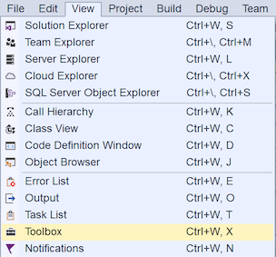
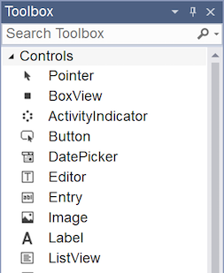
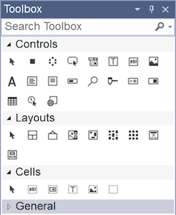
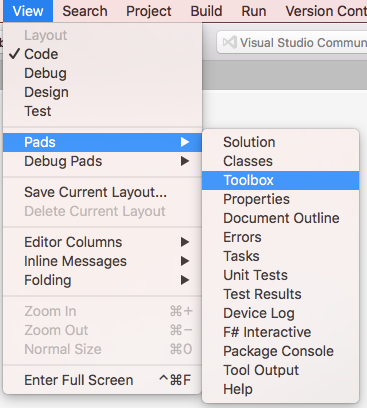
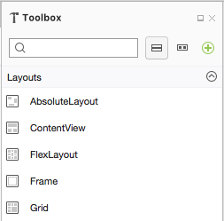
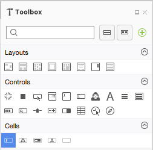

# Xamarin.Forms XAML Toolbox

Visual Studio 2017 version 15.8 and Visual Studio for Mac 7.6 now have a Toolbox
available while editing Xamarin.Forms XAML files. The toolbox contains all the built-in
Xamarin.Forms controls and layouts, which can be dragged into the XAML editor.

# [Visual Studio](#tab/windows)

In Visual Studio 2017, open a Xamarin.Forms XAML file for editing. The toolbox can be shown
by pressing **Ctrl + W, X** on the keyboard, or choosing the **View > Toolbox** menu item.

The toolbox can be hidden and docked like other panes in Visual Studio 2017, using the
icons in the top-right or the context menu. The Xamarin.Forms XAML toolbox has custom view options
that can be changed by right-clicking on each section. Toggle the **List View** option to switch between
the list and compact views:

 

When a Xamarin.Forms XAML file is opened for editing, drag any control or layout from the toolbox into the file, then take advantage of Intellisense to customize the user interface.

# [Visual Studio for Mac](#tab/macos)

In Visual Studio for Mac, choose the **View > Pads > Toolbox** menu item to
show the toolbox:

The toolbox can be hidden and pinned like other pads in Visual Studio for Mac, using the
icons in the top-right of the pad. The Xamarin.Forms XAML toolbox has custom view options
that can be changed with the buttons next to the search box:

- Show categories
- Use compact display

The full and compact options are shown below:

 

When a Xamarin.Forms XAML file is opened for editing, drag any control or layout from the toolbox into the file, then take advantage of Intellisense to customize the user interface.

-----
