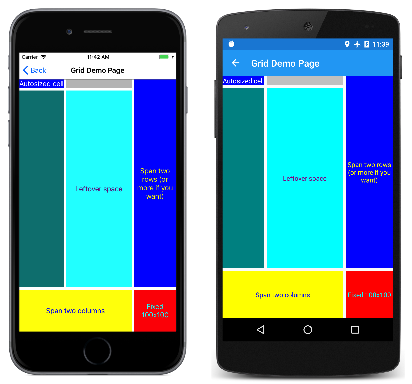
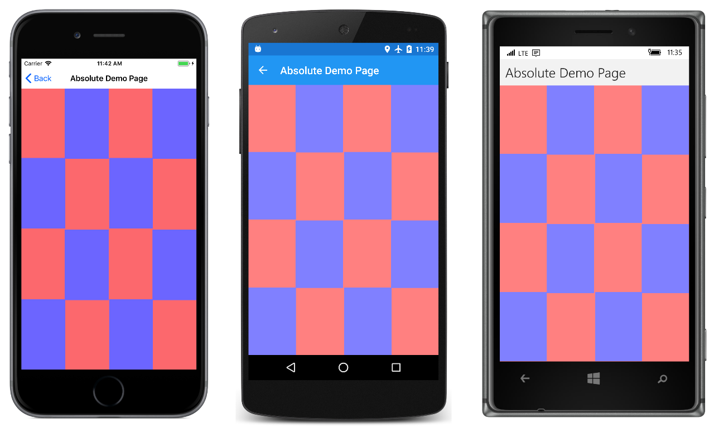

# Part 2. Essential XAML Syntax

[ Download the sample](/samples/xamarin/xamarin-forms-samples/xamlsamples)

_XAML is mostly designed for instantiating and initializing objects. But often, properties must be set to complex objects that cannot easily be represented as XML strings, and sometimes properties defined by one class must be set on a child class. These two needs require the essential XAML syntax features of property elements and attached properties._

## Property Elements

In XAML, properties of classes are normally set as XML attributes:

```xaml
<Label Text="Hello, XAML!"
       VerticalOptions="Center"
       FontAttributes="Bold"
       FontSize="Large"
       TextColor="Aqua" />
```

However, there is an alternative way to set a property in XAML. To try this alternative with `TextColor`, first delete the existing `TextColor` setting:

```xaml
<Label Text="Hello, XAML!"
       VerticalOptions="Center"
       FontAttributes="Bold"
       FontSize="Large" />
```

Open up the empty-element `Label` tag by separating it into start and end tags:

```xaml
<Label Text="Hello, XAML!"
       VerticalOptions="Center"
       FontAttributes="Bold"
       FontSize="Large">

</Label>
```

Within these tags, add start and end tags that consist of the class name and a property name separated by a period:

```xaml
<Label Text="Hello, XAML!"
       VerticalOptions="Center"
       FontAttributes="Bold"
       FontSize="Large">
    <Label.TextColor>

    </Label.TextColor>
</Label>
```

Set the property value as content of these new tags, like this:

```xaml
<Label Text="Hello, XAML!"
       VerticalOptions="Center"
       FontAttributes="Bold"
       FontSize="Large">
    <Label.TextColor>
        Aqua
    </Label.TextColor>
</Label>
```

These two ways to specify the `TextColor` property are functionally equivalent, but don't use the two ways for the same property because that would effectively be setting the property twice, and might be ambiguous.

With this new syntax, some handy terminology can be introduced:

- `Label` is an  *object element*. It is a Xamarin.Forms object expressed as an XML element.
- `Text`,  `VerticalOptions`, `FontAttributes` and  `FontSize` are  *property attributes*. They are Xamarin.Forms properties expressed as XML attributes.
- In that final snippet, `TextColor` has become a  *property element*. It is a Xamarin.Forms property but it is now an XML element.

The definition of property elements might at first seem to be a violation of XML syntax, but it’s not. The period has no special meaning in XML. To an XML decoder, `Label.TextColor` is simply a normal child element.

In XAML, however, this syntax is very special. One of the rules for property elements is that nothing else can appear in the `Label.TextColor` tag. The value of the property is always defined as content between the property-element start and end tags.

You can use property-element syntax on more than one property:

```xaml
<Label Text="Hello, XAML!"
       VerticalOptions="Center">
    <Label.FontAttributes>
        Bold
    </Label.FontAttributes>
    <Label.FontSize>
        Large
    </Label.FontSize>
    <Label.TextColor>
        Aqua
    </Label.TextColor>
</Label>
```

Or you can use property-element syntax for all the properties:

```xaml
<Label>
    <Label.Text>
        Hello, XAML!
    </Label.Text>
    <Label.FontAttributes>
        Bold
    </Label.FontAttributes>
    <Label.FontSize>
        Large
    </Label.FontSize>
    <Label.TextColor>
        Aqua
    </Label.TextColor>
    <Label.VerticalOptions>
        Center
    </Label.VerticalOptions>
</Label>
```

At first, property-element syntax might seem like an unnecessary long-winded replacement for something comparatively quite simple, and in these examples that is certainly the case.

However, property-element syntax becomes essential when the value of a property is too complex to be expressed as a simple string. Within the property-element tags you can instantiate another object and set its properties. For example, you can explicitly set a property such as `VerticalOptions` to a `LayoutOptions` value with property settings:

```xaml
<Label>
    ...
    <Label.VerticalOptions>
        <LayoutOptions Alignment="Center" />
    </Label.VerticalOptions>
</Label>
```

Another example: The `Grid` has two properties named `RowDefinitions` and `ColumnDefinitions`. These two properties are of type `RowDefinitionCollection` and `ColumnDefinitionCollection`, which are collections of `RowDefinition` and `ColumnDefinition` objects. You need to use property element syntax to set these collections.

Here’s the beginning of the XAML file for a `GridDemoPage` class, showing the property element tags for the `RowDefinitions` and `ColumnDefinitions` collections:

```xaml
<ContentPage xmlns="http://xamarin.com/schemas/2014/forms"
             xmlns:x="http://schemas.microsoft.com/winfx/2009/xaml"
             x:Class="XamlSamples.GridDemoPage"
             Title="Grid Demo Page">
    <Grid>
        <Grid.RowDefinitions>
            <RowDefinition Height="Auto" />
            <RowDefinition Height="*" />
            <RowDefinition Height="100" />
        </Grid.RowDefinitions>
        <Grid.ColumnDefinitions>
            <ColumnDefinition Width="Auto" />
            <ColumnDefinition Width="*" />
            <ColumnDefinition Width="100" />
        </Grid.ColumnDefinitions>
        ...
    </Grid>
</ContentPage>
```

Notice the abbreviated syntax for defining auto-sized cells, cells of pixel widths and heights, and star settings.

## Attached Properties

You've just seen that the `Grid` requires property elements for the `RowDefinitions` and `ColumnDefinitions` collections to define the rows and columns. However, there must also be some way for the programmer to indicate the row and column where each child of the `Grid` resides.

Within the tag for each child of the `Grid` you specify the row and column of that child using the following attributes:

- `Grid.Row`
- `Grid.Column`

The default values of these attributes are 0. You can also indicate if a child spans more than one row or column with these attributes:

- `Grid.RowSpan`
- `Grid.ColumnSpan`

These two attributes have default values of 1.

Here’s the complete GridDemoPage.xaml file:

```xaml
<ContentPage xmlns="http://xamarin.com/schemas/2014/forms"
             xmlns:x="http://schemas.microsoft.com/winfx/2009/xaml"
             x:Class="XamlSamples.GridDemoPage"
             Title="Grid Demo Page">

    <Grid>
        <Grid.RowDefinitions>
            <RowDefinition Height="Auto" />
            <RowDefinition Height="*" />
            <RowDefinition Height="100" />
        </Grid.RowDefinitions>

        <Grid.ColumnDefinitions>
            <ColumnDefinition Width="Auto" />
            <ColumnDefinition Width="*" />
            <ColumnDefinition Width="100" />
        </Grid.ColumnDefinitions>

        <Label Text="Autosized cell"
               Grid.Row="0" Grid.Column="0"
               TextColor="White"
               BackgroundColor="Blue" />

        <BoxView Color="Silver"
                 HeightRequest="0"
                 Grid.Row="0" Grid.Column="1" />

        <BoxView Color="Teal"
                 Grid.Row="1" Grid.Column="0" />

        <Label Text="Leftover space"
               Grid.Row="1" Grid.Column="1"
               TextColor="Purple"
               BackgroundColor="Aqua"
               HorizontalTextAlignment="Center"
               VerticalTextAlignment="Center" />

        <Label Text="Span two rows (or more if you want)"
               Grid.Row="0" Grid.Column="2" Grid.RowSpan="2"
               TextColor="Yellow"
               BackgroundColor="Blue"
               HorizontalTextAlignment="Center"
               VerticalTextAlignment="Center" />

        <Label Text="Span two columns"
               Grid.Row="2" Grid.Column="0" Grid.ColumnSpan="2"
               TextColor="Blue"
               BackgroundColor="Yellow"
               HorizontalTextAlignment="Center"
               VerticalTextAlignment="Center" />

        <Label Text="Fixed 100x100"
               Grid.Row="2" Grid.Column="2"
               TextColor="Aqua"
               BackgroundColor="Red"
               HorizontalTextAlignment="Center"
               VerticalTextAlignment="Center" />

    </Grid>
</ContentPage>
```

The `Grid.Row` and `Grid.Column` settings of 0 are not required but are generally included for purposes of clarity.

Here’s what it looks like:

[](essential-xaml-syntax-images/griddemo-large.png#lightbox)

Judging solely from the syntax, these `Grid.Row`, `Grid.Column`, `Grid.RowSpan`, and `Grid.ColumnSpan` attributes appear to be static fields or properties of `Grid`, but interestingly enough, `Grid` does not define anything named `Row`, `Column`, `RowSpan`, or `ColumnSpan`.

Instead, `Grid` defines four bindable properties named `RowProperty`, `ColumnProperty`, `RowSpanProperty`, and `ColumnSpanProperty`. These are special types of bindable properties known as *attached properties*. They are defined by the `Grid` class but set on children of the `Grid`.

When you wish to use these attached properties in code, the `Grid` class provides static methods named `SetRow`, `GetColumn`, and so forth. But in XAML, these attached properties are set as attributes in the children of the `Grid` using simple properties names.

Attached properties are always recognizable in XAML files as attributes containing both a class and a property name separated by a period. They are called *attached properties* because they are defined by one class (in this case, `Grid`) but attached to other objects (in this case, children of the `Grid`). During layout, the `Grid` can interrogate the values of these attached properties to know where to place each child.

The `AbsoluteLayout` class defines two attached properties named `LayoutBounds` and `LayoutFlags`. Here’s a checkerboard pattern realized using the proportional positioning and sizing features of `AbsoluteLayout`:

```xaml
<ContentPage xmlns="http://xamarin.com/schemas/2014/forms"
             xmlns:x="http://schemas.microsoft.com/winfx/2009/xaml"
             x:Class="XamlSamples.AbsoluteDemoPage"
             Title="Absolute Demo Page">

    <AbsoluteLayout BackgroundColor="#FF8080">
        <BoxView Color="#8080FF"
                 AbsoluteLayout.LayoutBounds="0.33, 0, 0.25, 0.25"
                 AbsoluteLayout.LayoutFlags="All" />

        <BoxView Color="#8080FF"
                 AbsoluteLayout.LayoutBounds="1, 0, 0.25, 0.25"
                 AbsoluteLayout.LayoutFlags="All" />

        <BoxView Color="#8080FF"
                 AbsoluteLayout.LayoutBounds="0, 0.33, 0.25, 0.25"
                 AbsoluteLayout.LayoutFlags="All" />

        <BoxView Color="#8080FF"
                 AbsoluteLayout.LayoutBounds="0.67, 0.33, 0.25, 0.25"
                 AbsoluteLayout.LayoutFlags="All" />

        <BoxView Color="#8080FF"
                 AbsoluteLayout.LayoutBounds="0.33, 0.67, 0.25, 0.25"
                 AbsoluteLayout.LayoutFlags="All" />

        <BoxView Color="#8080FF"
                 AbsoluteLayout.LayoutBounds="1, 0.67, 0.25, 0.25"
                 AbsoluteLayout.LayoutFlags="All" />

        <BoxView Color="#8080FF"
                 AbsoluteLayout.LayoutBounds="0, 1, 0.25, 0.25"
                 AbsoluteLayout.LayoutFlags="All" />

        <BoxView Color="#8080FF"
                 AbsoluteLayout.LayoutBounds="0.67, 1, 0.25, 0.25"
                 AbsoluteLayout.LayoutFlags="All" />

  </AbsoluteLayout>
</ContentPage>
```

And here it is:

[](essential-xaml-syntax-images/absolutedemo-large.png#lightbox)

For something like this, you might question the wisdom of using XAML. Certainly, the repetition and regularity of the `LayoutBounds` rectangle suggests that it might be better realized in code.

That’s certainly a legitimate concern, and there’s no problem with balancing the use of code and markup when defining your user interfaces. It’s easy to define some of the visuals in XAML and then use the constructor of the code-behind file to add some more visuals that might be better generated in loops.

## Content Properties

In the previous examples, the `StackLayout`, `Grid`, and `AbsoluteLayout` objects are set to the `Content` property of the `ContentPage`, and the children of these layouts are actually items in the `Children` collection. Yet these `Content` and `Children` properties are nowhere in the XAML file.

You can certainly include the `Content` and `Children` properties as property elements, such as in the **XamlPlusCode** sample:

```xaml
<ContentPage xmlns="http://xamarin.com/schemas/2014/forms"
             xmlns:x="http://schemas.microsoft.com/winfx/2009/xaml"
             x:Class="XamlSamples.XamlPlusCodePage"
             Title="XAML + Code Page">
    <ContentPage.Content>
        <StackLayout>
            <StackLayout.Children>
                <Slider VerticalOptions="CenterAndExpand"
                        ValueChanged="OnSliderValueChanged" />

                <Label x:Name="valueLabel"
                       Text="A simple Label"
                       FontSize="Large"
                       HorizontalOptions="Center"
                       VerticalOptions="CenterAndExpand" />

                <Button Text="Click Me!"
                      HorizontalOptions="Center"
                      VerticalOptions="CenterAndExpand"
                      Clicked="OnButtonClicked" />
            </StackLayout.Children>
        </StackLayout>
    </ContentPage.Content>
</ContentPage>
```

The real question is: Why are these property elements *not* required in the XAML file?

Elements defined in Xamarin.Forms for use in XAML are allowed to have one property flagged in the `ContentProperty` attribute on the class. If you look up the `ContentPage` class in the online Xamarin.Forms documentation, you’ll see this attribute:

```csharp
[Xamarin.Forms.ContentProperty("Content")]
public class ContentPage : TemplatedPage
```

This means that the `Content` property-element tags are not required. Any XML content that appears between the start and end `ContentPage` tags is assumed to be assigned to the `Content` property.

 `StackLayout`, `Grid`, `AbsoluteLayout`, and `RelativeLayout` all derive from `Layout<View>`, and if you look up `Layout<T>` in the  Xamarin.Forms documentation, you’ll see another `ContentProperty` attribute:

```csharp
[Xamarin.Forms.ContentProperty("Children")]
public abstract class Layout<T> : Layout ...
```

That allows content of the layout to be automatically added to the `Children` collection without explicit `Children` property-element tags.

Other classes also have `ContentProperty` attribute definitions. For example, the content property of `Label` is `Text`. Check the API documentation for others.

## Platform Differences with OnPlatform

In single page applications, it is common to set the `Padding` property on the page to avoid overwriting the iOS status bar. In code, you can use the `Device.RuntimePlatform` property for this purpose:

```csharp
if (Device.RuntimePlatform == Device.iOS)
{
    Padding = new Thickness(0, 20, 0, 0);
}
```

You can also do something similar in XAML using the [`OnPlatform`](xref:Xamarin.Forms.OnPlatform`1) and [`On`](xref:Xamarin.Forms.On) classes. First include property elements for the `Padding` property near the top of the page:

```xaml
<ContentPage xmlns="http://xamarin.com/schemas/2014/forms"
             xmlns:x="http://schemas.microsoft.com/winfx/2009/xaml"
             x:Class="...">

    <ContentPage.Padding>

    </ContentPage.Padding>
    ...
</ContentPage>
```

Within these tags, include an `OnPlatform` tag. `OnPlatform` is a generic class. You need to specify the generic type argument, in this case, `Thickness`, which is the type of `Padding` property. Fortunately, there’s a XAML attribute specifically to define generic arguments called `x:TypeArguments`. This should match the type of the property you're setting:

```xaml
<ContentPage xmlns="http://xamarin.com/schemas/2014/forms"
             xmlns:x="http://schemas.microsoft.com/winfx/2009/xaml"
             x:Class="...">

    <ContentPage.Padding>
        <OnPlatform x:TypeArguments="Thickness">

        </OnPlatform>
    </ContentPage.Padding>
  ...
</ContentPage>
```

`OnPlatform` has a property named `Platforms` that is an `IList` of `On` objects. Use property element tags for that property:

```xaml
<ContentPage xmlns="http://xamarin.com/schemas/2014/forms"
             xmlns:x="http://schemas.microsoft.com/winfx/2009/xaml"
             x:Class="...">

    <ContentPage.Padding>
        <OnPlatform x:TypeArguments="Thickness">
            <OnPlatform.Platforms>

            </OnPlatform.Platforms>
        </OnPlatform>
    </ContentPage.Padding>
  ...
</ContentPage>
```

Now add `On` elements. For each one set the `Platform` property and the `Value` property to markup for the `Thickness` property:

```xaml
<ContentPage xmlns="http://xamarin.com/schemas/2014/forms"
             xmlns:x="http://schemas.microsoft.com/winfx/2009/xaml"
             x:Class="...">

    <ContentPage.Padding>
        <OnPlatform x:TypeArguments="Thickness">
            <OnPlatform.Platforms>
                <On Platform="iOS" Value="0, 20, 0, 0" />
                <On Platform="Android" Value="0, 0, 0, 0" />
                <On Platform="UWP" Value="0, 0, 0, 0" />
            </OnPlatform.Platforms>
        </OnPlatform>
    </ContentPage.Padding>
  ...
</ContentPage>
```

This markup can be simplified. The content property of `OnPlatform` is `Platforms`, so those property-element tags can be removed:

```xaml
<ContentPage xmlns="http://xamarin.com/schemas/2014/forms"
             xmlns:x="http://schemas.microsoft.com/winfx/2009/xaml"
             x:Class="...">

    <ContentPage.Padding>
        <OnPlatform x:TypeArguments="Thickness">
            <On Platform="iOS" Value="0, 20, 0, 0" />
            <On Platform="Android" Value="0, 0, 0, 0" />
            <On Platform="UWP" Value="0, 0, 0, 0" />
        </OnPlatform>
    </ContentPage.Padding>
  ...
</ContentPage>
```

The `Platform` property of `On` is of type `IList<string>`, so you can include multiple platforms if the values are the same:

```xaml
<ContentPage xmlns="http://xamarin.com/schemas/2014/forms"
             xmlns:x="http://schemas.microsoft.com/winfx/2009/xaml"
             x:Class="...">

    <ContentPage.Padding>
        <OnPlatform x:TypeArguments="Thickness">
            <On Platform="iOS" Value="0, 20, 0, 0" />
            <On Platform="Android, UWP" Value="0, 0, 0, 0" />
        </OnPlatform>
    </ContentPage.Padding>
  ...
</ContentPage>
```

Because Android and UWP are set to the default value of `Padding`, that tag can be removed:

```xaml
<ContentPage xmlns="http://xamarin.com/schemas/2014/forms"
             xmlns:x="http://schemas.microsoft.com/winfx/2009/xaml"
             x:Class="...">

    <ContentPage.Padding>
        <OnPlatform x:TypeArguments="Thickness">
            <On Platform="iOS" Value="0, 20, 0, 0" />
        </OnPlatform>
    </ContentPage.Padding>
  ...
</ContentPage>
```

This is the standard way to set a platform-dependent `Padding` property in XAML. If the `Value` setting cannot be represented by a single string, you can define property elements for it:

```xaml
<ContentPage xmlns="http://xamarin.com/schemas/2014/forms"
             xmlns:x="http://schemas.microsoft.com/winfx/2009/xaml"
             x:Class="...">

    <ContentPage.Padding>
        <OnPlatform x:TypeArguments="Thickness">
            <On Platform="iOS">
                <On.Value>
                    0, 20, 0, 0
                </On.Value>
            </On>
        </OnPlatform>
    </ContentPage.Padding>
  ...
</ContentPage>
```

> [!NOTE]
> The `OnPlatform` markup extension can also be used in XAML to customize UI appearance on a per-platform basis. It provides the same functionality as the `OnPlatform` and `On` classes, but with a more concise representation. For more information, see [OnPlatform Markup Extension](~/xamarin-forms/xaml/markup-extensions/consuming.md#onplatform-markup-extension).

## Summary

With property elements and attached properties, much of the basic XAML syntax has been established. However, sometimes you need to set properties to objects in an indirect manner, for example, from a resource dictionary. This approach is covered in the next part, Part [3. XAML Markup Extensions](~/xamarin-forms/xaml/xaml-basics/xaml-markup-extensions.md).

## Related Links

- [XamlSamples](/samples/xamarin/xamarin-forms-samples/xamlsamples)
- [Part 1. Getting Started with XAML](~/xamarin-forms/xaml/xaml-basics/get-started-with-xaml.md)
- [Part 3. XAML Markup Extensions](~/xamarin-forms/xaml/xaml-basics/xaml-markup-extensions.md)
- [Part 4. Data Binding Basics](~/xamarin-forms/xaml/xaml-basics/data-binding-basics.md)
- [Part 5. From Data Binding to MVVM](~/xamarin-forms/xaml/xaml-basics/data-bindings-to-mvvm.md)