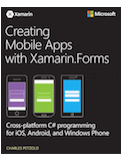

# Xamarin.Forms XAML Basics

[ Download the sample](https://docs.microsoft.com/samples/xamarin/xamarin-forms-samples/xamlsamples)

XAML—the eXtensible Application Markup Language—allows developers to define user interfaces in Xamarin.Forms applications using markup rather than code. XAML is never required in a Xamarin.Forms program, but it is often more succinct and more visually coherent than equivalent code, and potentially toolable. XAML is particularly well suited for use with the popular MVVM (Model-View-ViewModel) application architecture: XAML defines the View that is linked to ViewModel code through XAML-based data bindings.

## XAML Basics Contents

- [Overview](#Overview)
- [Part 1. Getting Started with XAML](~/xamarin-forms/xaml/xaml-basics/get-started-with-xaml.md)
- [Part 2. Essential XAML Syntax](~/xamarin-forms/xaml/xaml-basics/essential-xaml-syntax.md)
- [Part 3. XAML Markup Extensions](~/xamarin-forms/xaml/xaml-basics/xaml-markup-extensions.md)
- [Part 4. Data Binding Basics](~/xamarin-forms/xaml/xaml-basics/data-binding-basics.md)
- [Part 5. From Data Binding to MVVM](~/xamarin-forms/xaml/xaml-basics/data-bindings-to-mvvm.md)

In addition to these XAML Basics articles, you can download chapters of the book [Creating Mobile Apps with Xamarin.Forms](~/xamarin-forms/creating-mobile-apps-xamarin-forms/index.md):

XAML topics are covered in more depth in many chapters of the book, including:

| Chapter | Download | Summary |
|---------|---------|---------|
| Chapter 7. XAML vs. Code | [Download PDF](https://download.xamarin.com/developer/xamarin-forms-book/XamarinFormsBook-Ch07-Apr2016.pdf) | [Summary](~/xamarin-forms/creating-mobile-apps-xamarin-forms/summaries/chapter07.md) |
| Chapter 8. Code and XAML in Harmony | [Download PDF](https://download.xamarin.com/developer/xamarin-forms-book/XamarinFormsBook-Ch08-Apr2016.pdf) | [Summary](~/xamarin-forms/creating-mobile-apps-xamarin-forms/summaries/chapter08.md) |
| Chapter 10. XAML Markup Extensions | [Download PDF](https://download.xamarin.com/developer/xamarin-forms-book/XamarinFormsBook-Ch10-Apr2016.pdf) | [Summary](~/xamarin-forms/creating-mobile-apps-xamarin-forms/summaries/chapter10.md) |
| Chapter 18. MVVM | [Download PDF](https://download.xamarin.com/developer/xamarin-forms-book/XamarinFormsBook-Ch18-Apr2016.pdf) | [Summary](~/xamarin-forms/creating-mobile-apps-xamarin-forms/summaries/chapter18.md) |

These chapters can be [downloaded for free](~/xamarin-forms/creating-mobile-apps-xamarin-forms/index.md).

<a name="Overview" />

## Overview

XAML is an XML-based language created by Microsoft as an alternative to programming code for instantiating and initializing objects, and organizing those objects in parent-child hierarchies. XAML has been adapted to several technologies within the .NET framework, but it has found its greatest utility in defining the layout of user interfaces within the Windows Presentation Foundation (WPF), Silverlight, the Windows Runtime, and the Universal Windows Platform (UWP).

XAML is also part of Xamarin.Forms, the cross-platform natively-based programming interface for iOS, Android, and UWP mobile devices. Within the XAML file, the Xamarin.Forms developer can define user interfaces using all the Xamarin.Forms views, layouts, and pages, as well as custom classes. The XAML file can be either compiled or embedded in the executable. Either way, the XAML information is parsed at build time to locate named objects, and again at runtime to instantiate and initialize objects, and to establish links between these objects and programming code.

XAML has several advantages over equivalent code:

- XAML is often more succinct and readable than equivalent code.
- The parent-child hierarchy inherent in XML allows XAML to mimic with greater visual clarity the parent-child hierarchy of user-interface objects.
- XAML can be easily hand-written by programmers, but also lends itself to be toolable and generated by visual design tools.

Of course, there are also disadvantages, mostly related to limitations that are intrinsic to markup languages:

- XAML cannot contain code. All event handlers must be defined in a code file.
- XAML cannot contain loops for repetitive processing. (However, several Xamarin.Forms visual objects—most notably  [`ListView`](xref:Xamarin.Forms.ListView) —can generate multiple children based on the objects in its `ItemsSource` collection.)
- XAML cannot contain conditional processing (However, a data-binding can reference a code-based binding converter that effectively allows some conditional processing.)
- XAML generally cannot instantiate classes that do not define a parameterless constructor. (However, there is sometimes a way around this restriction.)
- XAML generally cannot call methods. (Again, this restriction can sometimes be overcome.)

There is not yet a visual designer for generating XAML in Xamarin.Forms applications. All XAML must be hand-written, but there is a [XAML Previewer](~/xamarin-forms/xaml/xaml-previewer/index.md). Programmers new to XAML might want to frequently build and run their applications, particularly after anything that might not be obviously correct. Even developers with lots of experience in XAML know that experimentation is rewarding.

XAML is basically XML, but XAML has some unique syntax features. The most important are:

- Property elements
- Attached properties
- Markup extensions

These features are *not* XML extensions. XAML is entirely legal XML. But these XAML syntax features use XML in unique ways. They are discussed in detail in the articles below, which conclude with an introduction to using XAML for implementing MVVM.

## Requirements

This article assumes a working familiarity with Xamarin.Forms. This article also assumes some familiarity with XML, including understanding the use of XML namespace declarations, and the terms *element*, *tag*, and *attribute*.

When you're familiar with Xamarin.Forms and XML, start reading [Part 1. Getting Started with XAML](~/xamarin-forms/xaml/xaml-basics/get-started-with-xaml.md).

## Related Links

- [XamlSamples](https://docs.microsoft.com/samples/xamarin/xamarin-forms-samples/xamlsamples)
- [Creating Mobile Apps book](~/xamarin-forms/creating-mobile-apps-xamarin-forms/index.md)
- [Xamarin.Forms Samples](https://docs.microsoft.com/samples/browse/?products=xamarin&term=Xamarin.Forms)
