# XAML Controls

[ Download the sample](/samples/xamarin/xamarin-forms-samples/formsgallery)

Views are user-interface objects such as labels, buttons, and sliders that are commonly known as *controls* or *widgets* in other graphical programming environments. The views supported by Xamarin.Forms all derive from the [`View`](xref:Xamarin.Forms.View) class.

All of the views that are defined in Xamarin.Forms can be referenced from XAML files.

## Views for presentation

| View | Example |
| --- | --- |
| <h3>BoxView</h3>Displays a rectangle of a particular color.

[API](xref:Xamarin.Forms.BoxView) / [Guide](~/xamarin-forms/user-interface/boxview.md) | 
<pre>&lt;BoxView Color="Accent"          WidthRequest="150"          HeightRequest="150"          HorizontalOptions="Center"&gt;</pre>
 |
| <h3>Ellipse</h3>Displays an ellipse or circle.

[API](xref:Xamarin.Forms.Shapes.Ellipse) / [Guide](~/xamarin-forms/user-interface/shapes/ellipse.md) | 
<pre>&lt;Ellipse Fill="Red"          WidthRequest="150"          HeightRequest="50"          HorizontalOptions="Center" /&gt;</pre>
 |
| <h3>Image</h3>Displays a bitmap.

[API](xref:Xamarin.Forms.Image) / [Guide](~/xamarin-forms/user-interface/images.md) | <pre>&lt;Image Source="https://aka.ms/campus.jpg"        Aspect="AspectFit"        HorizontalOptions="Center" /&gt;</pre>
 |
| <h3>Label</h3>Displays one or more lines of text.
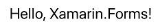
[API](xref:Xamarin.Forms.Label) / [Guide](~/xamarin-forms/user-interface/text/label.md) | 
<pre>&lt;Label Text="Hello, Xamarin.Forms!"        FontSize="Large"        FontAttributes="Italic"        HorizontalTextAlignment="Center" /&gt;</pre>
 |
| <h3>Line</h3>Display a line.
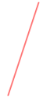
[API](xref:Xamarin.Forms.Shapes.Line) / [Guide](~/xamarin-forms/user-interface/shapes/line.md) | 
<pre>&lt;Line X1="40"       Y1="0"       X2="0"       Y2="120"       Stroke="Red"       HorizontalOptions="Center" /&gt;</pre>
 |
| <h3>Map</h3>Displays a map.
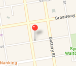
[API](xref:Xamarin.Forms.Maps.Map) / [Guide](~/xamarin-forms/user-interface/map/index.md) | 
<pre>&lt;maps:Map ItemsSource="{Binding Locations}" /&gt;</pre>
 |
| <h3>Path</h3>Display curves and complex shapes.
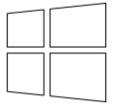
[API](xref:Xamarin.Forms.Shapes.Path) / [Guide](~/xamarin-forms/user-interface/shapes/path.md) | 
<pre>&lt;Path Stroke="Black"       Aspect="Uniform"       HorizontalOptions="Center"       HeightRequest="100"       WidthRequest="100"       Data="M13.9,16.2             L32,16.2 32,31.9 13.9,30.1Z             M0,16.2             L11.9,16.2 11.9,29.9 0,28.6Z             M11.9,2             L11.9,14.2 0,14.2 0,3.3Z             M32,0             L32,14.2 13.9,14.2 13.9,1.8Z" /&gt;</pre>
 |
| <h3>Polygon</h3>Display a polygon.
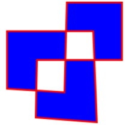
[API](xref:Xamarin.Forms.Shapes.Polygon) / [Guide](~/xamarin-forms/user-interface/shapes/polygon.md) | 
<pre>&lt;Polygon Points="0 48, 0 144, 96 150, 100 0, 192 0, 192 96,                  50 96, 48 192, 150 200 144 48"          Fill="Blue"          Stroke="Red"          StrokeThickness="3"          HorizontalOptions="Center" /&gt;</pre>
 |
| <h3>Polyline</h3>Display a series of connected straight lines.

[API](xref:Xamarin.Forms.Shapes.Polyline) / [Guide](~/xamarin-forms/user-interface/shapes/Polyline.md) | 
<pre>&lt;Polyline Points="0,0 10,30, 15,0 18,60 23,30 35,30 40,0                   43,60 48,30 100,30"           Stroke="Red"           HorizontalOptions="Center" /&gt;</pre>
 |
| <h3>Rectangle</h3>Display a rectangle or square.

[API](xref:Xamarin.Forms.Shapes.Rectangle) / [Guide](~/xamarin-forms/user-interface/shapes/rectangle.md) | 
<pre>&lt;Rectangle Fill="Red"            WidthRequest="150"            HeightRequest="50"            HorizontalOptions="Center" /&gt;</pre>
 |  
| <h3>WebView</h3>Displays Web pages or HTML content.
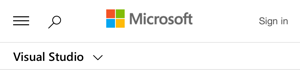
[API](xref:Xamarin.Forms.WebView) / [Guide](~/xamarin-forms/user-interface/webview.md) | 
<pre>&lt;WebView Source="https://docs.microsoft.com/xamarin/"          VerticalOptions="FillAndExpand" /&gt;</pre>
 |
|     |     |

## Views that initiate commands

| View | Example |
| --- | --- |
| <h3>Button</h3>Displays text in a rectangular object.
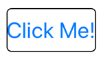
[API](xref:Xamarin.Forms.Button) / [Guide](~/xamarin-forms/user-interface/button.md) | 
<pre>&lt;Button Text="Click Me!"         Font="Large"         BorderWidth="1"         HorizontalOptions="Center"         VerticalOptions="CenterAndExpand"         Clicked="OnButtonClicked" /&gt;</pre>
 |
| <h3>ImageButton</h3>Displays an image in a rectangular object.

[API](xref:Xamarin.Forms.ImageButton) / [Guide](~/xamarin-forms/user-interface/imagebutton.md) | 
<pre>&lt;ImageButton Source="XamarinLogo.png"              HorizontalOptions="Center"              VerticalOptions="CenterAndExpand"              Clicked="OnImageButtonClicked" /&gt;</pre>
 |
| <h3>RadioButton</h3>Allows the selection of one option from a set.
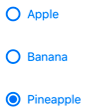
[Guide](~/xamarin-forms/user-interface/radiobutton.md) | 
<pre>&lt;RadioButton Text="Pineapple"              CheckedChanged="OnRadioButtonCheckedChanged" /&gt;</pre>
 |
| <h3>RefreshView</h3>Provides pull-to-refresh functionality for scrollable content.

[Guide](~/xamarin-forms/user-interface/refreshview.md) | 
<pre>&lt;RefreshView IsRefreshing="{Binding IsRefreshing}"              Command="{Binding RefreshCommand}" &gt;     &lt;!-- Scrollable control goes here --&gt; &lt;/RefreshView&gt;</pre>
 |
| <h3>SearchBar</h3> Accepts user input that it uses to perform a search.

[Guide](~/xamarin-forms/user-interface/searchbar.md) | 
<pre>&lt;SearchBar Placeholder="Enter search term"            SearchButtonPressed="OnSearchBarButtonPressed" /&gt;</pre>
 |
| <h3>SwipeView</h3> Provides context menu items that are revealed by a swipe gesture.
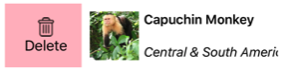
[Guide](~/xamarin-forms/user-interface/swipeview.md) | 
<pre>&lt;SwipeView&gt;     &lt;SwipeView.LeftItems&gt;         &lt;SwipeItems&gt;             &lt;SwipeItem Text="Delete"                        IconImageSource="delete.png"                        BackgroundColor="LightPink"                        Invoked="OnDeleteInvoked" /&gt;         &lt;/SwipeItems&gt;     &lt;/SwipeView.LeftItems&gt;     &lt;!-- Content --&gt; &lt;/SwipeView&gt;</pre>
 |
|     |     |

## Views for setting values

| View | Example |
| --- | --- |
| <h3>CheckBox</h3>Allows the selection of a `boolean` value.

 [Guide](~/xamarin-forms/user-interface/checkbox.md) | 
<pre>&lt;CheckBox IsChecked="true"           HorizontalOptions="Center"           VerticalOptions="CenterAndExpand" /&gt;</pre>
 |
| <h3>Slider</h3>Allows the selection of a `double` value from a continuous range.

[API](xref:Xamarin.Forms.Slider) / [Guide](~/xamarin-forms/user-interface/slider.md) | 
<pre>&lt;Slider Minimum="0"         Maximum="100"         VerticalOptions="CenterAndExpand" /&gt;</pre>
 |
| <h3>Stepper</h3>Allows the selection of a `double` value from an incremental range.
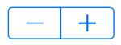
[API](xref:Xamarin.Forms.Stepper) / [Guide](~/xamarin-forms/user-interface/stepper.md) | 
<pre>&lt;Stepper Minimum="0"          Maximum="10"          Increment="0.1"          HorizontalOptions="Center"          VerticalOptions="CenterAndExpand" /&gt;</pre>
 |
| <h3>Switch</h3>Allows the selection of a `boolean` value.

[API](xref:Xamarin.Forms.Switch) / [Guide](~/xamarin-forms/user-interface/switch.md)| 
<pre>&lt;Switch IsToggled="false"         HorizontalOptions="Center"         VerticalOptions="CenterAndExpand" /&gt;</pre>
 |
| <h3>DatePicker</h3>Allows the selection of a date.
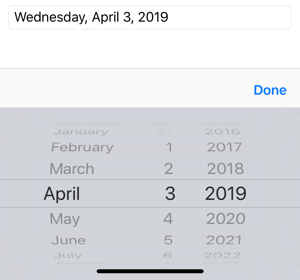
[API](xref:Xamarin.Forms.DatePicker) / [Guide](~/xamarin-forms/user-interface/datepicker.md) | 
<pre>&lt;DatePicker Format="D"             VerticalOptions="CenterAndExpand" /&gt;</pre>
 |
| <h3>TimePicker</h3>Allows the selection of a time.
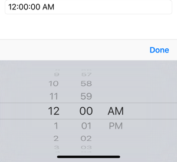
[API](xref:Xamarin.Forms.TimePicker) / [Guide](~/xamarin-forms/user-interface/timepicker.md) | 
<pre>&lt;TimePicker Format="T"             VerticalOptions="CenterAndExpand" /&gt;</pre>
 |
|     |     |

## Views for editing text

| View | Example |
| --- | --- |
| <h3>Entry</h3>Allows a single line of text to be entered and edited.
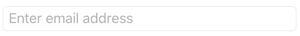
[API](xref:Xamarin.Forms.Entry) / [Guide](~/xamarin-forms/user-interface/text/entry.md) | 
<pre>&lt;Entry Keyboard="Email"        Placeholder="Enter email address"        VerticalOptions="CenterAndExpand" /&gt;</pre>
 |
| <h3>Editor</h3>Allows multiple lines of text to be entered and edited.
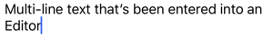
[API](xref:Xamarin.Forms.Editor) / [Guide](~/xamarin-forms/user-interface/text/editor.md) | 
<pre>&lt;Editor VerticalOptions="FillAndExpand" /&gt;</pre>
 |
|     |     |

## Views to indicate activity

| View | Example |
| --- | --- |
| <h3>ActivityIndicator</h3>Displays an animation to show that the application is engaged in a lengthy activity, without giving any indication of progress.

[API](xref:Xamarin.Forms.ActivityIndicator) / [Guide](~/xamarin-forms/user-interface/activityindicator.md) | 
<pre>&lt;ActivityIndicator IsRunning="True"                    VerticalOptions="CenterAndExpand" /&gt;</pre>
 |
| <h3>ProgressBar</h3>Displays an animation to show that the application is progressing through a lengthy activity.

[API](xref:Xamarin.Forms.ProgressBar) / [Guide](~/xamarin-forms/user-interface/progressbar.md) | 
<pre>&lt;ProgressBar Progress=".5"              VerticalOptions="CenterAndExpand" /&gt;</pre>
 |
|     |     |

## Views that display collections

| View | Example |
| --- | --- |
| <h3>CarouselView</h3>Displays a scrollable list of data items.

[Guide](~/xamarin-forms/user-interface/carouselview/index.md) | 
<pre>&lt;CarouselView ItemsSource="{Binding Monkeys}"&gt;               ItemTemplate="{StaticResource MonkeyTemplate}" /&gt;</pre>
|
| <h3>CollectionView</h3>Displays a scrollable list of selectable data items, using different layout specifications.
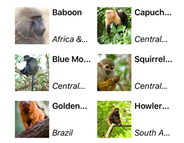
[Guide](~/xamarin-forms/user-interface/collectionview/index.md) | 
<pre>&lt;CollectionView ItemsSource="{Binding Monkeys}"&gt;                 ItemTemplate="{StaticResource MonkeyTemplate}"                 ItemsLayout="VerticalGrid, 2" /&gt;</pre>
 |
| <h3>IndicatorView</h3>Displays indicators that represent the number of items in a `CarouselView`.

[Guide](~/xamarin-forms/user-interface/indicatorview.md) | 
<pre>&lt;IndicatorView x:Name="indicatorView"                IndicatorColor="LightGray"                SelectedIndicatorColor="DarkGray" /&gt;</pre>
 |
| <h3>ListView</h3>Displays a scrollable list of selectable data items.
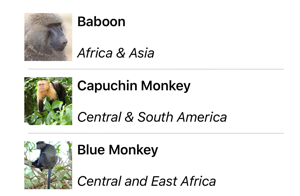
[API](xref:Xamarin.Forms.ListView) / [Guide](~/xamarin-forms/user-interface/listview/index.md) | 
<pre>&lt;ListView ItemsSource="{Binding Monkeys}"&gt;           ItemTemplate="{StaticResource MonkeyTemplate}" /&gt;</pre>
 |
| <h3>Picker</h3>Displays a select item from a list of text strings.

[API](xref:Xamarin.Forms.Picker) / [Guide](~/xamarin-forms/user-interface/picker/index.md) | 
<pre>&lt;Picker Title="Select a monkey"         TitleColor="Red"&gt;   &lt;Picker.ItemsSource&gt;     &lt;x:Array Type="{x:Type x:String}"&gt;       &lt;x:String&gt;Baboon&lt;/x:String&gt;       &lt;x:String&gt;Capuchin Monkey&lt;/x:String&gt;       &lt;x:String&gt;Blue Monkey&lt;/x:String&gt;       &lt;x:String&gt;Squirrel Monkey&lt;/x:String&gt;       &lt;x:String&gt;Golden Lion Tamarin&lt;/x:String&gt;       &lt;x:String&gt;Howler Monkey&lt;/x:String&gt;       &lt;x:String&gt;Japanese Macaque&lt;/x:String&gt;     &lt;/x:Array&gt;   &lt;/Picker.ItemsSource&gt; &lt;/Picker&gt;</pre>
 |
| <h3>TableView</h3>Displays a list of interactive rows.
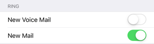
[API](xref:Xamarin.Forms.TableView) / [Guide](~/xamarin-forms/user-interface/tableview.md) | 
<pre>&lt;TableView Intent="Settings"&gt;     &lt;TableRoot&gt;         &lt;TableSection Title="Ring"&gt;             &lt;SwitchCell Text="New Voice Mail" /&gt;             &lt;SwitchCell Text="New Mail" On="true" /&gt;         &lt;/TableSection&gt;     &lt;/TableRoot&gt; &lt;/TableView&gt;</pre>
 |
|     |     |

## Related links

- [Xamarin.Forms FormsGallery sample](/samples/xamarin/xamarin-forms-samples/formsgallery)
- [Xamarin.Forms Samples](/samples/browse/?products=xamarin&term=Xamarin.Forms)
- [Xamarin.Forms API Documentation](/dotnet/api/xamarin.forms?view=xamarin-forms)