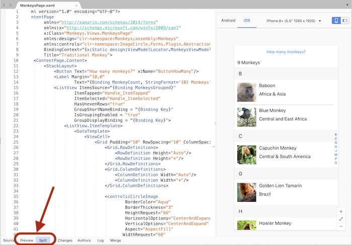

# XAML Previewer for Xamarin.Forms

_See your Xamarin.Forms layouts rendered as you type_

> [!WARNING]
> The XAML Previewer will start being phased out in Visual Studio 2019 version 16.8 and Visual Studio for Mac version 8.8.
> The recommended way to preview your XAML is now with **[XAML Hot Reload](~/xamarin-forms/xaml/hot-reload.md)**.

## Overview

The XAML Previewer shows you how your Xamarin.Forms XAML page will look on iOS and Android. When you make changes to your XAML, you'll see them previewed immediately alongside your code. The XAML Previewer is available in Visual Studio and Visual Studio for Mac.

## Getting started

::: zone pivot="windows"

### Visual Studio 2019

You can open the XAML Previewer by clicking the arrows on the split view pane. If you want to change the default split view behavior, use the **Tools > Options > Xamarin > Xamarin.Forms XAML Previewer** dialog. In this dialog, you can select the default document view and the split orientation.

[](xaml-previewer-images/xamlp-options-vs-lg.png#lightbox)

When you open a XAML file, the editor will open either full-sized or next to the previewer, based on the settings selected in the **Tools > Options > Xamarin > Xamarin.Forms XAML Previewer** dialog. However, the split can be changed for each file in the editor window.

#### XAML preview controls

Choose whether you want to see your code, the XAML Previewer, or both by selecting these buttons on the split view pane. The middle button swaps what side the Previewer and your code are on:

[](xaml-previewer-images/xamlp-controls-splitview-vs-lg.png#lightbox)

You can change whether the screen is split vertically or horizontally, or collapse one pane altogether:

[](xaml-previewer-images/xamlp-controls-orientation-vs-lg.png#lightbox)

#### Enable or disable the XAML Previewer

You can turn the XAML Previewer off in the **Tools > Options > Xamarin > Xamarin.Forms XAML Previewer** dialog by selecting **Default XML Editor** as your **Default XAML Editor**. This also turns off the Document Outline, Property Panel, and XAML Toolbox. To turn the XAML Previewer and those tools back on, change your **Default XAML Editor** to **Xamarin.Forms Previewer**.

::: zone-end
::: zone pivot="macos"

### Visual Studio for Mac

The **Preview** button is displayed on the editor when you open a XAML page. Show or hide the Previewer by pressing the **Preview** or **Split** buttons in the bottom-left of any XAML document window:

[](xaml-previewer-images/xamlp-list.png#lightbox)

> [!NOTE]
> In older versions of Visual Studio for Mac, the **Preview** button was located in the top-right of the window.

#### Enable or Disable the XAML Previewer

You can turn the XAML Previewer off in the **Visual Studio > Preferences > Text Editor > XAML** dialog by selecting **Default XML Editor** as your **Default XAML Editor**. This also turns off the Document Outline, Property Panel, and XAML Toolbox. To turn the XAML Previewer and those tools back on, change your **Default XAML Editor** to **Xamarin.Forms Previewer**.

::: zone-end

## XAML previewer options

The options along the top of the preview pane are:

* **Android** – show the Android version of the screen
* **iOS** – show the iOS version of the screen (*Note: If you're using Visual Studio on Windows, you must be [paired to a Mac](~/ios/get-started/installation/windows/connecting-to-mac/index.md) to use this mode*)
* **Device** - Drop-down list of Android or iOS devices including resolution and screen size
* **Portrait (icon)** – uses portrait orientation for the preview
* **Landscape (icon)** – uses landscape orientation for the preview

## Detect design mode

The static [`DesignMode.IsDesignModeEnabled`](xref:Xamarin.Forms.DesignMode.IsDesignModeEnabled) property tells you if the application is running in the previewer. Using it, you can specify code that will only execute when the application is or isn't running in the previewer:

```csharp
if (DesignMode.IsDesignModeEnabled)
{
  // Previewer only code  
}

if (!DesignMode.IsDesignModeEnabled)
{
  // Don't run in the Previewer  
}
```

This property is useful if you initialize a library in your page constructor that fails to run at design time.

## Troubleshooting

Check the issues below and the [Xamarin Forums](https://forums.xamarin.com/categories/xamarin-forms),
if the Previewer isn't working.

### XAML Previewer isn't showing or shows an error

* It can take some time for the Previewer to start up - you'll see "Initializing Render" until it's ready.
* Try closing and reopening the XAML file.
* Ensure that your `App` class has a parameterless constructor.
* Check your Xamarin.Forms version - it has to be at least Xamarin.Forms 3.6. You can update to the latest Xamarin.Forms version through NuGet.
* Check your JDK installation - previewing Android requires at least [JDK 8](https://www.oracle.com/technetwork/java/javase/downloads/index.html).
* Try wrapping any initialized classes in the page's C# code behind in `if (!DesignMode.IsDesignModeEnabled)`.

### Custom controls aren't rendering

Try building your project. The previewer shows the control's base class if it fails to render the control, or if the control's creator opted-out of design time rendering. For more information, see [Render Custom Controls in the XAML Previewer](render-custom-controls.md).
